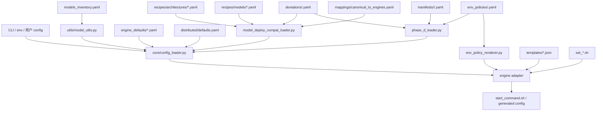
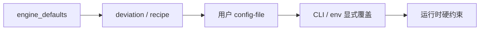
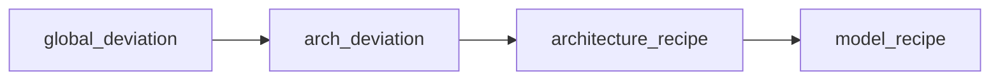
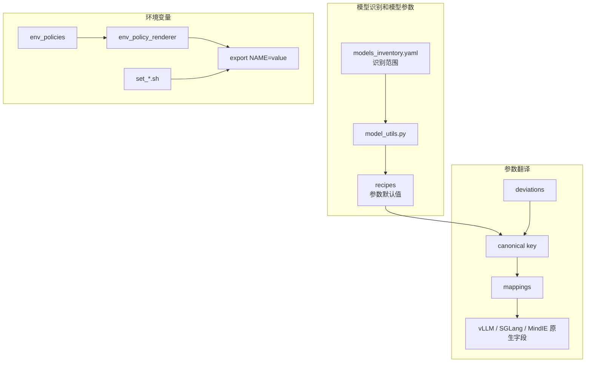
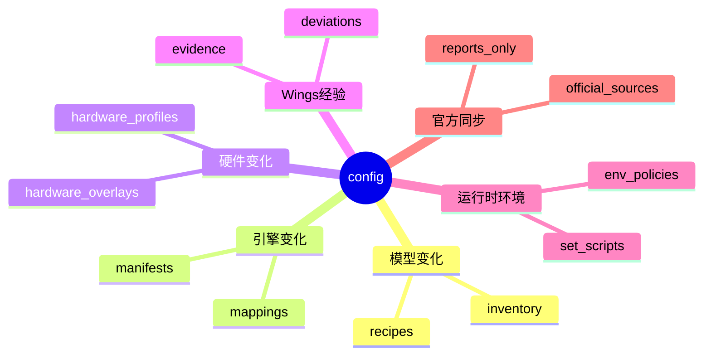
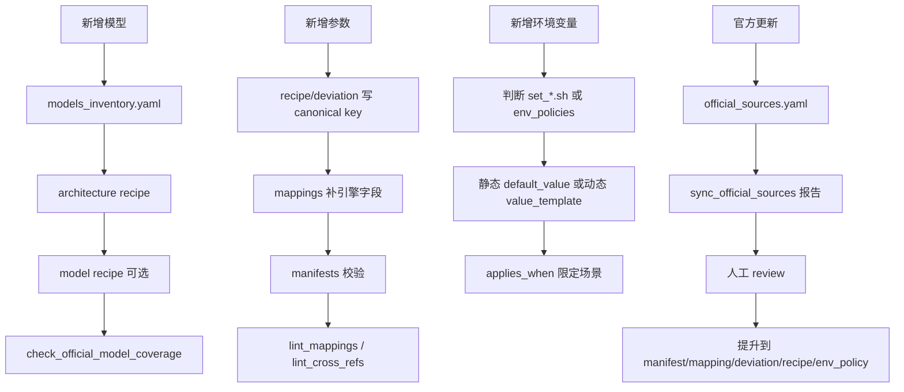

# wings_control/config 参数承载方案

本目录把启动命令拆成可维护的参数事实：模型识别、引擎默认值、模型 recipe、字段映射、环境变量、官方来源和运行时模板。运行时不拼接“官方示例命令”，而是由这些承载体合成最终 `start_command.sh` / 引擎配置文件。

## 一张图看懂



## 合并优先级



模型默认值内部再按这个顺序叠加：



## 目录速查

| 路径 | 负责什么 | 什么时候改 |
| --- | --- | --- |
| `models_inventory.yaml` | 模型 SKU、类型、架构、IndexCache 标记；驱动 `model_utils.py` 的三张模型表。 | 新增/删除支持模型。 |
| `engine_defaults/*.yaml` | 引擎最低优先级默认值。 | 引擎通用 baseline 改变。 |
| `recipes/architectures/*.yaml` | 架构级参数、硬件 overlay、验证信息。 | 一个架构下多个模型共享参数。 |
| `recipes/models/*.yaml` | 具体模型覆盖，继承 `inherits_architecture`。 | 单模型与架构默认不同。 |
| `mappings/canonical_to_engines.yaml` | canonical key 到引擎字段、target、value_map 的翻译。 | 新增参数或引擎字段变更。 |
| `deviations/<engine>.yaml` | Wings 有证据地偏离官方默认值。 | 默认值和官方不同，且要说明原因。 |
| `manifests/<engine>/<version>.yaml` | 本地官方参数快照。 | 官方 CLI/config 参数变更。 |
| `env_policies/<engine>.yaml` | 环境变量策略和动态渲染。 | 新增 export 或迁移 adapter 手写 env。 |
| `distributed/defaults.yaml` | 分布式端口、调度、master/worker 默认值。 | 分布式控制面默认值改变。 |
| `hardware_profiles/*.yaml` | chip id、厂商、显存等硬件事实。 | 新增硬件或修正硬件事实。 |
| `templates/*.json` | 引擎生成文件模板，当前主要是 MindIE。 | 生成配置文件结构变化。 |
| `set_*.sh` | 启动前基础 shell 环境初始化。 | 必须在引擎启动前执行的基础环境。 |
| `official_sources.yaml` | 官方/厂商文档来源目录；只用于离线同步报告。 | 官方来源 URL、抓取目标、提升要求变化。 |

## 关键协同关系



- `models_inventory.yaml` 只回答“是否认识模型”，不等于“已验证启动参数完整”。
- recipe 用 canonical key 表达意图；mapping 决定每个引擎是否接收、字段叫什么、值是否要转换。
- deviation 只放“Wings 与官方默认不同”的决策，必须带范围、原因和证据。
- env policy 承载可结构化表达的环境变量；当前动态渲染主要接在 `vllm_adapter.py`。
- manifest 和 official sources 不在热路径远程访问，只服务校验、diff 和人工提升。

## 为什么这样拆



如果把所有内容写进 adapter，启动命令会短期直观，但会带来重复参数、官方升级难定位、用户覆盖关系不清晰的问题。当前拆法让每类变化有固定位置，并能通过 lint、coverage、snapshot 解释参数来源。

## 常见修改路径



## 校验命令

```powershell
python tools\check_official_model_coverage.py
python tools\render_effective_config.py --model Qwen3-32B --engine vllm --hardware h20-141
python tools\lint_recipes.py
python tools\lint_mappings.py
python tools\lint_deviations.py
python tools\lint_env_policies.py
python tools\lint_cross_refs.py
```

只检查官方来源候选和模型覆盖：

```powershell
python tools\check_official_model_coverage.py --json
python tools\sync_official_sources.py --engines vllm vllm_ascend --use-cache
```

## 维护边界

- 运行时不远程抓官方文档。
- 模型专属参数不放进 `engine_defaults`。
- recipe 不直接散落引擎字段名，优先写 canonical key。
- 无证据的经验值不写入 `deviations`。
- adapter 不重复硬编码已能由 `env_policies` 表达的 export。
