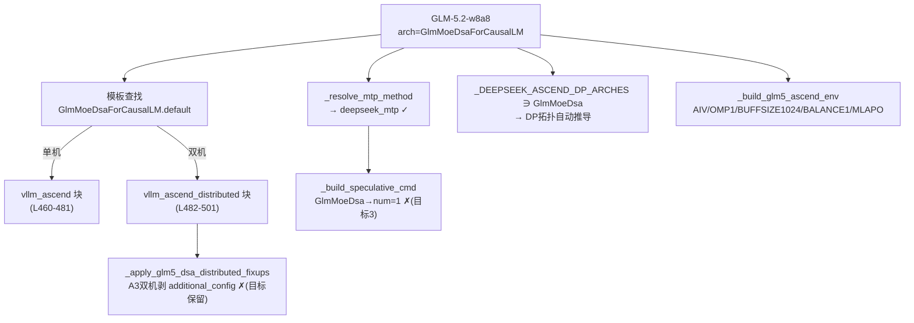

# GLM-5.2-w8a8 · Ascend 910C(A3) 单机/双机 Day0 适配设计

> 范围：**仅 Ascend**（`engine == "vllm_ascend"`），910C(A3)，两套场景：
> - **单机** 16 卡：`--data-parallel-size 2 --tensor-parallel-size 8`（served `glm-52`）
> - **双机** 2×16=32 卡：`--data-parallel-size 2 --data-parallel-size-local 1 --tensor-parallel-size 16`（headless worker，served `glm52-2`）
> 模型/架构：`GlmMoeDsaForCausalLM`（**已联网确认**，见下）/ `GLM-5.2-w8a8`（Z-AI ~743B MoE，39B 激活，DeepSeek Sparse Attention + MTP）。
> 目标：让 wings-control 对单/双机 910C 生成与下方两套官方参考脚本一致的启动命令。
> NVIDIA 路径本次**不动**。

> **架构确认**：GLM-5.2 与 GLM-5 / GLM-5.1 **同架构 `GlmMoeDsaForCausalLM`**（联网核对 vllm-ascend GLM-5.2 tutorial / zai-org/GLM-5.2 / recipes.vllm.ai）。
> 因此 GLM-5.2 **天然复用现有全部 GLM-5 机器**（模板查找 / DP 拓扑 / Ascend env / MTP 方法），本设计只列**相对 GLM-5/5.1 的差量**。

---

## 1. 目标启动命令（参考脚本，已是 Ascend 真值）

### 1.A 单机 910C（16 卡，TP8×DP2）
```bash
export HCCL_OP_EXPANSION_MODE="AIV"
export OMP_PROC_BIND=false
export OMP_NUM_THREADS=1
export HCCL_BUFFSIZE=200
export PYTORCH_NPU_ALLOC_CONF=expandable_segments:True
export VLLM_ASCEND_BALANCE_SCHEDULING=1
export VLLM_ASCEND_ENABLE_MLAPO=1
export VLLM_VERSION=0.21.0
vllm serve .../GLM-5.2-w8a8 --host 0.0.0.0 --port 8077 \
  --data-parallel-size 2 --tensor-parallel-size 8 --enable-expert-parallel \
  --seed 1024 --served-model-name glm-52 \
  --max-num-seqs 16 --max-model-len 81920 --max-num-batched-tokens 4096 \
  --trust-remote-code --gpu-memory-utilization 0.98 --quantization ascend --async-scheduling \
  --additional-config '{"enable_npugraph_ex": true,"fuse_muls_add":true,"multistream_overlap_shared_expert":true}' \
  --compilation-config '{"cudagraph_mode": "FULL_DECODE_ONLY"}' \
  --speculative-config '{"num_speculative_tokens": 3, "method": "deepseek_mtp"}'
```

### 1.B 双机 910C（32 卡，TP16×DP2，每节点 DP-local 1）
node0(master) / node1(headless) 关键差异（其余同上）：
```bash
# 新增/变化 env：
export VLLM_ASCEND_BALANCE_SCHEDULING=0        # ← 单机是 1，双机是 0
export HCCL_BUFFSIZE=400                         # ← 单机 200
export VLLM_ASCEND_ENABLE_FLASHCOMM1=1          # ← 单机无
export ASCEND_LAUNCH_BLOCKING=0                 # ← 单机无
export HCCL_IF_IP=$local_ip                      # 跨机组网
export GLOO_SOCKET_IFNAME=$nic_name; export TP_SOCKET_IFNAME=$nic_name; export HCCL_SOCKET_IFNAME=$nic_name
# CLI 拓扑：
--data-parallel-size 2 --data-parallel-size-local 1 \
--data-parallel-address $node0_ip --data-parallel-rpc-port 12980 --tensor-parallel-size 16 \
--enable-prefix-caching \              # ← 双机带，单机参考无
--max-num-seqs 30 --max-model-len 133120 --gpu-memory-utilization 0.95 --served-model-name glm52-2
# node1 额外：--headless --data-parallel-start-rank 1
```

> 注：官方 NVIDIA recipe（recipes.vllm.ai）为 `method=mtp / num=5`，**Ascend 用 `deepseek_mtp / num=3`**——两路不同，本设计取 Ascend 口径（与参考脚本一致）。

---

## 1.1 现状：wings 当前对 GLM-5.2 的产出（基线追踪）

GLM-5.2（`GlmMoeDsaForCausalLM`）今天进入 wings 后的命中链：



**对得上的（复用 GLM-5 机器即正确）**：架构识别、`quantization=ascend`、`compilation-config=FULL_DECODE_ONLY`、`enable-expert-parallel`、`async-scheduling`、`deepseek_mtp` 方法、`tool_call_parser=glm47`、思考策略（`glm-5` 子串命中 `enable_thinking`，[model_utils.py:298](../../wings_control/utils/model_utils.py#L298)）、**双机 DP 拓扑**（`device_count=16`、默认 TP=16 → DP-local=1、DP=2、start-rank 0/1、rpc-port、headless，由 [_resolve_dp_deployment_topology](../../wings_control/engines/vllm_distributed.py#L272) + [_build_dp_exec_command](../../wings_control/engines/vllm_distributed.py#L316) 产出）。

**对不上的（GLM-5.2 ≠ GLM-5/5.1 的差量，见 §3）**：MTP `num`、双机 `additional_config` 去留、`additional_config` 结构、若干 env 值、单机 TP/DP 默认。

---

## 2. 设计决策（结合用户拍板）

| 编号 | 议题 | 决策 |
|---|---|---|
| D1 | GLM-5.2 架构 | **`GlmMoeDsaForCausalLM`（联网确认）** → 复用 GLM-5 全部机器，仅打差量补丁；不新建架构键 |
| D2 | GLM-5.2 识别载体 | 新增**名称标识** `is_glm52_model`（`glm-5.2/glm5.2/glm52/glm-52`），与现有 [`is_glm51_model`:72](../../wings_control/utils/model_utils.py#L72) 同范式；用于把下列 GLM-5.2 专属差量从 GLM-5/5.1 中**精确切出**（标识互斥，不误伤 5.0/5.1） |
| D3 | MTP `num_speculative_tokens` | GLM-5.2 → **`3`**（覆盖 `GlmMoeDsaForCausalLM` 现行 `num=1`）；method 维持 `deepseek_mtp`（已对） |
| D4 | 双机 `additional_config` | **用户拍板：GLM-5.2 已稳定 → 保留**。让 GLM-5.2 **豁免** [`_apply_glm5_dsa_distributed_fixups`:1825](../../wings_control/engines/vllm_adapter.py#L1825) 的 A3 双机剥除（该剥除是 GLM-5.1 规避全图 decode replay MTE 越界的安全策略，5.2 不需要） |
| D5 | `additional_config` 结构 | 对齐参考的**扁平**形态 `{enable_npugraph_ex, fuse_muls_add, multistream_overlap_shared_expert}`；现模板/常量为**嵌套** `ascend_compilation_config:{enable_npugraph_ex}`（§6-② 待与官方 tutorial 终核） |
| D6 | 适配范围 | **仅 `vllm_ascend`**；单机 TP8/DP2 + 双机 TP16/DP2；NVIDIA 不动 |
| D7 | 稀疏 | GLM-5.2 参考**无**稀疏（无 `--hf-overrides` / 无 `kv_cache_dtype=fp8`）；保持 `enable_sparse` 关即可，**不可**让 GLM-5.2 走 GLM-5.1 的强制 IndexCache（§4.6） |

---

## 3. 现状差距（GLM-5.2 vs wings 当前 GlmMoeDsa 产物）

| # | 特性 | 目标（参考） | 当前产物 | 缺口 | 代码佐证 |
|---|---|---|---|---|---|
| G1 | MTP `num` | `num_speculative_tokens: 3` | `1`（method `deepseek_mtp` 已对） | num 值不同 | [_build_speculative_cmd:2699-2703](../../wings_control/engines/vllm_adapter.py#L2699) GlmMoeDsa→1 |
| G2 | 双机 `additional_config` | 保留三键 | **A3 双机被剥除** | 5.2 误用 5.1 安全剥除 | [_apply_glm5_dsa_distributed_fixups:1825-1828](../../wings_control/engines/vllm_adapter.py#L1825) |
| G3 | `additional_config` 结构 | 扁平 `enable_npugraph_ex` 顶层 | 嵌套 `ascend_compilation_config.enable_npugraph_ex` | key 层级不同 | 模板 [ascend_default.json:471-477](../../wings_control/config/defaults/ascend_default.json#L471) + [_GLM5_A2_ADDITIONAL_CONFIG:2179](../../wings_control/engines/vllm_adapter.py#L2179) |
| G4 | 双机 env `BALANCE_SCHEDULING` | `0` | `1`（GLM-5 恒 1） | 双机值相反 | [_build_glm5_ascend_env:1201](../../wings_control/engines/vllm_adapter.py#L1201) / [vllm_distributed.py:238](../../wings_control/engines/vllm_distributed.py#L238) |
| G5 | env `HCCL_BUFFSIZE` | 单 200 / 双 400 | 恒 `1024` | 数值不同（`os.getenv` 可覆盖） | 同上 1199 / [vllm_distributed.py:223](../../wings_control/engines/vllm_distributed.py#L223) |
| G6 | 双机 env `FLASHCOMM1` | `=1` | 不下发 | 缺失 | GLM-5 env builder 未含 |
| G7 | 单机拓扑 | TP8 / DP2 | 默认 TP=`device_count`=16 / DP1 | 单机默认与目标不同 | [default_deepseek_ascend_dp_tensor_parallel_size:231](../../wings_control/engines/vllm_adapter.py#L231) |
| G8 | 模型登记 | — | `_LLM_MODELS` 无 GLM-5.2 | 仅影响清单/矩阵，**非阻塞**（架构键已支持） | [model_utils.py:165-172](../../wings_control/utils/model_utils.py#L165) |

> G1/G2 是**真改逻辑**；G3 是口径对齐；G4/G6 是 env 差量；G5/G7 多为 page/env 可驱动；G8 做补登记。

---

## 4. 详细设计

所有改动收敛在 `engine=="vllm_ascend"` + `is_glm52_model(...)`，不影响 GLM-5/5.1 与其它模型。

### 4.1 GLM-5.2 识别（D2）— `model_utils.py`
镜像现有 GLM-5.1 范式新增（标识与 5.1 互斥）；`_contains_marker` 即把现有
[`_contains_glm51_marker`:62](../../wings_control/utils/model_utils.py#L62) 泛化成「值 × 标识集」二参版：
```python
_GLM52_NAME_MARKERS = ("glm-5.2", "glm5.2", "glm_5.2", "glm 5.2", "glm-52", "glm52")

def is_glm52_model(model_name=None, model_path=None, config=None) -> bool:
    """GLM-5.2 变体识别（架构同 GlmMoeDsaForCausalLM，靠名称/路径区分）。"""
    if _contains_marker(model_name, _GLM52_NAME_MARKERS) or _contains_marker(model_path, _GLM52_NAME_MARKERS):
        return True
    if isinstance(config, dict):
        return any(_contains_marker(config.get(k), _GLM52_NAME_MARKERS) for k in _MODEL_NAME_CONFIG_KEYS)
    return False
```
> `glm-52`/`glm52` 标识覆盖参考的 served-name（`glm-52`/`glm52-2`）与路径（`GLM-5.2-w8a8`）；与 5.1 标识（`glm-51`/`glm51`）无碰撞。

### 4.2 MTP `num=3`（D3 / G1）— `_build_speculative_cmd:2699`
```python
# before：GlmMoeDsa 一律 num=1
if (_is_deepseek_v4_pro_params(params) or _is_deepseek_v4_flash_params(params)
        or model_info.model_architecture == "GlmMoeDsaForCausalLM"):
    speculative_config_temp.append('"num_speculative_tokens": 1')
# after：GLM-5.2 例外为 3（GLM-5/5.1 仍 1）
glm52 = is_glm52_model(params.get("model_name"), params.get("model_path"))
if not glm52 and (... or model_info.model_architecture == "GlmMoeDsaForCausalLM"):
    append('"num_speculative_tokens": 1')
else:
    append('"num_speculative_tokens": 3')   # GLM-5.2 与通用 MTP 同档
```
- 触发前置：spec 仅在上层 `enable_speculative_decode=True` 时由 launcher 合成（[_should_append_auto_speculative_config:2722](../../wings_control/engines/vllm_adapter.py#L2722)）；method `deepseek_mtp` 来自 [_resolve_mtp_method:2540](../../wings_control/engines/vllm_adapter.py#L2540)，无需改。

### 4.3 双机保留 `additional_config`（D4 / G2）— `_apply_glm5_dsa_distributed_fixups:1825`
```python
# before：A3 双机一律剥 additional_config（GLM-5.1 防 MTE 崩溃）
if "additional_config" not in explicit_keys:
    if _resolve_deepseek_v4_flash_platform(params) == "a3":
        engine_config.pop("additional_config", None)
# after：GLM-5.2 已稳定 → 豁免（保留三键图优化）
if "additional_config" not in explicit_keys:
    if _resolve_deepseek_v4_flash_platform(params) == "a3" \
       and not is_glm52_model(params.get("model_name"), params.get("model_path")):
        engine_config.pop("additional_config", None)
```
> **关联记忆**：GLM-5.1 双机崩溃根因是 FULL_DECODE_ONLY 全图 decode replay MTE 越界（非 OOM）。GLM-5.2 用户确认已稳定，故保留；GLM-5.1 维持剥除不回归。

### 4.4 `additional_config` 扁平化（D5 / G3）
模板与常量目前是嵌套形（`ascend_compilation_config:{enable_npugraph_ex:true}`），参考是扁平形。两种取其一：
- **方案 a（推荐，最小面）**：为 GLM-5.2 单独走扁平常量
  ```python
  _GLM52_ADDITIONAL_CONFIG = {"enable_npugraph_ex": True, "fuse_muls_add": True,
                              "multistream_overlap_shared_expert": True}
  ```
  在 [_apply_glm5_ascend_engine_defaults:2186](../../wings_control/engines/vllm_adapter.py#L2186) 内按 `is_glm52_model` 选 `_GLM52_ADDITIONAL_CONFIG` 而非 `_GLM5_A2_ADDITIONAL_CONFIG`。
- **方案 b**：若联网核对官方 tutorial 确认嵌套/扁平**语义等价**（vllm-ascend 版本兼容），则 G3 降级为「无需改」。**待 §6-② 终核**。

### 4.5 env 差量对账（G4/G5/G6）
| env | 单机目标 | 双机目标 | wings 当前(GLM-5) | 处置 |
|---|---|---|---|---|
| `HCCL_OP_EXPANSION_MODE` | AIV | AIV | AIV ✓ | — |
| `OMP_NUM_THREADS` | 1 | 1 | 1 ✓ | — |
| `VLLM_ASCEND_ENABLE_MLAPO` | 1 | 1 | 1(A3) ✓ | — |
| `VLLM_ASCEND_BALANCE_SCHEDULING` | 1 | **0** | 恒 1 | **G4**：双机需 GLM-5.2 分支置 0（与 5.1 相反），见下 |
| `HCCL_BUFFSIZE` | 200 | 400 | 1024 | **G5**：`os.getenv('HCCL_BUFFSIZE',…)` 可由平台/页面注入覆盖；或补 GLM-5.2 默认 |
| `VLLM_ASCEND_ENABLE_FLASHCOMM1` | — | **1** | 无 | **G6**：双机补 `=1` |
| `ASCEND_LAUNCH_BLOCKING` | — | 0 | 无 | 无害（0 近默认）；可不补 |

G4/G6 落点：[_build_ascend_dp_env_commands:206-241](../../wings_control/engines/vllm_distributed.py#L206) 的 `is_glm5_dp` 分支内，叠加 `is_glm52` 子判定：
```python
if is_glm5_dp and is_glm52_model(params.get("model_name"), params.get("model_path")):
    # GLM-5.2 双机官方口径
    env_commands.append("export VLLM_ASCEND_BALANCE_SCHEDULING=0")    # 覆盖前序的 1
    env_commands.append("export VLLM_ASCEND_ENABLE_FLASHCOMM1=1")
```
> ⚠ `BALANCE_SCHEDULING` 单机=1/双机=0 的**极性反转**是 GLM-5.2 与 GLM-5.1 的硬差异；单机走 [_build_glm5_ascend_env:1201](../../wings_control/engines/vllm_adapter.py#L1201)（保持 1 即对），双机走 DP env（需置 0）。是否为 GLM-5.2 官方双机定值见 §6-③。

### 4.6 拓扑 & 稀疏边界（G7 / D7）
- **双机**：`device_count=16` + 默认 TP=16 → `dp_size_local=16/16=1`、`dp_size=1×2=2`、`start-rank=node_rank` → **与目标 TP16/DP2/local1/start-rank0,1 完全一致**，[_resolve_dp_deployment_topology:290-313](../../wings_control/engines/vllm_distributed.py#L290) 现成产出，**无需改**。
- **单机**：默认 TP=`device_count`=16 → DP1；目标 TP8/DP2。需**页面下发 `tensor_parallel_size=8`**（则 `dp_size_local=16/8=2` 自然得 DP2），或在模板/默认为 GLM-5.2 单机定 TP=8。本质是 page/device 驱动，建议页面侧给 TP=8（不写死，避免影响其它卡数）。
- **稀疏（D7）**：`GlmMoeDsaForCausalLM ∈ INDEXCACHE_ARCHS`（[model_utils.py:39](../../wings_control/utils/model_utils.py#L39)）。若上层把 `enable_sparse` 置真，[_build_kv_sparse_cmd](../../wings_control/engines/vllm_adapter.py#L2791) 会对 GLM-5.2 产出 IndexCache `--hf-overrides`——**参考无此项**。GLM-5.2 标识与 5.1 互斥，故 [_force_kv_sparse_for_glm51_ascend:2749](../../wings_control/engines/vllm_adapter.py#L2749) **不会**误触发 5.2（✓）；只需保证 GLM-5.2 部署**不开 SmartSparse 开关**即与参考一致。

---

## 5. 改动清单（✅ 已实现 — 命名组 + 最小 gate；env 不改）

> 落地方案（用户拍板）：**基本字段走模板命名组**、**env 维持现有硬编码**（`HCCL_BUFFSIZE=1024` 不动，接受与参考的 env 差异）、**仅 2 处代码 gate** 处理架构级逻辑。

| 文件 | 改动 | 关联 | 状态 |
|---|---|---|---|
| [ascend_default.json](../../wings_control/config/defaults/ascend_default.json) | 在 `GlmMoeDsaForCausalLM` 下新增 **`GLM-5.2-w8a8` 命名组**（`vllm_ascend` 单机 + `vllm_ascend_distributed` 双机）：承载 max_model_len(81920/133120)/max_num_seqs(16/30)/gpu_util(0.98/0.95)，并**补 `async_scheduling:true` + `enable_expert_parallel:true`**（双机另带 `enable_prefix_caching:true`）；`additional_config` **保持嵌套**（克隆）、`compilation_config=FULL_DECODE_ONLY` | 基本字段 + async/EP 缺口 | ✅ |
| [model_utils.py](../../wings_control/utils/model_utils.py) | ① 新增 `_GLM52_NAME_MARKERS` + `_contains_glm52_marker` + `is_glm52_model`（镜像 5.1，互斥）；② `_LLM_MODELS["GlmMoeDsaForCausalLM"]` 补 `GLM-5.2 / GLM-5.2-w8a8 / GLM-5.2-FP8` | D2/G8 | ✅ |
| [vllm_adapter.py](../../wings_control/engines/vllm_adapter.py) | ③ import `is_glm52_model`；④ `_build_speculative_cmd`：GLM-5.2 → `num=3`，**收口到 `engine=="vllm_ascend"`**（NV 的 5.2 是 mtp/num=5，不误产）；⑤ `_apply_glm5_dsa_distributed_fixups`：GLM-5.2 **豁免** A3 剥除（G2，5.1 仍剥除）；⑥ **`_apply_glm5_ascend_engine_defaults`：GLM-5.2 必产 `async_scheduling`+`enable_expert_parallel`，并单机(nnodes==1) `TP=dc//2`+`DP=2`（覆盖全部 backend，含非 dp_deployment / 页面未下发 TP 路径）**；⑦ `_apply_generic_deepseek_ascend_dp_defaults`：GLM-5.2 单机 `TP=dc//2`+`DP=2`（dp_deployment 路径，G7 解，与⑥同值） | D3/D4/G7 + 复杂名鲁棒 | ✅ |
| [vllm_distributed.py](../../wings_control/engines/vllm_distributed.py) `_build_ascend_dp_env_commands` | GLM-5.2 双机 env 仅对齐 **`BALANCE_SCHEDULING=0` / `+VLLM_ASCEND_ENABLE_FLASHCOMM1=1`**（DP env 后置 export 覆盖 arch env，运行期 last-wins）；5/5.1 维持 BALANCE=1/无 FLASHCOMM1。**`HCCL_BUFFSIZE` 维持 1024 不按模型硬编码**（由平台 `HCCL_BUFFSIZE` env 覆盖）| G4/G6 | ✅ |
| `additional_config` 扁平化 | **暂不做**：命名组保持嵌套，避免与 [_apply_glm5_ascend_engine_defaults:2221](../../wings_control/engines/vllm_adapter.py#L2221) 的嵌套 deep-merge 冲突（扁平会致键重复）；待 §6-② 终核 | G3 | ⏸ 延后 |
| [dry_run.py](../../dry_run.py) | 新增 `glm52-a3-16`（单机）/`glm52-a3-dual`（双机）场景：**复杂模型名** `GLM-5.2-355B-A3B-W8A8-Chat` + 芯片经 **`ENGINE_VERSION=…-a3`** 确定（`platform` 留空）；setup_env 增 `ENGINE_VERSION` 注入 | 验证 | ✅ |

**已验证**：`py_compile` 通过、`is_glm52_model` 10/10 互斥、**182 条回归全过**（GLM-5.1/4.7 + engine 选择 + DP 拓扑 + dp_deployment 脚本）。**dry_run 假跑两场景（复杂名 + engine-version 定 A3）逐字段产物**：

| 字段 | 单机 node0 | 双机 node0 | 双机 node1 | 对参考 |
|---|---|---|---|---|
| `--speculative-config` | `deepseek_mtp / num=3` | 同 | 同 | ✅ |
| `--additional-config`(三键) | 有 | **有(A3双机保留)** | **有** | ✅ |
| `--async-scheduling` | 有 | 有 | 有 | ✅（代码 gate，复杂名稳产）|
| `--enable-expert-parallel` | 有 | 有 | 有 | ✅ |
| `--enable-prefix-caching` | 有 | 有 | 有 | ✅(双机) |
| DP 拓扑 | **`TP8 / DP2`** | `TP16/DP2/local1` | `…/--headless/start-rank 1` | ✅ 单/双机均对齐（无需页面下发 TP，全 backend 鲁棒）|
| `HCCL_BUFFSIZE` | 1024 | 1024 | 1024 | 维持默认（不按模型硬编码；平台 `HCCL_BUFFSIZE` env 可覆盖为 200/400）|
| `VLLM_ASCEND_BALANCE_SCHEDULING` | 1 | **0**(eff) | **0**(eff) | ✅ 已对齐 |
| `VLLM_ASCEND_ENABLE_FLASHCOMM1` | 无 | **1** | **1** | ✅ 已对齐 |
| `VLLM_ASCEND_ENABLE_MLAPO=1` | 有 | 有 | 有 | ✅ ← 证明 **A3 经 engine-version 解析成功** |
| `--max-model-len` | 4096 | 131072 | 131072 | 回落 `default`（复杂名未命中命名组；页面驱动覆盖）|

> env(eff)：双机 arch env 先出 `BALANCE=1`，DP env 后置 `BALANCE=0/FLASHCOMM1=1` 覆盖（运行期 last-wins，与 5.1 同「DP env 覆盖前序」范式）；`HCCL_BUFFSIZE` 两边均 1024（不按模型改）。

> **复杂名结论**：安全关键项（num=3 / 保留 additional_config / async / EP / 思考策略）已全部**代码 gate 化**，对复杂模型名鲁棒；模板命名组（精确名匹配）仅承载 max_model_len/seqs/util 等页面可覆盖的便利默认，命中与否不影响正确性。

> ⚠ **命名组精确名匹配**：`GLM-5.2-w8a8` 键仅当页面 `model_name` 恰等于它才命中（[精确等值:2386](../../wings_control/core/config_loader.py#L2386)），否则回落 `default`（=GLM-5 基本字段，但 num=3/保留 additional_config 仍由代码 gate 兜住）。若页面下发别的名（如裸 `GLM-5.2`/`glm-52`），需加同名别名键。

---

## 6. 仍需确认（给值即终态）

| # | 事实 | 卡住 | 现状假设 |
|---|---|---|---|
| ① | **MTP num=3** 是否 GLM-5.2 Ascend 官方定值（参考两脚本均 3；NV recipe 是 5） | G1 取值 | 按参考取 3 |
| ② | **`additional_config` 扁平 vs 嵌套**：目标 vllm-ascend 版本是否要求 `enable_npugraph_ex` 顶层？（官方 GLM5.2 tutorial 因 429 未抓到正文，需补核） | G3 方向 | 按参考取扁平（方案a） |
| ③ | **双机 `BALANCE_SCHEDULING=0` / `FLASHCOMM1=1`** 是 GLM-5.2 官方双机定值，还是该集群调优？是否由平台 env 注入而非 wings 写死 | G4/G6 落点 | 暂按 wings 双机分支写死 |
| ④ | **单机 TP8/DP2** 由页面下发 `tensor_parallel_size=8`，还是 wings 给 GLM-5.2 单机定档 | G7 落点 | 倾向页面下发（不写死默认） |
| ⑤ | `HCCL_BUFFSIZE` 单200/双400 是否需 wings 兜底默认，还是纯平台 env 覆盖 | G5 | `os.getenv` 覆盖即可 |

> ②③④给值后 §4 即最终态；①⑤是确认/yes-no。

---

## 7. 测试要点
- UT：GLM-5.2 + spec 开 → `--speculative-config '{… "num_speculative_tokens": 3, "method": "deepseek_mtp"}'`；**GLM-5/5.1 仍 `num=1` 不回归**。
- UT：GLM-5.2 A3 **双机** → 命令含 `--additional-config`（三键）；**GLM-5.1 A3 双机仍被剥除**（[_apply_glm5_dsa_distributed_fixups](../../wings_control/engines/vllm_adapter.py#L1797) 不回归）。
- UT：GLM-5.2 双机 env 含 `VLLM_ASCEND_BALANCE_SCHEDULING=0` + `VLLM_ASCEND_ENABLE_FLASHCOMM1=1`；单机为 `BALANCE_SCHEDULING=1`。
- 端到端（dry_run）：
  - `glm52-910c-dual` 逐字段比对 1.B：`--data-parallel-size 2 --data-parallel-size-local 1 --tensor-parallel-size 16`、worker `--headless --data-parallel-start-rank 1`、`--enable-prefix-caching`、三特性命令齐全。
  - `glm52-910c-single`（页面 TP=8）比对 1.A：`--data-parallel-size 2 --tensor-parallel-size 8`、additional/compilation/speculative 齐全。
- 回归：GLM-5.2 **不**产出 `--hf-overrides`（未开 SmartSparse）；`is_glm52_model` 不误判 GLM-5 / GLM-5.1。

---

> 信息来源（架构与官方 recipe 核对）：
> [vllm-ascend GLM-5.2 tutorial](https://docs.vllm.ai/projects/ascend/en/main/tutorials/models/GLM5.2.html) ·
> [zai-org/GLM-5.2 (HF)](https://huggingface.co/zai-org/GLM-5.2) ·
> [recipes.vllm.ai/zai-org/GLM-5.2](https://recipes.vllm.ai/zai-org/GLM-5.2)
