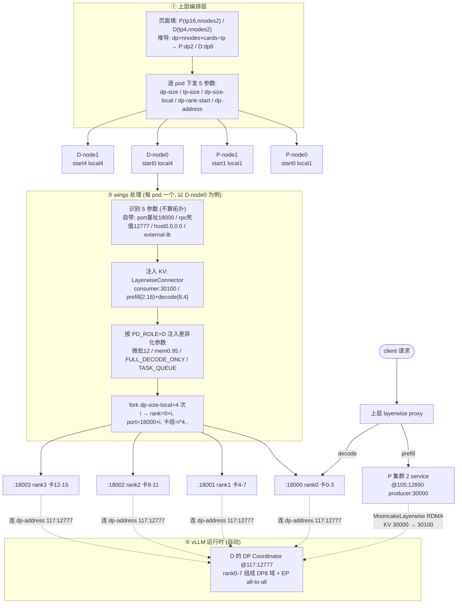

# DeepSeek-V3.2（vLLM-Ascend）PD 分离 —— wings-control 适配需求设计文档

| 项 | 内容 |
|----|------|
| 文档类型 | 需求设计文档 |
| 适配对象 | wings-control（`core/config_loader.py`、`engines/vllm_distributed.py`、`engines/vllm_adapter.py`、`core/port_plan.py`）|
| 参考来源 | vLLM-Ascend 官方教程 [DeepSeek-V3.2](https://docs.vllm.ai/projects/ascend/en/latest/tutorials/models/DeepSeek-V3.2.html) |
| 状态 | 方案锁定（4-pod + pod 内 fork，external-lb，上层下发已解析拓扑）|

---

## 1. 背景与目标

### 1.1 背景

DeepSeek-V3.2 在 vLLM-Ascend 上采用 **PD 分离（Prefill-Decode Disaggregation）** 部署：Prefill 与 Decode 拆成两套独立分布式集群，各自最优配置，通过 Mooncake RDMA 逐层传输 KV Cache。官方样例在 4 节点 A3-752T 上以 1P1D（DP2×TP16 的 Prefill + DP8×TP4 的 Decode）达到 **533 tps / TPOT 32ms**。

PD 分离的根本动因：**Prefill 计算密集、优化吞吐与 TTFT；Decode 访存密集、优化延迟与并发**。两阶段最优配置天然冲突（大批↔微批、大 TP↔大 DP、eager↔cudagraph），合在一个实例只能折中，拆开才能各自打满。

### 1.2 目标

- wings-control 支持 PD 分离场景下的**角色内多机 DP 编排**，与官方 4-pod 形态对齐。
- wings 作为**节点级薄启动器**：接收上层下发的已解析 DP 拓扑，在 pod 内 fork 出对应数量的 `vllm serve`（external-lb 模式）。

### 1.3 非目标

- **负载均衡 proxy 不做**：layerwise proxy 的逐 rank 路由由上层负责，wings 不实现 prefiller/decoder 分发。
- **拓扑计算不做**：`--dp-rank-start` 等由上层算好下发，wings 不自行推导集群拓扑。

---

## 2. 术语与计数口径

| 术语 | 含义 |
|------|------|
| P / D | Prefill 角色 / Decode 角色 |
| TP | Tensor Parallel，单实例张量并行卡数 |
| DP | Data Parallel，同角色横向扩展的实例数 |
| EP | Expert Parallel，MoE 专家并行（跨 DP rank all-to-all）|
| dp_size_local | 单节点本地 DP rank（service）数 |
| dp_rank_start | 本节点在角色全局 DP 中的起始 rank |
| service | 一条独立 `vllm serve` 进程（自带 API + 1 个 EngineCore，独占 tp_size 卡）|

**计数口径（避免混淆）**：官方记作 **1P1D**，"1" 数的是 **DP 域（逻辑集群）**——1 个 Prefill DP 域 + 1 个 Decode DP 域。把多个物理 service 联动成"1 个逻辑 P/D"的原语是 `dp_rank_start`（每节点全局 rank 起点）+ 共享 `dp-address`/`rpc-port`。
- 同一拓扑换口径：按**节点数**是「2 节点 P + 2 节点 D」；按**service 数**是「2 P + 8 D」。
- 工程上真正驱动数量的是 `dp_size`（service 数），切勿用节点口径推 service 数（D 是 2 节点 vs 8 service）。

---

## 3. 官方方案参考

### 3.1 整体拓扑（1P1D，4 节点 A3-752T）

| 角色 | 节点数 | 并行 | 卡/节点 | service 数 |
|------|--------|------|---------|-----------|
| Prefill | 2 | DP2 × TP16 | 16 | 2（每节点 1）|
| Decode | 2 | DP8 × TP4 | 16 | 8（每节点 4）|

- 模型：`DeepSeek-V3.2-w8a8-mtp-QuaRot`；基线：输入/输出 64k/3k，533 tps，TPOT 32ms。
- P 集群与 D 集群是两套独立分布式系统，通过 Mooncake KV 传输解耦。

### 3.2 进程模型：每个 DP rank 一个独立 service

`launch_online_dp.py` 核心循环（**每节点一条命令，pod 内 fork `dp_size_local` 个 service**）：

```python
for i in range(dp_size_local):
    dp_rank          = dp_rank_start + i                       # 全局 rank
    vllm_engine_port = vllm_start_port + i                     # 每 service 独立端口
    visible_devices  = range(i*tp_size, (i+1)*tp_size)         # 每 service 独立卡组
    Process(target=run_command, ...)                          # 独立进程
```

每个 DP rank = 一个完整 `vllm serve`（自带 API server + 1 EngineCore），独占 `tp_size` 卡、独立端口、独立 API 端点。全系统 **4 pod、10 service（2 P + 8 D）**。

### 3.3 三重并行叠加

```
① 进程内 TP        : P 每实例 tp16；D 每实例 tp4
② 同角色跨进程 DP/EP: P 集群 DP2（addr 105:12890）；D 集群 DP8（addr 117:12777）
                     —— P/D 用不同 address/rpc-port = 两套独立 DP 通信域
③ 跨角色 KV 传输    : MooncakeLayerwiseConnector（RDMA），P=producer:30000 → D=consumer:30100
```

物理上独立进程、逻辑上同一个分布式引擎：同角色 rank 经相同 `dp-address/rpc-port` 组成 DP 域；因开 `--enable-expert-parallel`，MoE 专家路由每步跨 DP rank 做 all-to-all。

### 3.4 P / D 启动参数差异及原因

> 根因主线：**Prefill 计算密集、一次性大算、优化吞吐/TTFT；Decode 访存密集、自回归逐步、优化延迟（TPOT）/并发。**

| 参数 | P（Prefill）| D（Decode）| 为什么存在差异 |
|------|------------|------------|---------------|
| `dp_size × tp_size` | DP2 × TP16 | DP8 × TP4 | P 计算密集，大 TP 把单次大矩阵乘摊到 16 卡降 TTFT；D 算力用不满、瓶颈在访存，小 TP 保单实例效率、大 DP 堆并发拉吞吐 |
| `--max-num-batched-tokens` | 32560 | 12 | P 一次并行算整段 prompt，塞满大批提算力利用率；D 每步只产 1 token，压微批保每步低延迟 |
| `--max-num-seqs` | 64 | 4 | P 可同时排多请求摊开销；D 并发宽度放在 DP8 横扩上，单实例只伺候极少序列保低延迟 |
| `--gpu-memory-utilization` | 0.82 | 0.95 | P 激活峰值大留余量防 OOM；D 激活极小，显存几乎全装 KV，装满并发越高故榨干 |
| `--enforce-eager` | 有（eager）| 无（cudagraph）| P 输入 shape 动态、图捕获收益低且易触兼容性问题；D shape 规整（每步固定 +1 token）适合图捕获 |
| `--compilation-config` | 无 | `{"cudagraph_mode":"FULL_DECODE_ONLY","cudagraph_capture_sizes":[3,6,9,12]}` | D 捕获几个小 batch size 消掉逐步 kernel launch 开销直接降 TPOT；P 动态 shape 无法受益 |
| `--additional-config` | `{"layer_sharding":["q_b_proj","o_proj"],"enable_dsa_cp":true}` | `{"recompute_scheduler_enable":true}` | P 开 DSA 上下文并行 + 层分片服务长序列；D 显存吃紧用重计算换显存让更多 KV 并发驻留 |
| `kv_role` / `kv_port` | producer / 30000 | consumer / 30100 | P 生产 KV、D 消费 KV，端口错开避免同机冲突 |
| 角色专属环境变量 | `VLLM_ASCEND_ENABLE_FLASHCOMM1=1` | `TASK_QUEUE_ENABLE=1` | P 大 TP16 + EP all-to-all 通信量大用 FlashComm 降延迟；D 通信压力小，转用任务队列平滑高频小步调度 |

P/D 共用静态参数：`--enable-expert-parallel`、`--speculative-config '{"num_speculative_tokens":2,"method":"deepseek_mtp"}'`、`--quantization ascend`、`--max-model-len 68000`、`--no-enable-prefix-caching`、`--trust-remote-code`、`--seed 1024`、`--served-model-name deepseek_v3.2`。

P/D 共用环境变量：`HCCL_OP_EXPANSION_MODE=AIV`、`OMP_PROC_BIND=false`、`OMP_NUM_THREADS=10`、`PYTORCH_NPU_ALLOC_CONF=expandable_segments:True`、`VLLM_USE_V1=1`、`HCCL_BUFFSIZE=256`、`ASCEND_AGGREGATE_ENABLE=1`、`ACL_OP_INIT_MODE=1`、`ASCEND_A3_ENABLE=1`、`VLLM_MOONCAKE_ABORT_REQUEST_TIMEOUT=480`。

### 3.5 KV Transfer 配置

P 节点（producer）：

```json
{
  "kv_connector": "MooncakeLayerwiseConnector",
  "kv_role": "kv_producer",
  "kv_port": "30000",
  "kv_connector_extra_config": {
    "prefill": { "dp_size": 2, "tp_size": 16 },
    "decode":  { "dp_size": 8, "tp_size": 4  }
  }
}
```

D 节点（consumer）：仅 `kv_role: kv_consumer`、`kv_port: 30100` 不同。**`extra_config` 中 prefill/decode 拓扑两边必须完全一致**（KV 的 TP/DP 映射换算依赖它）。

### 3.6 官方 launch 命令（4 pod）

```bash
# Prefill node0 / node1
launch_online_dp.py --dp-size 2 --tp-size 16 --dp-size-local 1 --dp-rank-start 0 --dp-address 141.61.39.105 --dp-rpc-port 12890 --vllm-start-port 9100
launch_online_dp.py --dp-size 2 --tp-size 16 --dp-size-local 1 --dp-rank-start 1 --dp-address 141.61.39.105 --dp-rpc-port 12890 --vllm-start-port 9100
# Decode node0 / node1
launch_online_dp.py --dp-size 8 --tp-size 4 --dp-size-local 4 --dp-rank-start 0 --dp-address 141.61.39.117 --dp-rpc-port 12777 --vllm-start-port 9100
launch_online_dp.py --dp-size 8 --tp-size 4 --dp-size-local 4 --dp-rank-start 4 --dp-address 141.61.39.117 --dp-rpc-port 12777 --vllm-start-port 9100
```

### 3.7 多模型 PD 参数差异（V3.2 / GLM5 / Qwen3.5）

横比多个模型的 PD 分离配置，**PD 参数是模型特定的，不能硬编码统一值**：

| 维度 | DeepSeek-V3.2 | GLM5 | Qwen3.5-397B-A17B | Qwen3-30B（实测脚本）|
|------|---------------|------|-------------------|---------------------|
| P 拓扑 | DP2×TP16 | DP2×TP16 | DP8×**TP2** | DP2×TP2 |
| D 拓扑 | DP8×TP4 | **DP16×TP4** | DP16×TP2 | DP4×**TP1** |
| **连接器** | MooncakeLayerwise | **MooncakeConnectorV1** | MooncakeLayerwise | **MooncakeConnectorV1**（带 `engine_id`）|
| **kv_port** P/D | 30000/30100 | 30000/30100 | **23010/36010** | **30100/30400** |
| extra 额外字段 | — | **use_ascend_direct** | — | engine_id（须按 rank）|
| batched-tokens P→D | 32560→12 | 4096→32 | 4096→128 | 8192→120 |
| gpu-mem P→D | 0.82→0.95 | **0.95→0.92（反向）** | 0.9→0.96 | **0.85→0.75（反向）** |
| 角色专属 env | P:FLASHCOMM1 / D:TASK_QUEUE | +FUSED_MC2 / D:MLAPO | 主要为卡组 | D:TASK_QUEUE/FUSED_MC2 |

四个模型连接器有 V1/Layerwise、kv_port 各不同、gpu-mem 方向两正两反 —— 印证**不可硬编码**。

**设计启示**（落到 §7.6、§8-C3/C4、§10）：
1. **连接器 + kv_port 降为注册表字段**（随模型变），不写死。
2. **P/D 差异化参数配置驱动**——沉淀进 [`pd_config.json`](../wings_control/config/defaults/pd_config.json) 注册表 + 通用 loader（§7.6），不为每模型写函数；专属优先、回退 `default`。
3. extra_config 与角色 env 留**模型专属扩展位**；V1 连接器的 `engine_id` 须按 rank 注入。

> 来源：[V3.2](https://docs.vllm.ai/projects/ascend/en/latest/tutorials/models/DeepSeek-V3.2.html) / [GLM5](https://docs.vllm.ai/projects/ascend/en/latest/tutorials/models/GLM5.html) / [Qwen3.5-397B-A17B](https://docs.vllm.ai/projects/ascend/en/latest/tutorials/models/Qwen3.5-397B-A17B.html)；Qwen3-30B 为真机 `run_dp_template.sh` 实测（问题见附录 B）。

---

## 4. 现状与差距

### 4.1 wings 现有 PD 机制

- `PD_ROLE` 触发 PD（[env_utils.py:223](../wings_control/utils/env_utils.py)）→ `kv_role` producer/consumer。
- `_get_pd_config`（[config_loader.py:812](../wings_control/core/config_loader.py)）读 `PD_PREFILL_*`/`PD_DECODE_*` 生成 `kv_transfer_config`。
- 昇腾 PD 走 **standalone 单实例**：[config_loader.py:2180](../wings_control/core/config_loader.py) 早退，每个 P/D 是孤立 `vllm serve`（仅 TP，无角色内 DP）。
- dp_deployment 路径的拓扑计算 `_resolve_dp_deployment_topology`（[vllm_distributed.py:308](../wings_control/engines/vllm_distributed.py)）已能算 `dp_rank_start = node_rank × dp_size_local`，但用 **headless（单节点单 API）**，非 external-lb。

### 4.2 差距

| 维度 | 现状 | 目标 |
|------|------|------|
| 角色内 DP | 孤立单实例 | 同角色多 service 组成 DP/EP 域 |
| 进程铺设 | headless（vLLM 内部铺、单 API）| external-lb（pod 内 fork、每 service 独立 API/端口/卡组）|
| KV 连接器 | `MooncakeConnectorV1` | `MooncakeLayerwiseConnector` + `kv_port` |
| 拓扑来源 | wings 自算 | 上层下发已解析值（`dp-rank-start` 等）|
| P/D 差异化参数 | 无 | 按 `PD_ROLE` 注入（§3.4 表）|

---

## 5. 总体设计

**架构**：每个 wings = 一个 pod = 一条 `launch_online_dp.py` 等价物。上层把拓扑算好（4 个 pod，每 pod 的 `--dp-rank-start` 等已解析），wings 识别参数后在 pod 内 fork `dp-size-local` 个 external-lb `vllm serve`。

```
┌─ 上层 ────────────────────────────────────────────────┐
│ 规划拓扑 → 起 4 个 pod，逐 pod 下发 5 个 DP 参数         │
│ 跑各角色 DP Coordinator 入口；layerwise proxy 路由请求    │
└───────────────┬───────────────────────────────────────┘
                │ 每 pod：5 DP 参数 + PD_ROLE + kv + 卡组
                ▼
┌─ wings（每 pod 一个）──────────────────────────────────┐
│ 识别参数（不算拓扑）→ pod 内 fork dp-size-local 个 service │
│ 逐 service：rank=start+i / port=base+i / 卡组=i*tp..      │
│ 注入 kv_transfer_config + §3.4 P/D 差异化参数             │
└───────────────┬───────────────────────────────────────┘
                ▼
┌─ vLLM 运行时 ──────────────────────────────────────────┐
│ ① 进程内 TP  ② 同角色 DP/EP all-to-all（dp-address 握手） │
│ ③ MooncakeLayerwise KV（kv_port 30000→30100）            │
└────────────────────────────────────────────────────────┘
```

**部署形态**：

| Pod | 角色 | `--dp-rank-start` | `--dp-size-local` | pod 内 service | port | 卡组 |
|-----|------|:----------------:|:-----------------:|:--------------:|------|------|
| P-node0 | P | 0 | 1 | 1（rank0）| 18000 | 0-15 |
| P-node1 | P | 1 | 1 | 1（rank1）| 18000 | 0-15 |
| D-node0 | D | 0 | 4 | 4（rank0-3）| 18000~18003 | 0-3/4-7/8-11/12-15 |
| D-node1 | D | 4 | 4 | 4（rank4-7）| 18000~18003 | 0-3/4-7/8-11/12-15 |

---

## 6. 接口契约

### 6.1 字段来源

| 来源 | 字段 | P 值 | D 值 |
|------|------|------|------|
| **上层下发（5 个）** | `--dp-size` | 2 | 8 |
| | `--tp-size` | 16 | 4 |
| | `--dp-size-local` | 1 | 4 |
| | `--dp-rank-start` | node0=0 / node1=1 | node0=0 / node1=4 |
| | `--dp-address` | P-node0 IP | D-node0 IP |
| **wings 自带** | `--port` 基址 | 18000（现有 `ENGINE_PORT`）| 同 |
| | `--data-parallel-rpc-port` | 死值（按 `PD_ROLE` 两个常量）| P 一个 / D 一个 |
| | `--host` / `--data-parallel-external-lb` | `0.0.0.0` / 恒开 | 同 |
| **平台/现有** | `ASCEND_RT_VISIBLE_DEVICES`（整 pod 卡）、`PD_ROLE`、`kv_port`、模型 | — | — |
| **上层透传** | 全局 prefill/decode 拓扑（`PD_PREFILL_*`/`PD_DECODE_*`，KV 映射用，两边一致）| — | — |

> rpc 死值按 `PD_ROLE` 给两个常量（P/D 各一），覆盖分机部署，并防 P/D 同机共置时 rpc 冲突。

### 6.2 责任分线

```
上层（全算好，下发）:
  dp-size / tp-size / dp-size-local / dp-rank-start / dp-address
  + PD_ROLE / kv_port / 全局 prefill-decode 拓扑 / 卡组基址 / model

wings（识别 + fork，不算拓扑）:
  按 dp-size-local 次 fork，逐 service rank=start+i / port=base+i / 卡组=i*tp..
  + 注入 kv_transfer_config（复用 _get_pd_config + LayerwiseConnector + kv_port）
  + 按 PD_ROLE 注入 §3.4 差异化参数
  + 管 pod 内 N 个子进程生命周期
```

### 6.3 必填页面字段（上层配置界面）

| 字段 | 含义 | P | D | 必填 |
|------|------|---|---|:----:|
| `model_name` / `model_path` | 模型（P/D 共用）| ← | ← | ✅ |
| `tp_size` | 单实例 TP（建模决策）| 16 | 4 | ✅ |
| `nnodes` | 角色节点数 | 2 | 2 | ✅ |
| `cards_per_node` | 每节点 NPU 数（可硬件探测则免填）| 16 | 16 | △ |

> `dp_size = nnodes × cards_per_node ÷ tp_size`、`dp_size_local`、`dp_rank_start`、`dp_address` 均由上层据此推导后下发，页面不直接填。

---

## 7. 详细设计

### 7.1 输入 → 派生（上层侧拓扑计算）

```
total_cards    = nnodes × cards_per_node
dp_size        = total_cards ÷ tp_size            （= 页面 dp 或反算）
dp_size_local  = cards_per_node ÷ tp_size
dp_rank_start  = role_node_rank × dp_size_local    （role_node_rank: 角色域内节点序）
dp_address     = 角色域 node0 IP
```

校验：`cards_per_node % tp_size == 0`、`tp_size` 整除模型注意力头数。

### 7.2 wings fork 逻辑（每 pod）

```python
# 识别上层 5 参数；port 基址 18000、rpc 死值、host、external-lb 由 wings 自带
for i in range(dp_size_local):                 # P=1 次，D=4 次
    rank  = dp_rank_start + i                    # 直接续号，不推导
    port  = 18000 + i                            # P→18000；D→18000..18003
    cards = range(i*tp_size, (i+1)*tp_size)      # wings 唯一保留的推导：卡组切分
    fork: vllm serve {model} \
        --host 0.0.0.0 --port {port} \
        --tensor-parallel-size {tp_size} \
        --data-parallel-size {dp_size} \
        --data-parallel-rank {rank} \
        --data-parallel-size-local 1 \           # 每 service 自身恒 1（external-lb）
        --data-parallel-address {dp_address} \
        --data-parallel-rpc-port {死值_按角色} \
        --data-parallel-external-lb \
        --kv-transfer-config '{kv_role/kv_port/全局prefill+decode拓扑}' \
        {§3.4 P/D 差异化参数}
      env: ASCEND_RT_VISIBLE_DEVICES={cards}
```

> 区分两个 `size-local`：上层 `--dp-size-local` 决定 **wings fork 几次**；每个 fork 进程自身的 `--data-parallel-size-local` 恒为 **1**。

### 7.3 地址语义（三个地址勿混）

| 地址 | 作用 | 取值 | rank0 vs rank1 |
|------|------|------|----------------|
| `--host` | 本进程 API 绑定 | `0.0.0.0` | 恒同 |
| `--data-parallel-address` | DP 域集合点（Coordinator）| 角色 node0 IP | 同角色恒同 |
| `HCCL_IF_IP` | HCCL 通信本机 IP | `RANK_IP` | P 不同机故不同；D 同机故相同 |

### 7.4 KV 配置

复用 `_get_pd_config`，改：连接器默认 `MooncakeLayerwiseConnector`、新增 `kv_port`（P=30000/D=30100）、`extra_config` 写全局 prefill+decode 拓扑（两边一致）。

### 7.5 P/D 差异化参数注入（配置驱动）

不为每个模型写 Python 注入函数，而是**配置驱动**：模型差异沉淀进一份 JSON 注册表，wings 用一个通用 loader 读取。**新增模型 = 加 JSON 条目，零 Python 代码**。见 §7.6。

### 7.6 PD 模型配置注册表（唯一真相源）

**文件**：[`wings_control/config/defaults/pd_config.json`](../wings_control/config/defaults/pd_config.json)，与 `ascend_default.json` 并列，沿用同一加载机制（注册到 `DEFAULT_CONFIG_FILES`，经 `load_json_config` 读取）。

**结构**（key = 模型架构，同时是 external-lb PD 的门控白名单）：

```jsonc
"pd_config": {
  "<ModelArchitecture>": {
    "connector":    "MooncakeLayerwiseConnector | MooncakeConnectorV1 | ...",
    "kv_port":      { "P": "<producer端口>", "D": "<consumer端口>" },
    "extra_config": { /* 模型专属附加字段，如 GLM5 的 use_ascend_direct */ },
    "common":       { /* P/D 共用 engine 参数 */ },
    "prefill":      { "engine": { /* P 专属 */ }, "env": { /* P 专属环境变量 */ } },
    "decode":       { "engine": { /* D 专属 */ }, "env": { /* D 专属环境变量 */ } }
  }
}
```

完整三模型条目（V3.2 / GLM5 / Qwen3.5）见该 JSON 文件，差异详见 §3.7。

**`default` 兜底条目**：注册表含一个 `"default"` 条目，未单独注册的模型回退到它，使**任意模型只要 `PD_ROLE`+`dp>1` 即可跑 PD external-lb**。`default` 只放通用安全项（连接器/kv_port/`disable_hybrid_kv_cache_manager`/P 的 `enforce_eager`/D 的 `FULL_DECODE_ONLY`+`TASK_QUEUE`），**刻意不含** `gpu_memory_utilization`、`enable_expert_parallel`（非 MoE 会报错）、`max_num_*`、模型专属算子项——这些留模型默认/用户/专属条目。

**通用 loader**（取代每模型函数）：
```python
def _apply_pd_model_config(params, engine_config, explicit_keys):
    if not params.get("_pd_external_lb"):
        return
    pd = _load_pd_config()
    entry = pd.get(resolve_model_architecture(params)) or pd.get("default")  # 专属优先，回退 default
    role = "prefill" if get_pd_role_env() == "P" else "decode"
    for k, v in {**entry.get("common", {}), **entry[role].get("engine", {})}.items():
        if k not in explicit_keys:                 # 不覆盖用户显式值
            engine_config.setdefault(k, v)
    params["_pd_kv"]  = {"connector": entry["connector"],
                         "kv_port": entry["kv_port"][get_pd_role_env()],
                         "extra": entry.get("extra_config", {})}
    params["_pd_env"] = entry[role].get("env", {})
```

`_get_pd_config` 从 `params["_pd_kv"]` 取连接器/kv_port（不写死）；fork 脚本从 `params["_pd_env"]` 出角色 env。

> **`engine_id` 按 rank 注入**：当 `connector == "MooncakeConnectorV1"` 时，每个 service 需唯一 `engine_id`，由 fork 循环按 `dp_rank` 生成（`kv_cfg["engine_id"] = str(dp_rank)`），**不可写死模板值**（否则同 pod 多 service 共享 engine_id 冲突）。`MooncakeLayerwiseConnector` 用 kv_port，不需要 engine_id。

---

## 8. 实现改造点

| # | 改动 | 位置 | 估时 |
|---|------|------|------|
| C1 | 识别 5 个 DP 参数（透传，关闭 wings 自身拓扑推导）| `config_loader` 透传白名单 + PD 早退路由 | 0.5d |
| C2 | **pod 内 fork 循环 + 子进程管理**（rank/port/卡组切分；保留 external-lb；连接器为 V1 时按 dp_rank 注 `engine_id`）| `vllm_distributed.py` 新 exec 分支 | 2~3d |
| C3 | KV：`kv_role` + 连接器/kv_port/extra **从注册表读**（§7.6）| `config_loader._get_pd_config` | 0.5d |
| C4 | **PD 配置注册表（数据，§7.6）+ 通用 loader（代码）** 取代每模型函数；新增 `pd_config.json` 文件 + 注册到 `DEFAULT_CONFIG_FILES` + `_apply_pd_model_config` | `config/defaults/pd_config.json` + `config_loader`/`vllm_adapter` | 1~1.5d |
| C5 | dry_run 快照（P 1 service / D 4 service）+ fork 单测 | tests | 1~2d |

---

## 9. 风险与对策

| # | 风险 | 说明 | 对策 |
|---|------|------|------|
| R1 | KV 全局拓扑不一致 | 每 service `kv_connector_extra_config` 的 prefill/decode dp/tp 须全局一致；P 也要声明 D 集群拓扑 | 上层下发对端角色完整拓扑，wings 写入每个 fork 进程 |
| R2 | 子进程生命周期（主风险）| pod 内 N 个 service，EP all-to-all 下任一 rank 挂会让整域 hang | wings 逐进程探活并上报；失败处理策略见 §11 待决 |
| R3 | external-lb 行为/端口自洽 | 每 service 独立 API + 各自 KV bootstrap，端口是否冲突、Mooncake 能否按 rank 映射需真机验证 | 第一步做单节点 `dp_size_local=2` 最小验证 |
| R4 | rpc 死值同机冲突 | P/D 同机共置时单一 rpc 死值会撞 | 按 `PD_ROLE` 给两个 rpc 常量 |
| R5 | 端口块不重叠 | wings fork 的 engine 端口块与内部 health/monitor 端口可能撞 | 约定保留区间，补交叉校验 |
| R6 | `FULL_DECODE_ONLY` 历史崩溃 | 全图 decode replay 曾触发 MTE 越界（GLM5 aclgraph 崩溃记录）| 迁移 D 的 compilation-config 时重点真机验证 |

---

## 10. 对现有功能的影响（回归风险与门控）

> 本节评估 §8 改造点对项目既有功能的影响。**核心原则：external-lb 触发收窄到「`PD_ROLE` + `PD_DP_SIZE>1`」双门控；模型参数注册表「专属优先、回退 `default`」（§7.6）。安全网从「架构白名单」转移到「`default` 条目保守 + 不覆盖用户显式值」，让现有 1P1D（dp≤1）、dp_deployment、非 PD 部署的输出字节级不变。**

### 10.1 最高回归风险（必须收窄 gating）

| 改动 | 误伤的现有功能 | 原因 | 对策 |
|------|---------------|------|------|
| C3 默认连接器改 Layerwise | 现有 1P1D standalone PD（Qwen3-8B 等，见 [pd-disaggregation.md](../docs/features/pd-disaggregation.md)）| `_get_pd_config` 默认从 `MooncakeConnectorV1` 改成 Layerwise，会改掉所有现存 PD 部署 | **不改默认**；仅 external-lb（dp>1）用 Layerwise，standalone 维持 V1 |
| C3 新增 `kv_port` 字段 | 现有 V1 PD | V1 可能不识别 `kv_port`，无脑加会启动报错 | `kv_port` 只在 Layerwise/external-lb 分支注入 |
| C4 P/D 差异化参数 | 未注册架构的 PD 模型 | 若把某模型专属参数（如 `layer_sharding`/`enable_dsa_cp`）注进别的模型 → 崩 | 专属优先、回退 `default`；`default` 只含通用安全项，不含模型专属危险参数 |
| C1/C2 external-lb 触发 | 现有 1P1D、所有非 PD 部署 | 触发若过宽会把现存 PD 拽进 fork 脚本 | 触发 = `PD_ROLE` **且** `PD_DP_SIZE>1`；否则走原 standalone，字节级不变 |

### 10.2 共享代码路径的连带影响

| 共享点 | 谁也在用 | 影响 | 处理 |
|--------|---------|------|------|
| `_get_pd_config`（[config_loader.py:812](../wings_control/core/config_loader.py)）| ① standalone PD ② LMCache+PD 的 MultiConnector（[:1024](../wings_control/core/config_loader.py)）| 改默认/加 kv_port 会连带影响 MultiConnector 子连接器 | Layerwise+kv_port 做成 external-lb 专属分支，MultiConnector 不受影响 |
| `_ensure_pd_head_dim`（[:1087](../wings_control/core/config_loader.py)，无条件 [:372](../wings_control/core/config_loader.py)）| 所有 PD | 为 V1 设计的 `--hf-overrides head_dim` 会照样对 external-lb 注入，Layerwise 是否需要/冲突未知 | 真机验证；若 Layerwise 不需要则 external-lb 跳过 |
| `_guard_pd_hybrid_kv_cache`（[:1067](../wings_control/core/config_loader.py)）| 所有 PD | 移除 hybrid kv flag，对 external-lb 同样适用 | 保持，无需改 |
| `_build_pd_role_env_commands`（[vllm_adapter.py:762](../wings_control/engines/vllm_adapter.py)）| 所有 PD | 加 FLASHCOMM1/TASK_QUEUE/MLAPO 等若不门控会污染现有 PD | 角色专属 env 按模型架构注册门控 |

### 10.3 相邻大功能的「不干扰」确认

| 功能 | 是否受影响 | 为什么 |
|------|:---------:|--------|
| V4-Pro / GLM5 / DeepSeek dp_deployment | ✅ 不受影响 | external-lb 走 `distributed=False` + build_start_script 新分支，不进 `_resolve_dp_deployment_topology`/`_strip_dp_cli_flags`/Ray，两路互斥 |
| Ray 分布式 | ✅ 不受影响 | 新分支在 `is_distributed` 判定前 return |
| LMCache KV Offload | ⚠️ 需确认 | 仅 LMCache+PD 同开时经 MultiConnector 碰 `_get_pd_config`，靠 10.2 分支隔离 |
| 非 PD 单机/分布式（绝大多数）| ✅ 不受影响 | 新函数在 `get_pd_role_env()` 为空时 early-return |
| `build_start_script` 主入口（[:2856](../wings_control/engines/vllm_adapter.py)）| ⚠️ 改动点 | 新分支插在最前且条件极窄；`_pd_external_lb` 未设则后续逻辑原样执行 |

### 10.4 端口与资源冲突（pod 内新增）

- fork 端口 18000~18003 vs health(19000+)/monitor(19500+)：不撞，安全；PD 不起 proxy（proxy_port=0），亦不撞。
- `ASCEND_RT_VISIBLE_DEVICES` 子集：一 pod 4 service 各切 4 卡，若平台已对容器做卡映射，基址需对齐（R5）。

### 10.5 必须新增的回归保护（合并门禁）

1. `PD_ROLE=D` 但**不给** `PD_DP_SIZE`（dp≤1）→ 断言输出 == 现有 1P1D standalone（字节级），证明旧路径不回归。
2. **未注册架构** + `PD_ROLE` + dp>1 → 断言走 `default`：只注入 default 保守项，**不**注入专属模型危险参数（如 `layer_sharding`/`enable_dsa_cp`）。
3. external-lb（以 V3.2 D 为例）→ 断言 fork 4 条、连接器/kv_port == 该模型注册值（V3.2: Layerwise/30100）、standalone 路径不触发。
4. 连接器=V1 时 → 断言各 service `engine_id` 互异（== dp_rank）。

### 10.6 安全网清单

```
1. external-lb 双门控: PD_ROLE + PD_DP_SIZE>1 → 不满足走旧路；参数专属优先、回退 default
2. 连接器/kv_port/差异化参数 全部来自注册表且 external-lb 专属，不碰 standalone 与 MultiConnector
3. 新增「旧路径字节级不变」回归测试(10.5 第1条)作为合并门禁
4. _ensure_pd_head_dim 对 Layerwise 的行为真机先验
```

---

## 11. 工作量与验证

### 11.1 工作量

**合计 ~6~9 人日**（拓扑由上层下发，wings 不算，省去拓扑推导工作量与风险）；外加真机 bring-up buffer ~3~5 天（多机 HCCL/Mooncake + R3/R6 验证）。

### 11.2 验证方案

1. **最小验证（优先）**：单节点 `dp_size_local=2`，确认 external-lb 下两 service 的 KV/bootstrap 端口不撞、能完成一次 P→D KV 传输（消除 R3 不确定性，决定连接器是否需调整）。
2. 注册表 schema 校验单测：每个条目必含 connector/kv_port/prefill/decode，门控 key 与白名单一致。
3. dry_run 快照逐行比对官方 4 条 launch 命令的等价输出（P 1 service、D 4 service）。
4. 4 pod 真机：健康检查逐 service 探活 → 集群级就绪聚合 → 小并发推理 → 对齐 533tps 基线。

---

## 12. 待决事项

| # | 事项 | 建议 |
|---|------|------|
| 1 | C2 子进程失败策略：任一 service 挂 → 整 pod 重启 vs 单 service 拉起 | **整 pod 重启**（EP all-to-all 下单 rank 缺失会让整域 hang）|
| 2 | `cards_per_node` 是否页面暴露 | 单一硬件环境用硬件探测，不暴露；混合硬件才页面填 |
| 3 | rpc 死值常量取值 | 沿用官方 P=12890 / D=12777 |

---

## 附录 A：端到端样例与流程图

### A.1 场景设定

- 模型 `DeepSeek-V3.2-w8a8`，4 节点 A3（每节点 16 卡）。
- 拓扑：P = DP2×TP16（2 节点），D = DP8×TP4（2 节点）。
- 节点 IP：P-node0=`7.6.52.105`、P-node1=`7.6.52.113`、D-node0=`7.6.52.117`、D-node1=`7.6.52.125`。

### A.2 上层下发（4 pod）

| Pod | PD_ROLE | dp-size | tp-size | dp-size-local | dp-rank-start | dp-address |
|-----|:-------:|:-------:|:-------:|:-------------:|:-------------:|:----------:|
| P-node0 | P | 2 | 16 | 1 | 0 | 7.6.52.105 |
| P-node1 | P | 2 | 16 | 1 | 1 | 7.6.52.105 |
| D-node0 | D | 8 | 4 | 4 | 0 | 7.6.52.117 |
| D-node1 | D | 8 | 4 | 4 | 4 | 7.6.52.117 |

### A.3 整体流程图



### A.4 五个阶段职责

| 阶段 | 谁做 | 关键动作 |
|------|------|---------|
| ① 上层编排 | 上层 | 页面 `tp+nnodes` → 推导 `dp` → 算好每 pod 的 `dp-rank-start`/`dp-address` |
| ② 分发 4 pod | 上层 | 每 pod 一个 wings 容器，下发 5 参数 + PD_ROLE + 平台注入卡组 |
| ③ wings 处理 | wings | 识别（不算拓扑）→ 注 KV → 注 P/D 差异化参数 → **fork** |
| ④ pod 内 service | wings | `dp-size-local` 个 `vllm serve`，rank/port/卡组逐一隔离 |
| ⑤ 运行时 | vLLM | 同角色 service 经 `dp-address` 握手组 DP/EP 域；P→D 经 Mooncake 传 KV；上层 proxy 路由请求 |

### A.5 wings 为 D-node0 生成的命令（fork 第 i=2 个为例）

```bash
export ASCEND_RT_VISIBLE_DEVICES=8,9,10,11
export TASK_QUEUE_ENABLE=1
export VLLM_MOONCAKE_BOOTSTRAP_PORT=30100

exec vllm serve /models/DeepSeek-V3.2-w8a8 \
  --host 0.0.0.0 --port 18002 \
  --tensor-parallel-size 4 \
  --data-parallel-size 8 \
  --data-parallel-rank 2 \
  --data-parallel-size-local 1 \
  --data-parallel-address 7.6.52.117 \
  --data-parallel-rpc-port 12777 \
  --data-parallel-external-lb \
  --enable-expert-parallel \
  --max-num-batched-tokens 12 --max-num-seqs 4 \
  --gpu-memory-utilization 0.95 \
  --compilation-config '{"cudagraph_mode":"FULL_DECODE_ONLY","cudagraph_capture_sizes":[3,6,9,12]}' \
  --additional-config '{"recompute_scheduler_enable":true}' \
  --quantization ascend --max-model-len 68000 --trust-remote-code \
  --kv-transfer-config '{"kv_connector":"MooncakeLayerwiseConnector","kv_role":"kv_consumer","kv_port":"30100","kv_connector_extra_config":{"prefill":{"dp_size":2,"tp_size":16},"decode":{"dp_size":8,"tp_size":4}}}'
```

其余 3 条仅差 `--port`（18000/18001/18003）、`--data-parallel-rank`（0/1/3）、`ASCEND_RT_VISIBLE_DEVICES`（0-3/4-7/12-15）。P-node0 因 `dp-size-local=1` 只 fork 1 条（tp16 / dp2 / rank0 / producer:30000 / `--enforce-eager` / layer_sharding+enable_dsa_cp / FLASHCOMM1）。

### A.6 主线

`dp-rank-start` 由上层算好 → wings 只 `+i` 续号 fork → 各 service 凭相同 `dp-address` 自动组成一个逻辑 P/D 域 → 跨域靠 `kv_port`（30000→30100）传 KV。wings 全程只看自己这一个 pod。

---

## 附录 B：常见 PD 脚本错误自查表

> 基于真机 `run_dp_template.sh`（Qwen3-30B 等）排查总结。wings 生成脚本时应规避，人工写模板时可对照自查。

| # | 错误 | 现象 | 正确做法 |
|---|------|------|---------|
| B1 | **`--additional_config`（下划线）** | vLLM 不识别该 CLI，配置静默失效 | 必须连字符 `--additional-config` |
| B2 | **P/D 网卡名不一致**（如 D=`bond0`、P=`eth0`）| HCCL/Mooncake KV 跨节点连不通 | P/D 统一 `nic_name`（或确认两网均可达对端）|
| B3 | **`engine_id` 写死**（模板固定值）| 同 pod fork 多 service 共享 engine_id，MooncakeConnectorV1 冲突 | 按 `dp_rank` 生成：`engine_id = str(dp_rank)`（仅 V1 需要）|
| B4 | **HCCL 超时漏位**（如 P 侧 `EXEC=204/CONNECT=120` vs D 侧 `2000/1200`）| P 侧超时过短，建连/执行误判失败 | P/D 超时量级一致 |
| B5 | **EPLB 开关矛盾**（env `DYNAMIC_EPLB=true` vs config `dynamic_eplb:false`）| 行为不确定 | env 与 additional-config 取值统一 |
| B6 | **`VLLM_USE_V1` 仅单侧设** | P/D 引擎版本路径不一致 | P/D 都设（或都依赖默认）|
| B7 | **`max-num-seqs` P/D 取值** | 与 DP 并发策略不匹配时吞吐/延迟异常 | 确认是"靠 DP 并发"(D 低 seq) 还是"靠单实例并发"(D 高 seq)，与拓扑一致 |
| B8 | **PD 下保留 hybrid KV manager** | 与 Mooncake 连接器不兼容 | 显式 `--disable-hybrid-kv-cache-manager`（wings 由 `_guard_pd_hybrid_kv_cache` 处理）|

> wings 实现注意：B1（用连字符渲染）、B3（fork 循环按 rank 注 engine_id）由代码保证；B2/B4/B5/B6 属上层下发/模板约定，应在契约或 schema 校验中拦截。
