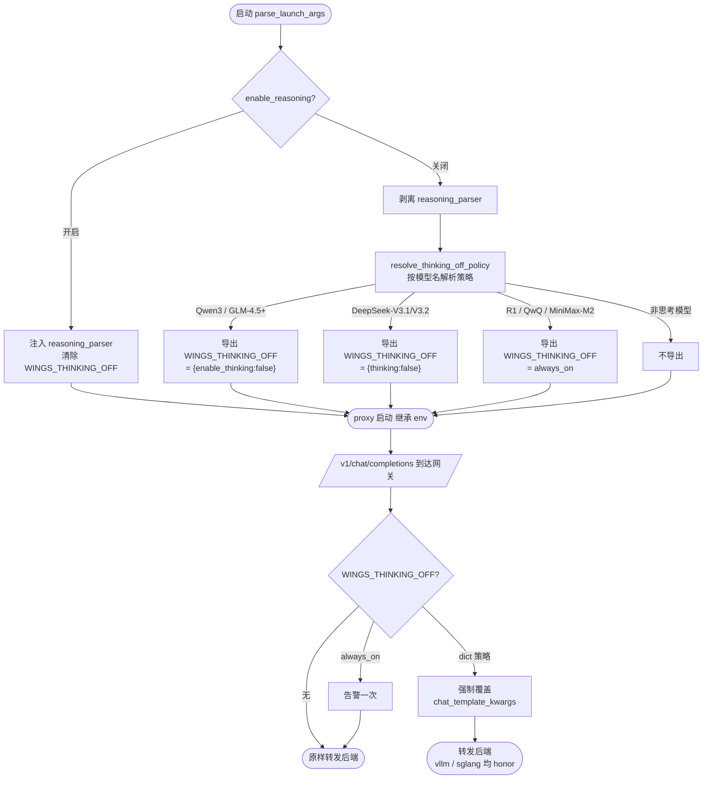

# 推理思考模式开关（reasoning_parser 解耦 + 思考强制关闭）

## 需求背景

历史实现中 `reasoning_parser`（思维链解析）被强绑定在 function call 开关（`enable_auto_tool_choice`）上：不开 FC 就拿不到思维链解析，无法独立控制。同时，运维侧存在「关闭推理后要求模型彻底不输出思考内容」的诉求，但 `reasoning_parser` 只控制服务端是否「解析」`<think>`，控制不了模型「是否思考」——两者是推理管线的不同阶段，需要分别治理并由统一开关驱动。

## 需求价值

提供一个独立、统一的推理开关 `--enable-reasoning` / `ENABLE_REASONING`（默认关闭），关闭时：启动命令不注入 `reasoning_parser`（**解析端**关闭）；对可关闭思考的混合推理模型，在网关层强制非思考、且客户端无法绕过（**生成端**关闭），从而「保证关闭后模型不触发思考」。

## 需求详情

- 开关与 function call **完全解耦**，独立生效；默认 `false`。
- 适用引擎：`vllm` / `vllm_ascend` / `sglang`（`mindie` 思维解析为服务端内置，不涉及）。
- 解析端：开则保留模型默认配置中的 `reasoning_parser`，关则剔除；配置中无该字段则不凭空注入。
- 生成端：关闭时按模型族在网关强制注入 `chat_template_kwargs` 关闭思考，客户端反向开启会被压制。
- 始终推理模型（DeepSeek-R1 / R1-Distill / QwQ / MiniMax-M2）天生必思考、无法关闭，仅打印告警。
- 兼容 x86（GPU）与 Arm（Ascend NPU）平台。

## 整体流程图



## 实现设计

**总体：** 开关从「单段（解析）」升级为「两段契约」——解析端在 launcher 配置合并层裁决，生成端在 proxy 网关层强制执行；二者由同一个 `enable_reasoning` 驱动。

**解析端（launcher / config_loader）：** `reasoning_parser` 不再由 `_set_function_call` 管理，改由独立的 `_set_reasoning_parser(params, engine_cmd_parameter)` 依据 `enable_reasoning` 裁决，vllm/vllm_ascend 与 sglang 复用同一函数。取值来源严格对齐 `config/defaults/nvidia_default.json`（vllm/sglang）与 `ascend_default.json`（vllm_ascend）中真实配置的 `reasoning_parser` 字段；sglang 段按官方连字符命名补全（如 `deepseek-r1` / `deepseek-v3` / `minimax-append-think`）。V4-Flash 适配器层不再重复注入，统一由配置合并层裁决，避免绕过开关。

**生成端（proxy 网关）：** launcher 解析出关闭策略后写入环境变量 `WINGS_THINKING_OFF`，proxy 子进程经 `os.environ.copy()` 继承；网关对 `/v1/chat/completions` 强制注入/覆盖 `chat_template_kwargs`，客户端无法绕过。

**策略解析（`utils/model_utils.resolve_thinking_off_policy`）：** 按模型名解析关闭思考所需的 `chat_template_kwargs`，键名按各家官方对齐：

| 模型族 | 关闭思考的 kwarg | 说明 |
| --- | --- | --- |
| Qwen3 / Qwen3-MoE / Qwen3-Next / Qwen3.5 | `{"enable_thinking": false}` | 混合推理 |
| GLM-4.5 / 4.6 / 4.7 / GLM-5 / 5.1（MoE） | `{"enable_thinking": false}` | 混合推理 |
| DeepSeek-V3.1 / V3.2 | `{"thinking": false}` | 键名是 `thinking`，非 enable_thinking |
| DeepSeek-R1 / R1-Distill / QwQ / MiniMax-M2 | `always_on`（仅告警） | 始终推理，无法关闭 |
| Qwen2.5 / Llama / GLM-4-9B 等 | `None`（不介入） | 本就不思考 |

**环境变量导出（`wings_control._export_thinking_policy_env`）：** `enable_reasoning=False` 且策略非空时，写 `WINGS_THINKING_OFF`（JSON kwargs 或 `"always_on"`）；开启或非思考模型则清除该变量。

**网关强制（`proxy/thinking_policy.apply_to_chat_body`）：** dict 策略 → 解析请求体，强制 `payload["chat_template_kwargs"].update(策略)`，覆盖客户端值后重序列化；`always_on` → 仅告警一次，不改写请求体（零额外开销）；解析失败 / 非对象 / 非 chat 路径 → 安全回退原 body（绝不因策略导致请求失败）。

**接入点（`proxy/gateway.py`）：** 流式与非流式两个 forwarder 在 `read_json_body` 之后调用 `apply_to_chat_body`。`make_upstream_headers` 不透传客户端 `Content-Length`，httpx 按新 body 重算长度，改写安全。

**启动接线：** 新增开关 `--enable-reasoning` / `ENABLE_REASONING`（默认 `false`），在 `start_args_compat` 注册并进入 `LaunchArgs`；launcher 在 `parse_launch_args` 后调用 `_export_thinking_policy_env(launch_args)` 导出策略，由 proxy 子进程继承执行。

## 引擎兼容性：sglang 是否可用？

**可用。** 网关方案是「改写请求体里的 `chat_template_kwargs`」，对后端引擎透明——只要引擎的 OpenAI 接口接受并把该字段传给 chat 模板即可。已确认 `vllm` / `vllm_ascend` / `sglang` 三者均支持：SGLang 的 `/v1/chat/completions` 同样接受请求体中的 `chat_template_kwargs`（如 `{"enable_thinking": false}`），并使其 chat 模板生成「空思考块」，从而硬关思考。

注意：kwarg 键名按**模型族**区分（Qwen3/GLM 用 `enable_thinking`、DeepSeek-V3.1/V3.2 用 `thinking`），**不是按引擎**区分——同一请求体对 vllm 与 sglang 通用。

## reasoning_parser 支持范围（引擎 × 模型）

> 同步自 `wings_control/docs/features/reasoning_parser/reasoning_parser_support.yaml`，供上层用户 / 界面展示。
> 表中取值为「开启 `--enable-reasoning` 后，该模型在该引擎实际生效的 reasoning_parser」；`—` 表示该引擎下不启用思维解析（配置未配或无该引擎段）。
> 命名差异：vllm / vllm_ascend 用下划线，sglang 用连字符；`qwen3` / `glm45` 两边一致。

**引擎范围：** `vLLM`（x86 GPU）、`vLLM-Ascend`（Arm NPU）、`SGLang`（x86 GPU）。`MindIE` 思维解析为服务端内置，不走 reasoning_parser，不在本表范围。

**模型范围 —— DeepSeek 系列**

| 模型 | vLLM | vLLM-Ascend | SGLang |
| --- | --- | --- | --- |
| DeepSeek-R1 / R1-w8a8 | deepseek_r1 | deepseek_r1 | deepseek-r1 |
| DeepSeek-R1-0528 / -w8a8 | deepseek_r1 | — | deepseek-r1 |
| DeepSeek-V3 / -0324（及 -w8a8） | deepseek_r1 | — | deepseek-r1 |
| DeepSeek-V3.1 | deepseek_v3 | deepseek_v3 | deepseek-v3 |
| DeepSeek-V3.1-w8a8 | deepseek_r1 ⚠️ | deepseek_v3 | deepseek-r1 ⚠️ |
| DeepSeek-V3.2 / -Exp / -0715 | deepseek_r1 | — | deepseek-v3 |
| DeepSeek-Coder-V2-Instruct（及 -w8a8） | deepseek_r1 | — | deepseek-r1 |
| DeepSeek-V4 / -Flash / -Pro（及量化/mtp 变体） | deepseek_v4 | deepseek_v4 | deepseek-v4 |

> ⚠️ DeepSeek-V3.1-w8a8 在 vllm/sglang 无精确配置键，回落 default → 得 `deepseek_r1`（非 V3.1 的 `deepseek_v3`）。vllm_ascend 的 DeepseekV3 default 段与 DeepseekV32 整段均未配 reasoning_parser，故昇腾上 V3/V3-0324/R1-0528/V3.2 等回落为 `—`。

**模型范围 —— Qwen3 / GLM / MiniMax / Kimi**

| 模型 | vLLM | vLLM-Ascend | SGLang |
| --- | --- | --- | --- |
| Qwen3-32B / 30B-A3B / 235B-A22B | qwen3 | qwen3 | qwen3 |
| Qwen3-Next-80B-A3B-Instruct | qwen3 | qwen3 | qwen3 |
| Qwen3.5-27B / -Instruct | qwen3 | qwen3 | qwen3 |
| Qwen3.5-397-A17B（及 -w8a8） | qwen3 | qwen3 | qwen3 |
| GLM-5 / 5-FP8 / 5-w4a8 / 5.1 / 5.1-FP8 | glm45 | glm45 | glm45 |
| GLM-4.7（及 -w8a8） | glm45 | glm45 | glm45 |
| MiniMax-M2.5 / M2.7（及 -w8a8） | minimax_m2_append_think | minimax_m2_append_think | minimax-append-think |
| Kimi-K2.5（及 -w4a8） | — | kimi_k2 | — |

> Kimi 仅 ascend 配置文件含该架构段，vllm/sglang 默认配置无 Kimi 段，故为 `—`。

**模型范围 —— 不启用思维解析（三引擎均 `—`）**

GLM-4-9B-0414、Qwen2.5-32B-Instruct、QwQ-32B、LLaMA3-8B / 3.1-70B / 3.1-70B-Instruct / Meta-Llama-3.1-70B-Instruct、DeepSeek-R1-Distill-Qwen-1.5B/7B/14B/32B、DeepSeek-R1-Distill-Llama-8B/70B。

> ⚠️ 其中 DeepSeek-R1-Distill-* 与 QwQ-32B 本质是推理型模型，但当前默认配置未配 reasoning_parser，开启开关也不会注入（仅告警）；如需启用可在对应配置文件补该字段。

## 接口与示例

**CLI / 环境变量**

```bash
# 关闭推理（默认）：剥离 reasoning_parser；混合推理模型在网关强制非思考
python -m wings_control --model-name Qwen3-32B ...

# 开启推理：注入 reasoning_parser；不强制非思考
python -m wings_control --model-name Qwen3-32B --enable-reasoning ...
# 或
ENABLE_REASONING=true python -m wings_control --model-name Qwen3-32B ...
```

**用户原始请求（`/v1/chat/completions`，无需感知开关）**

```bash
curl -X POST 'http://127.0.0.1:18000/v1/chat/completions' \
  -H 'Content-Type: application/json' \
  -d '{
    "model": "Qwen3-32B",
    "messages": [
      {"role": "user", "content": "9.11 和 9.9 哪个大？"}
    ]
  }'
```

**网关改写后转发给后端引擎的请求体（`enable_reasoning=false` + Qwen3）**

```json
{
  "model": "Qwen3-32B",
  "messages": [
    {"role": "user", "content": "9.11 和 9.9 哪个大？"}
  ],
  "chat_template_kwargs": {"enable_thinking": false}
}
```

> 即使客户端自带 `"chat_template_kwargs": {"enable_thinking": true}`，也会被强制覆盖为 `false`，无法绕过。

**返回 — 关闭推理（无思维链）**

```json
{
  "id": "chatcmpl-1",
  "model": "Qwen3-32B",
  "choices": [
    {"index": 0, "message": {"role": "assistant", "content": "9.11 更大。"}, "finish_reason": "stop"}
  ]
}
```

**返回 — 开启推理（`--enable-reasoning`，思维链解析到 `reasoning_content`）**

```json
{
  "id": "chatcmpl-2",
  "model": "Qwen3-32B",
  "choices": [
    {
      "index": 0,
      "message": {
        "role": "assistant",
        "reasoning_content": "比较小数部分 0.11 与 0.9，0.9 > 0.11 …",
        "content": "9.9 更大。"
      },
      "finish_reason": "stop"
    }
  ]
}
```

## 行为对照表（`enable_reasoning=false` 时）

| 模型 | 解析端 | 生成端（vllm / vllm_ascend / sglang 通用） |
| --- | --- | --- |
| Qwen3-32B / GLM-4.5+ | 剥离 `reasoning_parser` | 网关强制 `enable_thinking=false`，保证不思考、客户端不可绕过 |
| DeepSeek-V3.1 / V3.2 | 剥离 `reasoning_parser` | 网关强制 `thinking=false` |
| DeepSeek-R1 / MiniMax-M2 | 剥离 `reasoning_parser` | 无法关闭，告警一次（模型天生必思考） |
