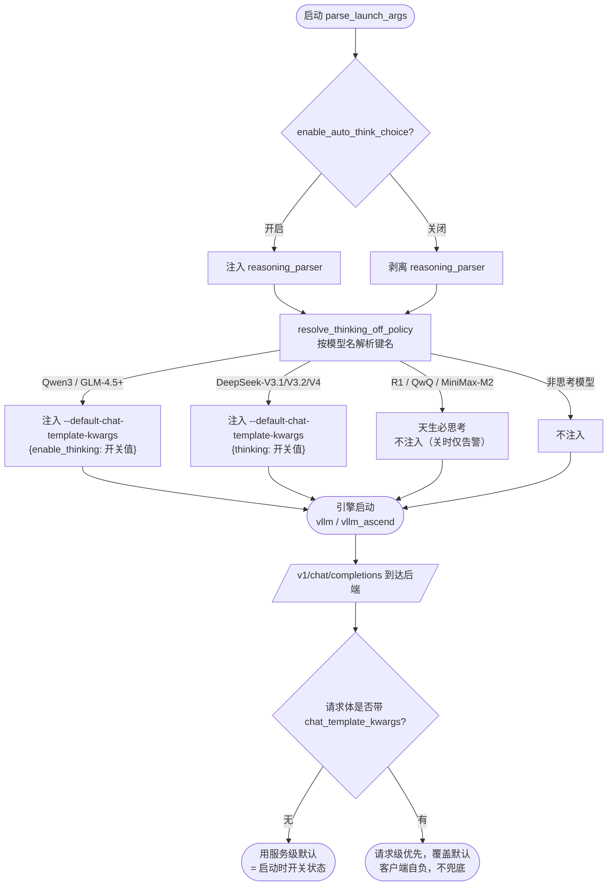

# 推理思考模式开关（reasoning_parser 解耦 + 思考默认关闭）

## 需求背景

历史实现中 `reasoning_parser`（思维链解析）被强绑定在 function call 开关（`enable_auto_tool_choice`）上：不开 FC 就拿不到思维链解析，无法独立控制。同时，运维侧存在「关闭推理后要求模型默认不输出思考内容」的诉求，但 `reasoning_parser` 只控制服务端是否「解析」`<think>`，控制不了模型「是否思考」——两者是推理管线的不同阶段，需要分别治理并由统一开关驱动。

## 需求价值

提供一个独立、统一的推理开关 `--enable-auto-think-choice` / `ENABLE_AUTO_THINK_CHOICE`（默认关闭）。开关**对称驱动解析端与生成端**：关闭（默认）→ 剥离 `reasoning_parser`（**解析端**关）+ 对混合推理模型注入服务级默认 `{key: false}` 使思考默认关闭（**生成端**关），「保证默认不触发思考」；开启 → 注入 `reasoning_parser`（**解析端**开）+ 对混合推理模型注入服务级默认 `{key: true}` **强制默认打开思考**（**生成端**开）。请求级 `chat_template_kwargs` 始终优先、可覆盖该默认（客户端自负，不兜底）。

**边界（不兜底）：** 生成端的关闭只作用于「服务级默认值」。引擎语义上请求级 `chat_template_kwargs` 优先级高于服务级默认值；客户端若在请求体里显式反向开启思考，可覆盖该默认值——**此行为由客户端自负，网关不做兜底改写**。

## 需求详情

- 开关命名与 function call 的 `enable_auto_tool_choice` 并列对齐：思考开关字段为 `enable_auto_think_choice`（CLI `--enable-auto-think-choice` / 环境变量 `ENABLE_AUTO_THINK_CHOICE`）。
- 开关与 function call **完全解耦**，独立生效；默认 `false`。
- 适用引擎：**仅 `vllm` / `vllm_ascend`**（解析端与生成端均是）。`sglang` 完全不参与 reasoning（配置层已移除全部 `reasoning_parser`），无论开关如何其启动命令都不带 `reasoning_parser`、也不注入生成端默认；`mindie` 思维解析为服务端内置，不涉及。
  - 注：reasoning 与 function call 早已解耦，剔除 sglang 的 reasoning **不影响** sglang 的 function call（`tool_call_parser` 保留，见 `function_call_support.yaml`）。
- 解析端（vllm / vllm_ascend）：开则保留模型默认配置中的 `reasoning_parser`，关则剔除；配置中无该字段则不凭空注入。
- 生成端（vllm / vllm_ascend）：按模型族在**启动命令**注入 `--default-chat-template-kwargs` 设服务级默认思考状态（**关→`{key:false}` 非思考、开→`{key:true}` 思考**）；客户端请求体覆盖不做兜底。
- 始终推理模型（DeepSeek-R1 / R1-Distill / QwQ / MiniMax-M2）天生必思考、无法关闭，仅打印告警。
- 兼容 x86（GPU）与 Arm（Ascend NPU）平台。

## 整体流程图



> 上图整条链路仅对 `vllm` / `vllm_ascend` 生效；`sglang` 完全不参与 reasoning（配置层无 `reasoning_parser`），既不走解析端也不走生成端。

## 实现设计

**总体：** 开关从「单段（解析）」升级为「两段契约」——解析端在 launcher 配置合并层裁决，生成端在 launcher 启动命令组装层注入引擎服务级默认值；二者由同一个 `enable_auto_think_choice` 驱动。**全程不引入网关请求体改写**，生成端只在拉起服务时落地。

**解析端（launcher / config_loader，vllm / vllm_ascend）：** `reasoning_parser` 不再由 `_set_function_call` 管理，改由独立的 `_set_reasoning_parser(params, engine_cmd_parameter)` 依据 `enable_auto_think_choice` 裁决。取值来源严格对齐 `config/defaults/nvidia_default.json`（vllm）与 `ascend_default.json`（vllm_ascend）中真实配置的 `reasoning_parser` 字段。`sglang` 配置层已移除全部 `reasoning_parser`，故 sglang 不再获得任何思维解析（其 function call 不受影响）。V4-Flash 适配器层不再重复注入，统一由配置合并层裁决，避免绕过开关。

**生成端（launcher 启动命令，仅 vllm / vllm_ascend）：** `enable_auto_think_choice=false` 时，launcher 按模型族解析关闭策略，并把对应的 `--default-chat-template-kwargs '<json>'` 拼进引擎启动命令（vllm / vllm_ascend 同一参数）。该参数为引擎服务级默认值——请求不带 `chat_template_kwargs` 时按此默认非思考；请求带时由请求级覆盖（不兜底）。`sglang` 因无对应启动参数，生成端整段跳过——其思考是否触发完全交由客户端请求体决定。

**策略解析（`utils/model_utils.resolve_thinking_off_policy`）：** 按模型名解析关闭思考所需的 `chat_template_kwargs`，键名按各家官方对齐：

| 模型族 | 关闭思考的 kwarg | 说明 |
| --- | --- | --- |
| Qwen3 / Qwen3-MoE / Qwen3-Next / Qwen3.5 / 3.6（**不含 Coder**） | `{"enable_thinking": false}` | 混合推理；Qwen3-Coder-* 官方非思考、YAML 置 null，故排除 |
| GLM-4.5 / 4.6 / 4.7 / GLM-5 / 5.1（MoE） | `{"enable_thinking": false}` | 混合推理 |
| DeepSeek-V3.1 / V3.2 / V4-Flash / V4-Pro | `{"thinking": false}` | 键名是 `thinking`，非 enable_thinking；V4 经官方 vLLM Recipes 确认同为混合推理、键名一致（另有正交的 `reasoning_effort` 控深度，不在本开关范畴） |
| Kimi-K2.5 / K2.7 / K2.7-Code | `{"thinking": false}` | 键名 `thinking`；moonshotai/Kimi-K2.5 `chat_template.jinja` 字面以 `` 关闭思考（与 `reasoning_parser=kimi_k2` 对应） |
| DeepSeek-R1 / R1-Distill / QwQ / MiniMax-M2 | `always_on`（仅告警） | 始终推理，无官方关闭手段 |
| Qwen2.5 / Qwen3-Coder / Llama / GLM-4-9B / MiniMax-M3 等 | `None`（不介入） | 本就不思考（M3 经 `thinking_mode` 字符串切换，键/值不同，暂不纳入本开关） |

**启动命令注入（launcher，仅 vllm / vllm_ascend）：** 策略为 dict 时，向启动命令追加 `--default-chat-template-kwargs '{<key>: <开关值>}'`（开关开→`true` 强制思考、关→`false` 强制非思考，键名按模型族）；策略为 `always_on` → 不注入（模型天生必思考，关时仅告警一次）；策略为 `None`（非思考模型）→ 不注入。引擎为 `sglang` 时整段不执行。

**启动接线：** 新增开关 `--enable-auto-think-choice` / `ENABLE_AUTO_THINK_CHOICE`（默认 `false`），在 `start_args_compat` 注册并进入 `LaunchArgs`；launcher 在 `parse_launch_args` 组装启动命令时，依据 `enable_auto_think_choice` 完成解析端裁决与生成端注入。

## 引擎范围：为什么 reasoning 只支持 vllm / vllm_ascend

> reasoning 特性（解析端 + 生成端）现仅覆盖 `vllm` / `vllm_ascend`。`sglang` 已**整体移出 reasoning**（配置层 `reasoning_parser` 全部删除）；其 function call 仍正常（独立特性，见 `function_call_support.yaml`）。

**生成端「启动时关闭思考」依赖引擎提供服务级默认 `chat_template_kwargs` 的能力。**

- `vllm` / `vllm_ascend`：原生支持启动参数 `--default-chat-template-kwargs '{"enable_thinking": false}'`（vllm_ascend 复用同一 vLLM OpenAI server）。该值是服务级默认，请求级 `chat_template_kwargs` 优先级更高、可覆盖——符合「客户端自负、不兜底」的约定。
- `sglang`：**无任何启动级关闭思考的参数**（`--reasoning-parser` 只控制解析，`--chat-template` 需逐模型 fork Jinja 且语义脆弱；官方仅在请求级暴露「是否思考」，见 sgl-project/sglang#5948，feature request 长期 open）。既无法在拉起服务时关闭思考、其请求级行为又不在本特性兜底范围，故 sglang **整体不纳入 reasoning**——配置层已移除其全部 `reasoning_parser`。

> 注：kwarg 键名按**模型族**区分（Qwen3/GLM 用 `enable_thinking`、DeepSeek-V3.1/V3.2/V4 用 `thinking`），不按引擎区分——同一组 kwargs 对 vllm 与 vllm_ascend 通用。

## reasoning_parser 支持范围（引擎 × 模型）

> 权威来源：`wings_control/docs/features/reasoning_parser/reasoning_parser_support.yaml`（运行时唯一真值，config_loader 合并时注入）；本表由其同步生成，供上层用户 / 界面展示。
> 表中取值为「开启 `--enable-auto-think-choice` 后该模型实际生效的 reasoning_parser」；`—` 表示不启用思维解析。
> **`vLLM`（x86 GPU）与 `vLLM-Ascend`（Arm NPU）当前对每个模型取值完全一致**，故合并为单列。`SGLang` 已移出 reasoning、`MindIE` 思维解析为服务端内置——均不在本表。

**DeepSeek 系列**

| 模型 | reasoning_parser |
| --- | --- |
| DeepSeek-R1 / R1-0528（及 -w8a8） | deepseek_r1 |
| DeepSeek-V3 / V3-0324 / V3.1（及 -w8a8） | deepseek_v3 |
| DeepSeek-V3.2 / V3.2-Exp（及 -w8a8） | deepseek_v3 |
| DeepSeek-V4 / -Flash / -Pro（及量化 / mtp 变体） | deepseek_v4 |
| DeepSeek-Coder-V2-Instruct（及 -w8a8） | — |

**Qwen3 / GLM / MiniMax / Kimi**

| 模型 | reasoning_parser |
| --- | --- |
| Qwen3-32B / 30B-A3B / 235B-A22B / Next-80B-A3B-Instruct | qwen3 |
| Qwen3.5-27B / Qwen3.6-27B（及 -w8a8） | qwen3 |
| Qwen3.5-397(B)-A17B / Qwen3.6-35B-A3B（及 -w8a8） | qwen3 |
| GLM-5 / 5-FP8 / 5-w4a8 / 5.1 / 5.1-w8a8 / 5.1-FP8 | glm45 |
| GLM-4.7（及 -w8a8） | glm45 |
| MiniMax-M2.5 / M2.7（及 -w8a8） | minimax_m2_append_think |
| Kimi-K2.5 / K2.7（及 -w4a8） | kimi_k2 |

**不启用思维解析（`—`）**

GLM-4-9B-0414、Qwen2.5-32B-Instruct、QwQ-32B、LLaMA3-8B / 3.1-70B / 3.1-70B-Instruct / Meta-Llama-3.1-70B-Instruct、DeepSeek-R1-Distill-Qwen-1.5B/7B/14B/32B、DeepSeek-R1-Distill-Llama-8B/70B。

> ⚠️ 其中 DeepSeek-R1-Distill-* 与 QwQ-32B 本质是推理型模型，但当前 YAML 统一置 null（不启用），开启开关也不会注入（仅告警）；如需启用可在 `reasoning_parser_support.yaml` 对应模型补 `deepseek_r1`。

## 接口与示例

**CLI / 环境变量**

```bash
# 关闭推理（默认）：剥离 reasoning_parser；混合推理模型在启动命令注入服务级非思考默认
python -m wings_control --model-name Qwen3-32B ...

# 开启推理：注入 reasoning_parser + 强制思考默认（{key: true}）
python -m wings_control --model-name Qwen3-32B --enable-auto-think-choice ...
# 或
ENABLE_AUTO_THINK_CHOICE=true python -m wings_control --model-name Qwen3-32B ...
```

**生成端落地：启动命令注入的引擎参数（`enable_auto_think_choice=false`）**

```bash
# Qwen3 / GLM-4.5+ 族 —— 服务级默认非思考
vllm serve Qwen3-32B \
  --default-chat-template-kwargs '{"enable_thinking": false}'

# DeepSeek-V3.1 / V3.2 —— 键名是 thinking
vllm serve DeepSeek-V3.1 \
  --default-chat-template-kwargs '{"thinking": false}'
```

> vllm_ascend 复用同一 vLLM OpenAI server，参数一致。

**用户请求（`/v1/chat/completions`，不带 `chat_template_kwargs`，走服务级默认非思考）**

```bash
curl -X POST 'http://127.0.0.1:18000/v1/chat/completions' \
  -H 'Content-Type: application/json' \
  -d '{
    "model": "Qwen3-32B",
    "messages": [
      {"role": "user", "content": "9.11 和 9.9 哪个大？"}
    ]
  }'
```

**返回 — 关闭推理（走默认，无思维链）**

```json
{
  "id": "chatcmpl-1",
  "model": "Qwen3-32B",
  "choices": [
    {"index": 0, "message": {"role": "assistant", "content": "9.11 更大。"}, "finish_reason": "stop"}
  ]
}
```

**客户端显式反开（自负，不兜底）**

```bash
# 客户端在请求体里显式开启思考 —— 请求级优先于服务级默认，覆盖生效，由客户端自负
curl -X POST 'http://127.0.0.1:18000/v1/chat/completions' \
  -H 'Content-Type: application/json' \
  -d '{
    "model": "Qwen3-32B",
    "messages": [{"role": "user", "content": "9.11 和 9.9 哪个大？"}],
    "chat_template_kwargs": {"enable_thinking": true}
  }'
```

**返回 — 开启推理（`--enable-auto-think-choice`，思维链解析到 `reasoning_content`）**

```json
{
  "id": "chatcmpl-2",
  "model": "Qwen3-32B",
  "choices": [
    {
      "index": 0,
      "message": {
        "role": "assistant",
        "reasoning_content": "比较小数部分 0.11 与 0.9，0.9 > 0.11 …",
        "content": "9.9 更大。"
      },
      "finish_reason": "stop"
    }
  ]
}
```

## 行为对照表（`enable_auto_think_choice=false` 时）

| 模型 | 解析端（vllm / vllm_ascend） | 生成端（vllm / vllm_ascend） |
| --- | --- | --- |
| Qwen3-32B / GLM-4.5+ | 剥离 `reasoning_parser` | 启动命令注入 `--default-chat-template-kwargs '{"enable_thinking": false}'`，服务级默认非思考；客户端请求体反开自负、不兜底 |
| DeepSeek-V3.1 / V3.2 / V4-Flash / V4-Pro | 剥离 `reasoning_parser` | 启动命令注入 `--default-chat-template-kwargs '{"thinking": false}'` |
| DeepSeek-R1 / MiniMax-M2 | 剥离 `reasoning_parser` | 无法关闭，告警一次（模型天生必思考） |

> `sglang`：完全不参与 reasoning（配置层已无 `reasoning_parser`），解析端/生成端均不涉及；其 function call 不受影响。

## 行为对照表（`enable_auto_think_choice=true` 时）

| 模型 | 解析端（vllm / vllm_ascend） | 生成端（vllm / vllm_ascend） |
| --- | --- | --- |
| Qwen3-32B / GLM-4.5+ | 注入 `reasoning_parser` | 启动命令注入 `--default-chat-template-kwargs '{"enable_thinking": true}'`，**服务级默认强制思考**；客户端请求体可覆盖、不兜底 |
| DeepSeek-V3.1 / V3.2 / V4-Flash / V4-Pro | 注入 `reasoning_parser` | 启动命令注入 `--default-chat-template-kwargs '{"thinking": true}'` |
| DeepSeek-R1 / MiniMax-M2 | 注入 `reasoning_parser` | 天生必思考，不注入（无需强制） |
