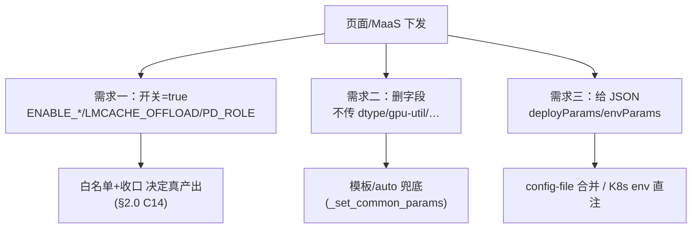

# 三特性使能改造 + 参数删减/自定义透传 — wings-control 实施文档（代码就绪版）

> 范围：wings-control / wings-accel 侧。依据：反串讲文档（目标态）+ 当前仓库代码（基线态）。
> 本版按已拍板决策写到**可直接照着改代码**的程度；仍需你给值的事实集中在 §6。

## 0. 已拍板决策（实现基线，不再假设）

| 决策           | 取定                                                         |
| -------------- | ------------------------------------------------------------ |
| 白名单**载体** | 代码内常量表，放 `utils/model_utils.py`（类比现有 `INDEXCACHE_ARCHS`） |
| 白名单**粒度** | `(engine, 模型名标识, 卡型标识)` 三维                        |
| 投机**地板**   | **恒产 suffix**：开关 on 时未命中白名单也产 suffix（主反串讲口径） |
| **范围**       | 核心三件（使能改造/参数删减/自定义透传）+ **C6 PD 一票否决** + **C7 删软FP8/算子加速**；稀疏**只做精度档=保持现状**（性能档不做）；**TokenBox native 泛化不在本次** |

---

## 0.5 触发矩阵（页面传什么 → wings 在哪判定 → 才执行）

> 三个需求的**触发极性不同**，这是理解全局的入口：
>
> - **需求一 = 开关「置真」触发**（env/CLI = true，再由白名单决定是否真产出）
> - **需求二 = 字段「缺省」触发**（页面**不传** → 落模板/auto）
> - **需求三 = 字段「存在」触发**（deployParams/envParams 非空 → 透传）



### A) 需求一 · 三特性使能（开关置真触发；白名单决定真产出）

> 链路：**页面字段 → MaaS 映射 → wings 入参(env/CLI) → 判定点(file:line) → 执行**。
> 改名仅在页面/MaaS；wings 入参口径不变（A1）。`🆕`=本次新增入参/判定。

**SmartDecoding（投机）**

| 页面字段                                                 | wings 入参                                                   | 判定点                                                       | 执行                             |
| -------------------------------------------------------- | ------------------------------------------------------------ | ------------------------------------------------------------ | -------------------------------- |
| `enableSmartDecoding=true`                               | `ENABLE_SPECULATIVE_DECODE=true`（`--enable-speculative-decode`） | `_should_append_auto_speculative_config` vllm_adapter:2722（开关真 且 engine_config 无 speculative_config） | 合成 `--speculative-config`      |
| `assistantModel`（辅助模型目录）                         | `SPECULATIVE_DECODE_MODEL_PATH`                              | `resolve_speculative_strategy` 2554（有 path）               | 走 eagle3 / draft_model          |
| —（隐式）`(模型,卡)` 命中 spec `🆕`                       | 由 model_name/path + 卡型解析                                | `feature_allowed(...,"spec")` §2.3                           | 命中→MTP；**未命中→suffix 地板** |
| `SPECULATIVE_TOKEN_RANGE` / `DRAFT_CONFIDENCE_THRESHOLD` | 同名 env                                                     | 自适应草稿注入                                               | 注入 spec config 字段            |

> 开关默认开启，用户可关闭

**SmartSparse（稀疏）**

| 页面字段                            | wings 入参                                       | 判定点                                                       | 执行                   |
| ----------------------------------- | ------------------------------------------------ | ------------------------------------------------------------ | ---------------------- |
| `enableSmartSparse=true`            | `ENABLE_SPARSE=true`（`--enable-sparse`）        | `apply_effective_feature_enablement` §2.0（`switch AND "sparse"∈白名单`） | 命中→IndexCache 或 FP8 |
| —（隐式）GLM-5.1·Ascend `forced`    | model_name 含 `glm-5.1` + engine=vllm_ascend     | `"sparse"∈forced`（§2.0）                                    | **开关 off 也产**稀疏  |
| `smartSparseLevel` `🆕`（精度/性能） | `SMART_SPARSE_LEVEL`（C3 新增；本次只精度=现状） | `_build_kv_sparse_cmd` 2835/2848/2852                        | `index_topk_freq`(4/8) |

> Maas：新增环境变量，SMART_SPARSE_LEVEL，**Accuracy  Performance**

**SmartKVCache（卸载）**

| 页面字段                                         | wings 入参                                                   | 判定点                                                       | 执行                      |
| ------------------------------------------------ | ------------------------------------------------------------ | ------------------------------------------------------------ | ------------------------- |
| `enableSmartKvCache=true`                        | `LMCACHE_OFFLOAD=true`（纯 env，无 CLI flag）                | `apply_effective_feature_enablement` §2.0（`"offload"∈白名单`）→ `get_lmcache_env()` config_loader:1036 | 注入 `kv_transfer_config` |
| `kvCacheMemoryMode=auto` `🆕`                     | `LMCACHE_MAX_LOCAL_CPU_SIZE=auto`                            | `resolve_offload_cpu_capacity_gb`（C4，auto 分支）           | 自算容量 + `<阈值` 熔断   |
| `kvCacheMemoryMode=custom` + `kvCacheMemorySize` | `LMCACHE_LOCAL_CPU=true` + `LMCACHE_MAX_LOCAL_CPU_SIZE=<GB>` | `_build_cache_env_commands` 688-692                          | 透传 CPU 容量             |
| `kvCacheDiskSize` / `kvCacheDiskPath`            | `LMCACHE_LOCAL_DISK` + `LMCACHE_MAX_LOCAL_DISK_SIZE`         | `_build_cache_env_commands` 694-695                          | 磁盘卸载 + YAML           |
| （QAT，老逻辑）                                  | `LMCACHE_QAT=true`                                           | `get_qat_env()` 195                                          | QAT 硬件压缩              |

> Maas：内存自动计算逻辑，复用`LMCACHE_MAX_LOCAL_CPU_SIZE`，auto传入wings自动计算，具体数值，则不计算。整个pod的内存，需要新增环境变量，

**PD（一票否决）**

| 触发    | wings 入参      | 判定点                                                       | 执行                              |
| ------- | --------------- | ------------------------------------------------------------ | --------------------------------- |
| PD 角色 | `PD_ROLE=P`/`D` | `apply_effective_feature_enablement` §2.0（`get_pd_role_env()`） | **三特性全关，仅留 PD connector** |

### B) 需求二 · 参数删减（字段「缺省」触发，极性反转）

> 触发 = 页面**不传**该字段 → 不再「显式」→ 落模板或 argparse 默认（`_set_common_params` 762-774）。

| 页面删除字段                                                 | 不传后落到                      | 判定点                          | 结果                                             |
| ------------------------------------------------------------ | ------------------------------- | ------------------------------- | ------------------------------------------------ |
| `dtype` / `kv-cache-dtype`                                   | argparse `auto`                 | `_set_common_params` 766-773    | 模板有则用，否则 `auto`（无害）                  |
| `gpu-memory-utilization`                                     | argparse **0.9**                | 同上                            | 模板值 / **0.9**（⚠非最优，需 C8 补模板）        |
| `block-size`/`quantization`/`seed`/`quantization-param-path` | argparse 默认                   | 同上                            | 模板值 / 默认（`quantization` 空→靠自动检测，⚠） |
| `enable-chunked-prefill`/`enable-prefix-caching`/`enable-expert-parallel` | argparse **False**（定值，C10） | 同上                            | 模板写则 true，否则**静默 False**（⚠MoE 掉 EP）  |
| `max-num-seqs`/`max-num-batched-tokens`                      | `🆕`改 `None`（C9）              | `cli_val is None: continue` 766 | **不下发 → vLLM auto**                           |

> Maas ：主要是删减操作，具体删减的参数，今天下班前提供。

### C) 需求三 · JSON自定义透传（字段「存在」触发）

| 页面字段                              | wings 入参                                   | 判定点                                  | 执行                                               |
| ------------------------------------- | -------------------------------------------- | --------------------------------------- | -------------------------------------------------- |
| `deployParams`（自定义启动字段 JSON） | `CONFIG_FILE` / `--config-file`（JSON 文本） | `_load_user_config` 1718（config 非空） | 归一 kebab→snake → 合并 `engine_config` → 渲染 CLI |
| `deployParams` + 强制覆盖             | `CONFIG_FORCE=true`                          | `get_config_force_env()` 2733           | 用户配置**独占**，跳过模板                         |
| `envParams`（自定义环境变量 JSON）    | **直接 K8s Pod env**（MaaS 映射 `EnvVar[]`） | **wings 无判定**（引擎容器继承 env）    | 直达 vLLM 进程，**不过 wings、不拼 CLI**           |

> Maas：找傲宇确认json内部参数设计的逻辑（vllm，sglang，mindie），json页面开启后，需要环境变量承载；引擎侧环境变量，需要统一放置在一起，不要放在全局中。
>
> wings：依旧需要使能加速特性。（0708先不做）

---

## 1. C1 · 白名单模块（完整代码，可直接落）

### 1.1 常量表 — 新增于 `utils/model_utils.py`

> 已用反串讲两张「模型特性清单」表种值。`spec=投机 sparse=稀疏 offload=卸载`。
> 模型名/卡型标识=**小写子串，任一命中即可**；卡型 `"*"`=任意卡。

```python
# utils/model_utils.py  （放在 INDEXCACHE_ARCHS 附近）
# 每条 5-tuple = (engine, (模型名标识...), (卡型标识...|"*"), 允许特性, 强制开特性⊆允许)
# 来源：反串讲 0430 兼容性列表 + 0DAYS(26.0.3)。新增模型按此格式追加。
SMART_FEATURE_WHITELIST: tuple = (
    # ── NVIDIA (vllm) ──  卡：NRP0500(72G) / NH02(141G)
    # 5-tuple: (engine, 名标识, 卡标识|"*", 允许特性=开关on才产, 强制开=off也产 ⊆允许特性)
    ("vllm",        ("qwen3.5-397b","qwen3_5-397b"), ("*",),           frozenset({"spec","sparse"}),           frozenset()),
    ("vllm",        ("glm-4.7",),                    ("*",),           frozenset({"spec","sparse","offload"}), frozenset()),
    ("vllm",        ("glm-5.1","glm5.1"),            ("*",),           frozenset({"spec","sparse"}),           frozenset()),
    ("vllm",        ("minimax-m2.7","minimax-m27"),  ("*",),           frozenset({"spec","sparse","offload"}), frozenset()),
    # ── Ascend (vllm_ascend) ──  卡：910B3(64G) / 910C(128G)
    ("vllm_ascend", ("glm-4.7",),                    ("910b","910c"),  frozenset({"spec","offload"}),          frozenset()),
    ("vllm_ascend", ("minimax-m2.5","minimax-m25"),  ("910b","910c"),  frozenset({"spec","offload"}),          frozenset()),
    ("vllm_ascend", ("deepseek-v3.2","deepseek_v3.2"),("910c",),       frozenset({"spec","offload"}),          frozenset()),
    ("vllm_ascend", ("deepseek-v4-flash","v4-flash"),("910b","910c"),  frozenset({"spec","offload"}),          frozenset()),
    ("vllm_ascend", ("glm-5.1","glm5.1"),            ("910b","910c"),  frozenset({"sparse"}),                  frozenset({"sparse"})),  # 强制开、关不掉
    # TODO(§6-②): 老模型 top3 待补；NV 卡码 NRP0500/NH02 是否进 key 待定(现用 "*")
)
```

### 1.2 卡型解析 — 新增于 `utils/device_utils.py`

```python
def resolve_card_token(hardware_env: dict | None = None) -> str:
    """返回小写卡型标识，用于白名单匹配。来源优先级：
       device_details[0].name → WINGS_DEVICE_NAME → 显存推断(H20)。"""
    name = ""
    if hardware_env:
        details = hardware_env.get("details") or []
        if details and isinstance(details[0], dict):
            name = str(details[0].get("name", ""))
    name = (name or os.getenv("WINGS_DEVICE_NAME", "")).strip().lower()
    if name:
        return name           # 例 "ascend910b3" / "ascend910c" → 含 "910b"/"910c"
    # NV 无 device name 时用显存兜底（H20-96G/141G）
    mem = _safe_float(os.getenv("WINGS_DEVICE_MEMORY", ""))
    return is_h20_gpu(mem).lower() if mem else ""
```

### 1.3 解析器 + 门控判定 — 新增于 `utils/model_utils.py`

```python
def resolve_feature_whitelist(engine, model_name, model_path, card_token):
    """返回 (允许特性, 强制开特性)；未命中返回 (空, 空)。"""
    hay = " ".join(str(x).lower() for x in (model_name, model_path) if x)
    ct = (card_token or "").lower()
    for wl_engine, name_tokens, card_tokens, feats, forced in SMART_FEATURE_WHITELIST:
        if wl_engine != engine:
            continue
        if not any(tok in hay for tok in name_tokens):
            continue
        if not (("*" in card_tokens) or any(c in ct for c in card_tokens)):
            continue
        return feats, forced
    return frozenset(), frozenset()

def feature_allowed(engine, model_name, model_path, card_token, feature) -> bool:
    feats, _ = resolve_feature_whitelist(engine, model_name, model_path, card_token)
    return feature in feats
```

> **设计要点**：删除散点强制开 `_force_kv_sparse_for_glm51_ascend`(vllm_adapter.py:2749) / `_force_kv_sparse_for_v4flash_nv`(2776)；其语义=「白名单 forced」，已并入表（GLM-5.1·Ascend sparse=forced；V4-Flash·NV 见 §6-④）。优先级：**forced > 开关；白名单未命中即不产**。具体产出/收口由 §2.0 C14 统一处理。

---

## 2. 使能收口 + 门控 diff

### 2.0 C14 · 使能收口（单一真相源，先于一切消费者）★本次新增

**为什么必须**：白名单若只在三产出口拦，**开关标志没改**，下游 5+ 处仍读原始开关 → 感知/补丁/回退集体漂移：

| 消费者                               | 行                       | 读什么                              | 漂移后果                                             |
| ------------------------------------ | ------------------------ | ----------------------------------- | ---------------------------------------------------- |
| `_write_advanced_features_json`      | wings_entry.py:965-967   | merged+env                          | 页面感知**错报** `speculative_decode/sparse_kv=true` |
| `_collect_indexcache_patch_features` | wings_entry.py:468       | `enable_sparse`+arch                | 白名单外仍装 indexcache 补丁                         |
| `_collect_enabled_features`          | wings_entry.py:298       | `ENABLE_SPARSE/LMCACHE_OFFLOAD` env | 装用不上的补丁                                       |
| `_build_cache_env_commands`          | vllm_adapter.py:656      | `get_lmcache_env()`                 | 导出无用 LMCache env                                 |
| `_has_advanced_features`/回退        | wings_entry.py:1003/1261 | merged+env                          | 拼错 fallback 命令                                   |

**怎么改**：白名单**解析一次**，把「请求开关」收敛成「有效开关」回写 `cmd_known_params` + `os.environ`（mutate env 已有先例：`SD_ENABLE/SPARSE_ENABLE`）。**收口后上面 5 处全自动一致，无需逐点改**。

```python
# config_loader.py 新增；在 load_and_merge_configs(2668) 中
#   _auto_select_engine(2719) 之后、_get_model_specific_config(2737) 之前调用：
#     apply_effective_feature_enablement(cmd_known_params, hardware_env)
#   ★位置关键★：必须早于 _merge_vllm_params→_set_kv_cache_config(382)，否则卸载收不掉。
def apply_effective_feature_enablement(p, hardware_env):
    engine = p.get("engine", "")
    card = resolve_card_token(hardware_env)          # env 兜底，无需 ctx 透传
    name, path = p.get("model_name"), p.get("model_path")

    # C6 PD 一票否决：三特性全关（US646 暂不支持 PD）
    if get_pd_role_env():
        p["enable_sparse"] = p["enable_speculative_decode"] = False
        for n in ("ENABLE_SPARSE","SPARSE_ENABLE","ENABLE_SPECULATIVE_DECODE","SD_ENABLE","LMCACHE_OFFLOAD"):
            os.environ[n] = "false"
        return

    feats, forced = resolve_feature_whitelist(engine, name, path, card)
    # 稀疏有效 = 强制开 OR (开关 on AND 命中)。GLM-5.1·Ascend 走 forced 分支(关不掉)
    sparse_eff = ("sparse" in forced) or (bool(p.get("enable_sparse")) and "sparse" in feats)
    p["enable_sparse"] = sparse_eff
    os.environ["ENABLE_SPARSE"] = os.environ["SPARSE_ENABLE"] = "true" if sparse_eff else "false"
    # 卸载：白名单外收口为关（无 forced 场景）
    if get_lmcache_env() and "offload" not in feats:
        os.environ["LMCACHE_OFFLOAD"] = "false"
    # 投机：suffix 地板恒产 → 开关不收口（保持 true 是诚实的）；
    #   MTP-vs-suffix 仍由 §2.3 在 resolve_speculative_strategy 内 gate。
```

> **简化红利**：收口后 §2.1/§2.2 的「产出口再判白名单」基本变冗余——产出口直接读已收口的开关；仅 §2.3 投机仍需 MTP gate。

### 2.1 稀疏产出口 — `vllm_adapter.build_start_script()` (2985)（收口后简化）

```python
# 改前：三路 OR（含两个 _force_*）
# 改后：白名单/forced 已由 C14 收口进 enable_sparse；删 _force_kv_sparse_*(2749/2776)
should_emit_sparse = bool(params.get("enable_sparse"))
sparse_args = _build_kv_sparse_cmd(params, engine) if should_emit_sparse else ""
```

### 2.2 卸载产出口 — `config_loader._set_kv_cache_config()` (1036)

```python
# 收口已把白名单结果写进 LMCACHE_OFFLOAD env；此处保持原逻辑、无需再判白名单
lmcache_offload = get_lmcache_env()   # 已是"有效值"
```

### 2.3 投机 — `vllm_adapter.resolve_speculative_strategy()` (2568)（**suffix 地板恒留**）

```python
mtp_method = _resolve_mtp_method(model_info.model_architecture)
if mtp_method:
    card = resolve_card_token()      # env 兜底取卡型，无需透传 hardware_env
    if not feature_allowed(engine, params.get("model_name"), params.get("model_path"), card, "spec"):
        logger.info("[SpecDecode] spec not in whitelist → suffix floor (arch=%s)", model_info.model_architecture)
        return "suffix"                       # ← 决策：恒产 suffix，不返回空
    lmcache_effective = get_lmcache_env()
    ...   # 现有卸载×投机降级 + V4 例外不变
    return "suffix" if lmcache_effective else mtp_method
return "suffix"
```

**修掉真实 bug**：GLM-5.1·Ascend（清单 sparse-only）现状误产 `deepseek_mtp` → 改后回落 suffix。

---

## 3. C6 PD 一票否决 / C7 删软FP8（精确 diff）

### 3.1 C6 — PD 一票否决（**已由 §2.0 C14 收口承担，几乎无需单独改**）

收口在 PD 命中时已把 `LMCACHE_OFFLOAD/ENABLE_SPARSE/ENABLE_SPECULATIVE_DECODE` 全置 false。于是 `_set_kv_cache_config`(1075) 因 `lmcache_offload=False` **自然走 `elif pd_role:` 分支 → 仅 `_get_pd_config`**，原 `if lmcache_offload and pd_role:` 的 MultiConnector 分支变死代码。

```python
# 唯一可选清理：删掉已不可达的 MultiConnector 共存分支（1075-1087），保留：
elif pd_role:
    config = _get_pd_config(ctx, pd_role)   # PD-only，收口后这是唯一活路径
```

**影响**：覆盖单机 + 分布式(2213) 两路（收口在 config 合并前执行，两路都经过）。无需在 `_merge_vllm_params` 另置假——收口已统一处理。

### 3.2 C7 — 删开关、留自动量化

```python
# config_loader.py:386  删调用 _set_operator_acceleration(params, ctx)（整函数 566 可删）
#   → 移除 use_kunlun_atb 开关注入（唯一真·开关驱动项；确认无模型依赖昆仑 ATB，见 §6-⑤）
# _set_soft_fp8(642)/_set_soft_fp4(685)：行为是自动检测驱动，quantization='ascend' 原样保留；
#   仅删 _log_soft_fp8_switch_state 里 get_soft_fp8_env/get_soft_fp4_env 的读取（纯日志）
# wings_entry.py:59 _FEATURE_SWITCH_MAP 删两行：
#   "ENABLE_SOFT_FP8": "soft_fp8",
#   "ENABLE_SOFT_FP4": "soft_fp4",
```

---

## 4. 需求二/三（参数删减 + 透传，精确 diff）

### 4.1 C8 模板补值

- 在 `config/defaults/{ascend,nvidia,vllm}_default.json` 的 `model_deploy_config/<arch>/<模型名>/<engine>` 补：`gpu_memory_utilization / block_size / quantization / enable_expert_parallel`。
- 合并规则（`_set_common_params` 762-774）：删参后字段非显式 → 模板有则用模板，无则落 argparse 定值。
- **必须跑挂兜底**：`quantization` 删后靠 C7 保留的自动检测；MoE 必须补 `enable_expert_parallel`（见 C10）。

### 4.2 C9 seqs/tokens 真 auto — `start_args_compat.py:288/291`

```python
# 改前 default=_env_int("MAX_NUM_SEQS",32) / default=_env_int("MAX_NUM_BATCHED_TOKENS",4096)
# 改后 default=_env_int_or_none("MAX_NUM_SEQS") / default=_env_int_or_none("MAX_NUM_BATCHED_TOKENS")
# None → _set_common_params(766) `cli_val is None: continue` 跳过下发 → vLLM auto
# ⚠ 模板里也别写死这两个键，否则用模板值
```

### 4.3 C10 布尔删参陷阱 — `start_args_compat.py:286/290/292`

- `_add_bool` 默认=定值 **False**（81 行），`enable-expert-parallel` 删后静默 False → **MoE 掉 EP**。
- 处理：①MoE 模型模板显式写 `enable_expert_parallel:true`（并入 C8 盘点）；②或这三个布尔默认改 None 走「未传不下发」。

### 4.4 C11/C12/C13 透传

- **C11 deployParams**：复用现有 `--config-file`/`CONFIG_FILE`→`_load_user_config`(1718)，wings 无改。
- **C12 envParams**：MaaS 注入 Pod env；wings 加保留字黑名单（禁覆盖 `WINGS_*/LMCACHE_*/PD_*/SD_*/SPARSE_*`）。
- **C13 自定义 vs 白名单优先级**（需求一×三耦合点）：用户在 deployParams 显式写 `kv_transfer_config/kv_cache_dtype/speculative_config` 时是否覆盖白名单——**待定见 §6-③**；实现挂靠现有「已预置不合成」范式（`_should_append_auto_speculative_config` 2722）。

---

## 5. 实现注：`card_token` 与收口的执行点

收口（§2.0）在 `load_and_merge_configs` 内执行，**直接拿到 `hardware_env`** → `resolve_card_token(hardware_env)`，最准。
收口之后的产出口（§2.3 投机在 adapter 内）拿不到 hardware_env，则用 `resolve_card_token()` 的 **env 兜底**（`WINGS_DEVICE_NAME`/显存）解析同一卡型——两处结果一致即可，无需把 card_token 透传进 params。

> 即：**收口点用 hardware_env，产出口用 env 兜底**，`resolve_card_token` 同一函数双入口。Ascend 用 `910b/910c` 子串、NV 用显存兜底，env 路径足够可靠（§6-① 仅影响 NV 卡码细分）。

---

## 6. 仍需你给值的事实（只剩这些，给了即可全量收口）

| #    | 事实                                                         | 卡住               | 现占位               |
| ---- | ------------------------------------------------------------ | ------------------ | -------------------- |
| ①    | **NV 卡码对齐**：`WINGS_DEVICE_NAME` 在 NV 上的实际字符串？是否需用 NRP0500/NH02 区分（同模型不同卡特性是否不同）？ | 白名单 NV 行卡维度 | 现用 `"*"`           |
| ②    | **老模型 top3 白名单**：反串讲遗留的「每家 top3 老模型 × 特性」清单 | 白名单完整性       | 表内 TODO            |
| ③    | **C13 优先级**：deployParams 手写 `kv_transfer_config` 等，用户显式 > 白名单 还是反之？ | C13 实现方向       | 暂按「用户显式优先」 |
| ④    | **V4-Flash·NV 现状去留**：NV 表无 V4-Flash，但现有 day0 强制开稀疏 + native 卸载。本次（TokenBox native 不做）要保留 V4-Flash·NV day0 吗？保留则白名单加一条 `("vllm",("v4-flash",),("*",),{"offload"})` 并对 native 单独开门 | C1 边界            | 现状会被白名单关掉   |
| ⑤    | **昆仑 ATB 去留**：删 `use_kunlun_atb` 开关后，是否有 Ascend 模型依赖它？ | C7 安全性          | 暂按可删             |
| ⑥    | **稀疏精度档现值确认**：精度档 = 现 `index_topk_freq` 4(NV DSA/V4-Flash)/8(GLM-5.1·Ascend)，确认即定档（性能档不做） | C3                 | 保持现状             |

> ①②③⑥ 给值后 §1 表与 §4 即最终态；④⑤是 yes/no。

---

## 7. 影响范围 + 顺序

| 文件:行                                    | 项         | 回归关注                                       |
| ------------------------------------------ | ---------- | ---------------------------------------------- |
| `model_utils.py`(新表+解析器)              | C1,C2,C4   | 所有模型特性判定                               |
| `device_utils.py`(新 resolve_card_token)   | C1         | 卡型识别准确性                                 |
| **`config_loader.py:2720`(新 收口)**       | **C14,C6** | **感知/补丁/回退一致性（5 处消费者随之收口）** |
| `vllm_adapter.py:2985/2568`                | C1,C2      | 开稀疏/投机的模型；删 `_force_*`；产出口简化   |
| `config_loader.py:1036/1075`               | C4,C6      | 开卸载的模型 + 全 PD 部署                      |
| `wings_entry.py:965/468/298/1003/1261`     | C14        | **不再单独改——读收口后的有效值即一致**         |
| `config_loader.py:566`+`wings_entry.py:59` | C7         | 昆仑 ATB / accel 补丁清单                      |
| `config/defaults/*.json`                   | C8,C9,C10  | **删参后全部模型**（薄模板/MoE 重点）          |
| `start_args_compat.py:286-292`             | C9,C10     | 全模型默认                                     |


| 项                       | 人日                       |
| ------------------------ | -------------------------- |
| C1 白名单表+解析器       | 1–2                        |
| **C14 收口（含 C6 PD）** | **2–3（含 5 消费者回归）** |
| C2 投机门控              | 1                          |
| C4 卸载白名单+auto容量   | 3–4                        |
| C7 删开关                | 1–2                        |
| C8 模板补值（含 C10）    | 4–6                        |
| C9 / C11/C12/C13         | 各 0.5–2                   |
| **合计(wings)**          | **约 15–24**               |

> C14 是把白名单变「单一真相源」的关键——没有它，C1 只gate产出口，感知/补丁/回退仍错。
> auto 容量自算（C4 内）的 OS 常量/DP 占用/熔断阈值仍依赖运维口径；未给前 auto 档先按「显式值透传」兜底，不阻塞主线。