# 需求一 · 三特性使能改造 — wings-control 实施文档

> 母文档/索引见 [smart.md](smart.md)。本文件承载：§0 裁定 · A) 触发表 · §1 白名单 · §2 收口/门控 · §3 auto容量/PD/删FP8 · §4 状态监控 · §5 实现注 · 附录A–D（流程图/组合/边界/触发参考）。
> spec=投机 sparse=稀疏 offload=卸载。`🆕`=本次新增入参/判定。
> 跨需求的「§6 未决事实」「§7 影响范围/排期」仍在索引 [smart.md](smart.md)。

---

## 诉求与文档导航（本文件覆盖什么）

> 本文件按以下诉求逐步建成（来自评审对话）；实现口径一律以 **§0 裁定**为准。

| # | 诉求 | 落在 |
| --- | --- | --- |
| 1 | 三特性使能改造主体：白名单门控 + 收口单一真相源 + 三产出口 + PD 一票否决 + 删软FP8 | A) · §1 · §2 · §3 |
| 2 | 三条裁定收窄口径：**只开关不强制(无 forced)** / **不管老模型** / **graph 默认 full** | §0 |
| 3 | KV卸载 auto 容量：本节点容器内存 → 可用 offload **反向预算公式**(线性估引擎自耗 / swap=0 / margin / 熔断) | §3.0 C4 |
| 4 | 状态监控细粒度 = **记录「用哪种变体」**(非生命周期状态)；bool 与一刀切回退**不动** | §4 |
| 5 | 可视化：**per-case mermaid 子图**(多张，非大图) | 附录A |
| 6 | **组合场景**(入参→执行→出参) + 白名单**全枚举矩阵** | 附录B |
| 7 | **非白名单 / 边界**场景详版(含真实命令实例) | 附录C |
| 8 | **开发触发参考**(模拟入参触发各功能，供造测试用例) | 附录D |

**导航**：§0 裁定基线 → A) 触发表 → §1 白名单(C1) → §2 收口(C14)/门控 → §3 auto容量(C4)/PD(C6)/删FP8(C7) → §4 状态监控 → §5 card_token → 附录 A(决策图) / B(组合) / C(边界·真实命令) / D(开发触发)。

---

## 0. 本次裁定基线（指导写码，优先级最高）★

> 三条裁定收窄实现口径，下文所有代码以此为准：
>
> 1. **只开关、不强制（无 forced）**：有效使能 = `页面开关 on AND 特性 ∈ 白名单`。白名单**只收窄、永不强开**。删除 forced 列与所有 day0 强制开（`_force_kv_sparse_*`），GLM-5.1·Ascend(sparse)、V4-Flash·NV(offload) 一律降为普通开关门控。唯一的反向操作是 **C6 PD 一票否决（force-OFF，仍属收窄）**。
> 2. **不管老模型**：白名单只覆盖文档已列模型 + 后续 0day 适配模型；未适配模型「miss → 不产」即可接受（0day 适配时顺带追加白名单行，§6-② 作废）。
> 3. **C4 容量走线性估算（不查表、不读 graph）**：可用卸载容量 = 本节点容器 DRAM − 引擎自耗 − swap − margin；引擎自耗按 `7G×(TP×DP)+3G` 线性估，**不查 per-模型 PSS 表、不读 graph 三态**（自然无需三态判定 plumbing）。over-reserve 偏保守、永不 OOM。
>
> ⚠ **删 forced 的连带确认（动手前回答）**：GLM-5.1·Ascend(sparse) / V4-Flash·NV(offload) 当初强制开，是「优化」还是「正确性必需」？若该特性关闭后模型即不可正确运行，则「可被用户关」是脚枪——需确认这些模型在对应特性 off 时仍能跑通；若不能，由**适配层**兜底（仍非 forced，不走白名单强开）。

---

## 0.1 动手前必清（前置约束 / 连带确认）★

> 写码前需先有答案、或先满足的硬前置，散落各处，此处汇总成一张表。

| # | 前置 / 待答 | 性质 | 详见 |
| --- | --- | --- | --- |
| 1 | 删 forced 连带：GLM-5.1·Ascend(sparse) / V4-Flash·NV(offload) 在对应特性 **off 时能否正确运行** | yes/no；否则适配层兜底（非 forced） | §0 ⚠ |
| 2 | Ascend 卡型依赖：`hardware_info.json` **必须填 `details[0].name`**（含 910b/910c），否则 `card=''` → 整条 Ascend 白名单 miss | MaaS 保证（硬前置） | C.5 ⚠ · §1.2 |
| 3 | V4-Flash·NV 的 sparse/offload：白名单无此行 → **当前不可触发**（原 day0 强制开已按 §0 删） | 需 §6-④ 决定是否补行 | 附录D.2/D.3 · [smart.md](smart.md) §6-④ |
| 4 | C4 线性公式系数核定（引擎自耗 `7×(TP×DP)+3`、margin 10%）/ 权重挂载 NFS / 熔断下限 | 运维·实测校准，先保守兜底 | §3.0 待运维表 |
| 5 | 昆仑 ATB 删除安全 / NV 卡码是否细分 | yes/no | [smart.md](smart.md) §6-⑤ / §6-① |

> 1–3 是 §0 三裁定的**直接连带，必须在 C1/C14 编码前定**；4–5 有保守兜底，不阻塞主线起步。

---

## A) 需求一 · 三特性使能（开关置真触发；白名单决定真产出）

> 链路：**页面字段 → MaaS 映射 → wings 入参(env/CLI) → 判定点(file:line) → 执行**。
> 改名仅在页面/MaaS；wings 入参口径不变（A1）。`🆕`=本次新增入参/判定。

**SmartDecoding（投机）**

| 页面字段                                                 | wings 入参                                                   | 判定点                                                       | 执行                             |
| -------------------------------------------------------- | ------------------------------------------------------------ | ------------------------------------------------------------ | -------------------------------- |
| `enableSmartDecoding=true`                               | `ENABLE_SPECULATIVE_DECODE=true`（`--enable-speculative-decode`） | `_should_append_auto_speculative_config` vllm_adapter:2722（开关真 且 engine_config 无 speculative_config） | 合成 `--speculative-config`      |
| `assistantModel`（辅助模型目录）                         | `SPECULATIVE_DECODE_MODEL_PATH`                              | `resolve_speculative_strategy` 2554（有 path）               | 走 eagle3 / draft_model          |
| —（隐式）`(模型,卡)` 命中 spec `🆕`                       | 由 model_name/path + 卡型解析                                | `feature_allowed(...,"spec")` §2.3                           | 命中→MTP；**未命中→suffix 地板** |
| `SPECULATIVE_TOKEN_RANGE` / `DRAFT_CONFIDENCE_THRESHOLD` | 同名 env                                                     | 自适应草稿注入                                               | 注入 spec config 字段            |

> 开关默认开启，用户可关闭

**SmartKVSparse（稀疏）**

| 页面字段                            | wings 入参                                       | 判定点                                                       | 执行                   |
| ----------------------------------- | ------------------------------------------------ | ------------------------------------------------------------ | ---------------------- |
| `enableSmartSparse=true`            | `ENABLE_SPARSE=true`（`--enable-sparse`）        | `apply_effective_feature_enablement` §2.0（`switch AND "sparse"∈白名单`） | 命中→IndexCache 或 FP8 |
| —（曾 forced）GLM-5.1·Ascend        | model_name 含 `glm-5.1` + engine=vllm_ascend     | 同上（§0 裁定1：降为普通开关门控，不再 forced）             | 开关 on 且命中才产；**off 即不产** |
| `smartSparseLevel` `🆕`（精度/性能） | `SPARSE_LEVEL=<accuracy_first\|performance_first>`（C3 新增；本次只实现 accuracy_first=现状） | `_build_kv_sparse_cmd` 2835/2848/2852                        | `index_topk_freq`(4/8) |

> Maas：新增环境变量 `SPARSE_LEVEL`，取值 **`accuracy_first` / `performance_first`**（精度优先 / 性能优先）；本次只实现 `accuracy_first`，`performance_first` 未实现需告警回落 `accuracy_first`（见附录 A.4）。

**SmartKVCache（卸载）**

| 页面字段                                         | wings 入参                                                   | 判定点                                                       | 执行                      |
| ------------------------------------------------ | ------------------------------------------------------------ | ------------------------------------------------------------ | ------------------------- |
| `enableSmartKvCache=true`                        | `LMCACHE_OFFLOAD=true`（纯 env，无 CLI flag）                | `apply_effective_feature_enablement` §2.0（`"offload"∈白名单`）→ `get_lmcache_env()` config_loader:1036 | 注入 `kv_transfer_config` |
| `kvCacheMemoryMode=auto` `🆕`                     | **不下发** `LMCACHE_MAX_LOCAL_CPU_SIZE`（缺省即 auto）+ 仅注入 `LMCACHE_POD_MEMORY=<本节点 DRAM GiB>` `🆕` | `resolve_offload_cpu_capacity_gb`（§3.0 C4，auto 分支）      | 反向预算容量 + `<阈值` 熔断 |
| `kvCacheMemoryMode=custom` + `kvCacheMemorySize` | `LMCACHE_LOCAL_CPU=true` + `LMCACHE_MAX_LOCAL_CPU_SIZE=<GB>` | `_build_cache_env_commands` 688-692                          | 透传 CPU 容量             |
| `kvCacheDiskSize` / `kvCacheDiskPath`            | `LMCACHE_LOCAL_DISK` + `LMCACHE_MAX_LOCAL_DISK_SIZE`         | `_build_cache_env_commands` 694-695                          | 磁盘卸载 + YAML           |
| （QAT，老逻辑）                                  | `LMCACHE_QAT=true`                                           | `get_qat_env()` 195                                          | QAT 硬件压缩              |

> Maas：内存自动计算逻辑——**auto 模式不下发 `LMCACHE_MAX_LOCAL_CPU_SIZE`**（变量缺省即代表 auto），仅注入 `LMCACHE_POD_MEMORY`（「本节点容器 DRAM 上限」GiB，非全 pod 之和，见 §3.0 C4）由 wings 自算；**custom 模式才下发 `LMCACHE_MAX_LOCAL_CPU_SIZE=<具体 GB>`**，wings 直接透传不算。
> ⚠ 判定口径：auto/custom **不靠字面值 `=auto` 区分**，而靠「`LMCACHE_MAX_LOCAL_CPU_SIZE` 缺省(空) 且 `LMCACHE_POD_MEMORY` 非空 → auto 自算；变量带数值 → custom 透传」。
**PD（一票否决）**

| 触发    | wings 入参      | 判定点                                                       | 执行                              |
| ------- | --------------- | ------------------------------------------------------------ | --------------------------------- |
| PD 角色 | `PD_ROLE=P`/`D` | `apply_effective_feature_enablement` §2.0（`get_pd_role_env()`） | **三特性全关，仅留 PD connector** |

---

## 1. C1 · 白名单模块（完整代码，可直接落）

### 1.1 常量表 — 新增于 `utils/model_utils.py`

> 已用反串讲两张「模型特性清单」表种值。`spec=投机 sparse=稀疏 offload=卸载`。
> 模型名/卡型标识=**小写子串，任一命中即可**；卡型 `"*"`=任意卡。

```python
# utils/model_utils.py  （放在 INDEXCACHE_ARCHS 附近）
# 每条 4-tuple = (engine, (模型名标识...), (卡型标识...|"*"), 允许特性)
#   ← 无 forced 列：只开关不强制（§0 裁定1，白名单只收窄、永不强开）
# 来源：反串讲 0430 兼容性列表 + 0DAYS(26.0.3)。新增模型（含 0day 适配）按此 4-tuple 追加。
SMART_FEATURE_WHITELIST: tuple = (
    # ── NVIDIA (vllm) ──  卡：NRP0500(72G) / NH02(141G)
    # 4-tuple: (engine, 名标识, 卡标识|"*", 允许特性=开关on才产)
    ("vllm",        ("qwen3.5-397b","qwen3_5-397b"), ("*",),           frozenset({"spec","sparse"})),
    ("vllm",        ("glm-4.7",),                    ("*",),           frozenset({"spec","sparse","offload"})),
    ("vllm",        ("glm-5.1","glm5.1"),            ("*",),           frozenset({"spec","sparse"})),
    ("vllm",        ("minimax-m2.7","minimax-m27"),  ("*",),           frozenset({"spec","sparse","offload"})),
    # ── Ascend (vllm_ascend) ──  卡：910B3(64G) / 910C(128G)
    ("vllm_ascend", ("glm-4.7",),                    ("910b","910c"),  frozenset({"spec","offload"})),
    ("vllm_ascend", ("minimax-m2.5","minimax-m25"),  ("910b","910c"),  frozenset({"spec","offload"})),
    ("vllm_ascend", ("deepseek-v3.2","deepseek_v3.2"),("910c",),       frozenset({"spec","offload"})),
    ("vllm_ascend", ("deepseek-v4-flash","v4-flash"),("910b","910c"),  frozenset({"spec","offload"})),
    ("vllm_ascend", ("glm-5.1","glm5.1"),            ("910b","910c"),  frozenset({"sparse"})),  # 曾 forced，已降为普通开关门控（§0 裁定1）
    # 新增模型按 4-tuple 追加；NV 卡码 NRP0500/NH02 是否进 key 待定(现用 "*")，见 §6-①
)
```

### 1.2 卡型解析 — 新增于 `utils/device_utils.py`（依旧保留现状采用ENGINE-version去判定，这个后续放在需求二，三）

```python
def resolve_card_token(hardware_env: dict | None = None) -> str:
    """返回小写卡型标识，用于白名单匹配。来源优先级：
       device_details[0].name → WINGS_DEVICE_NAME → 显存推断(H20)。"""
    name = ""
    if hardware_env:
        details = hardware_env.get("details") or []
        if details and isinstance(details[0], dict):
            name = str(details[0].get("name", ""))
    name = (name or os.getenv("WINGS_DEVICE_NAME", "")).strip().lower()
    if name:
        return name           # 例 "ascend910b3" / "ascend910c" → 含 "910b"/"910c"
    # NV 无 device name 时用显存兜底（H20-96G/141G）
    mem = _safe_float(os.getenv("WINGS_DEVICE_MEMORY", ""))
    return is_h20_gpu(mem).lower() if mem else ""
```

> ⚠ **硬前置（见 §0.1#2，详 C.5）**：`details:[]` 且无 `WINGS_DEVICE_NAME` 时此函数返回 `''`，Ascend 白名单各行的 `910b/910c` **永不匹配 → 整条 Ascend 白名单 miss**。MaaS 须保证 Ascend 部署的 `hardware_info.json` 填 `details[0].name`。

### 1.3 解析器 + 门控判定 — 新增于 `utils/model_utils.py`

```python
def resolve_feature_whitelist(engine, model_name, model_path, card_token):
    """返回 允许特性 frozenset；未命中返回空集。无 forced（§0 裁定1：只开关不强制）。"""
    hay = " ".join(str(x).lower() for x in (model_name, model_path) if x)
    ct = (card_token or "").lower()
    for wl_engine, name_tokens, card_tokens, feats in SMART_FEATURE_WHITELIST:
        if wl_engine != engine:
            continue
        if not any(tok in hay for tok in name_tokens):
            continue
        if not (("*" in card_tokens) or any(c in ct for c in card_tokens)):
            continue
        return feats
    return frozenset()

def feature_allowed(engine, model_name, model_path, card_token, feature) -> bool:
    return feature in resolve_feature_whitelist(engine, model_name, model_path, card_token)
```

> **设计要点**：删除散点强制开 `_force_kv_sparse_for_glm51_ascend`(vllm_adapter.py:2749) / `_force_kv_sparse_for_v4flash_nv`(2776)——**不再以 forced 复活，直接并入普通开关门控**（§0 裁定1）。优先级：**白名单只收窄；开关 on 且命中才产，未命中即不产，永不强开**。具体产出/收口由 §2.0 C14 统一处理。

---

## 2. 使能收口 + 门控 diff

### 2.0 C14 · 使能收口（单一真相源，先于一切消费者）★本次新增

**为什么必须**：白名单若只在三产出口拦，**开关标志没改**，下游 5+ 处仍读原始开关 → 感知/补丁/回退集体漂移：

| 消费者                               | 行                       | 读什么                              | 漂移后果                                             |
| ------------------------------------ | ------------------------ | ----------------------------------- | ---------------------------------------------------- |
| `_write_advanced_features_json`      | wings_entry.py:965-967   | merged+env                          | 页面感知**错报** `speculative_decode/sparse_kv=true` |
| `_collect_indexcache_patch_features` | wings_entry.py:468       | `enable_sparse`+arch                | 白名单外仍装 indexcache 补丁                         |
| `_collect_enabled_features`          | wings_entry.py:298       | `ENABLE_SPARSE/LMCACHE_OFFLOAD` env | 装用不上的补丁                                       |
| `_build_cache_env_commands`          | vllm_adapter.py:656      | `get_lmcache_env()`                 | 导出无用 LMCache env                                 |
| `_has_advanced_features`/回退        | wings_entry.py:1003/1261 | merged+env                          | 拼错 fallback 命令                                   |

**怎么改**：白名单**解析一次**，把「请求开关」收敛成「有效开关」回写 `cmd_known_params` + `os.environ`（mutate env 已有先例：`SD_ENABLE/SPARSE_ENABLE`）。**收口后上面 5 处全自动一致，无需逐点改**。

```python
# config_loader.py 新增；在 load_and_merge_configs(2668) 中
#   _auto_select_engine(2719) 之后、_get_model_specific_config(2737) 之前调用：
#     apply_effective_feature_enablement(cmd_known_params, hardware_env)
#   ★位置关键★：必须早于 _merge_vllm_params→_set_kv_cache_config(382)，否则卸载收不掉。
def apply_effective_feature_enablement(p, hardware_env):
    engine = p.get("engine", "")
    card = resolve_card_token(hardware_env)          # env 兜底，无需 ctx 透传
    name, path = p.get("model_name"), p.get("model_path")

    # C6 PD 一票否决：三特性全关（US646 暂不支持 PD）
    if get_pd_role_env():
        p["enable_sparse"] = p["enable_speculative_decode"] = False
        for n in ("ENABLE_SPARSE","SPARSE_ENABLE","ENABLE_SPECULATIVE_DECODE","SD_ENABLE","LMCACHE_OFFLOAD"):
            os.environ[n] = "false"
        return

    feats = resolve_feature_whitelist(engine, name, path, card)
    # 有效 = 开关 on AND 命中白名单。无 forced（§0 裁定1）：白名单只收窄、不强开。
    sparse_eff = bool(p.get("enable_sparse")) and "sparse" in feats
    p["enable_sparse"] = sparse_eff
    os.environ["ENABLE_SPARSE"] = os.environ["SPARSE_ENABLE"] = "true" if sparse_eff else "false"
    # 卸载：白名单外收口为关
    if get_lmcache_env() and "offload" not in feats:
        os.environ["LMCACHE_OFFLOAD"] = "false"
    # 投机：suffix 地板恒产 → 开关不收口（保持 true 是诚实的）；
    #   MTP-vs-suffix 仍由 §2.3 在 resolve_speculative_strategy 内 gate。
```

> **简化红利**：收口后 §2.1/§2.2 的「产出口再判白名单」基本变冗余——产出口直接读已收口的开关；仅 §2.3 投机仍需 MTP gate。

### 2.1 稀疏产出口 — `vllm_adapter.build_start_script()` (2985)（收口后简化）

```python
# 改前：三路 OR（含两个 _force_*）
# 改后：白名单已由 C14 收口进 enable_sparse；删 _force_kv_sparse_*(2749/2776)，不再以 forced 复活（§0 裁定1）
should_emit_sparse = bool(params.get("enable_sparse"))
sparse_args = _build_kv_sparse_cmd(params, engine) if should_emit_sparse else ""
```

### 2.2 卸载产出口 — `config_loader._set_kv_cache_config()` (1036)

```python
# 收口已把白名单结果写进 LMCACHE_OFFLOAD env；此处保持原逻辑、无需再判白名单
lmcache_offload = get_lmcache_env()   # 已是"有效值"
```

### 2.3 投机 — `vllm_adapter.resolve_speculative_strategy()` (2568)（**suffix 地板恒留**）

```python
mtp_method = _resolve_mtp_method(model_info.model_architecture)
if mtp_method:
    card = resolve_card_token()      # env 兜底取卡型，无需透传 hardware_env
    if not feature_allowed(engine, params.get("model_name"), params.get("model_path"), card, "spec"):
        logger.info("[SpecDecode] spec not in whitelist → suffix floor (arch=%s)", model_info.model_architecture)
        return "suffix"                       # ← 决策：恒产 suffix，不返回空
    lmcache_effective = get_lmcache_env()
    ...   # 现有卸载×投机降级 + V4 例外不变
    return "suffix" if lmcache_effective else mtp_method
return "suffix"
```

**修掉真实 bug**：GLM-5.1·Ascend（清单 sparse-only）现状误产 `deepseek_mtp` → 改后回落 suffix。

---

## 3. KV卸载 auto 容量 / C6 PD 一票否决 / C7 删软FP8（精确 diff）

### 3.0 C4 — KV卸载 auto 容量（wings 反向预算 CPU 卸载内存）`🆕`

> 入参契约：auto 模式 **不下发 `LMCACHE_MAX_LOCAL_CPU_SIZE`**（缺省即 auto）+ 仅注入 `LMCACHE_POD_MEMORY=<本节点容器 DRAM 上限 GiB>`（上游新增注入，产生方式不属本项目）。
> auto 语义：wings 以**本节点 DRAM**为基数反向预算可用 CPU 卸载容量；custom 给具体 GB 则直接透传不算（688-692 原逻辑不变）。
> ⚠ 多节点须为**本节点**额度，非全 pod 之和（与 §1.2 `resolve_card_token` 读 `device_details[0]` 同节点本地口径）。

**容量公式（落地口径）：**

```
M_offload      = M_container − M_engine_self − M_swap − M_margin
M_container    = LMCACHE_POD_MEMORY（本节点容器 DRAM 上限，GiB）
M_engine_self  ≈ 7G × (TP × DP) + 3G        ← 引擎自耗线性估算（不查表、不读 graph，§0 裁定3）
M_margin       ≈ M_container × 10%          ← 安全垫
M_swap         = 0                          ← auto 分支强制 swap_space=0（见下）
若 M_offload < M_offload_min（业务下限，如 100G）→ 熔断不开 offload
```

- **引擎自耗走线性估算（不查表、不读 graph）**：`M_engine_self ≈ 7G × (TP × DP) + 3G`，覆盖各 worker 自身常驻（CANN/torch_npu、`.so`、激活）+ 固定开销。**不再维护 per-模型实测 PSS 表、不读 graph 三态**——`§0 裁定3` 的「不补三态判定 plumbing」由此自然满足。系数偏保守宁可池小不可 OOM；代价是对小模型/低并发部署 over-reserve、池偏小，但永不 OOM。
- **权重不进预算**：权重落 GPU；host 侧 mmap 加载只产生 page cache，可回收、OOM 前内核先回收 → **不扣「模型权重」**。前提：权重在**本地盘**；挂 NFS/Lustre 时 mmap 升级 prefetch 会灌权重进 RAM，假设破裂，需另留一份 shard（见待确认）。
- **swap 原子绑定**：auto 分支**同时强制 `swap_space=0`**（无 beam search / n>1 前提），否则预算凭空少算 `4×N_gpu_local`（TP8=32G）。此项不在 `_build_cache_env_commands` 内，须在启动参数构建处下发。

**挂载点（两处）**：① 容量解析 `resolve_offload_cpu_capacity_gb` 挂 `_build_cache_env_commands`(vllm_adapter.py:656) 导出 `LMCACHE_MAX_LOCAL_CPU_SIZE`（688-692）**之前**；② `swap_space=0` 挂启动参数构建处。
**模式判定**：`LMCACHE_MAX_LOCAL_CPU_SIZE` **缺省(空)** 且 `LMCACHE_POD_MEMORY` 非空 → auto 自算（auto 模式上游不下发该变量，**不靠字面值 `=auto` 判定**）；变量带具体数值 → custom 透传（688-692 原逻辑不变）。

> **待运维/实测口径**（线性公式系数校准）：
> | 未决项 | 卡住 |
> | --- | --- |
> | 引擎自耗系数 `7G × (TP × DP) + 3G` 的实测校准（含高 TP×DP 是否仍线性） | 系数准确性 |
> | margin 比例（现取 10%）+ 熔断下限 `M_offload_min`（如 100G） | 安全垫定值 |
> | 权重挂载本地盘 / NFS（NFS 下 mmap prefetch 会灌权重进 RAM，须另留 shard） | staging≈0 前提 |
>
> ✅ **已裁定（§0 裁定3）**：C4 走线性估算，**不查 per-模型 PSS 表、不读 graph 三态**——原「graph 三态如何判定」「PSS 表准确性」两缺口一并消解。
> 系数未校准前先保守兜底（系数偏大、margin=10%），over-reserve 不阻塞主线。

### 3.1 C6 — PD 一票否决（**已由 §2.0 C14 收口承担，几乎无需单独改**）

收口在 PD 命中时已把 `LMCACHE_OFFLOAD/ENABLE_SPARSE/ENABLE_SPECULATIVE_DECODE` 全置 false。于是 `_set_kv_cache_config`(1075) 因 `lmcache_offload=False` **自然走 `elif pd_role:` 分支 → 仅 `_get_pd_config`**，原 `if lmcache_offload and pd_role:` 的 MultiConnector 分支变死代码。

```python
# 唯一可选清理：删掉已不可达的 MultiConnector 共存分支（1075-1087），保留：
elif pd_role:
    config = _get_pd_config(ctx, pd_role)   # PD-only，收口后这是唯一活路径
```

**影响**：覆盖单机 + 分布式(2213) 两路（收口在 config 合并前执行，两路都经过）。无需在 `_merge_vllm_params` 另置假——收口已统一处理。

### 3.2 C7 — 删开关、留自动量化

```python
# config_loader.py:386  删调用 _set_operator_acceleration(params, ctx)（整函数 566 可删）
#   → 移除 use_kunlun_atb 开关注入（唯一真·开关驱动项；确认无模型依赖昆仑 ATB，见 §6-⑤）
# _set_soft_fp8(642)/_set_soft_fp4(685)：行为是自动检测驱动，quantization='ascend' 原样保留；
#   仅删 _log_soft_fp8_switch_state 里 get_soft_fp8_env/get_soft_fp4_env 的读取（纯日志）
# wings_entry.py:59 _FEATURE_SWITCH_MAP 删两行：
#   "ENABLE_SOFT_FP8": "soft_fp8",
#   "ENABLE_SOFT_FP4": "soft_fp4",
```

> **★ 代码核对结论（落地前必读，行号按当前仓校准）**
>
> **A. 实际行号**（上方注释为旧值）：`_set_operator_acceleration` 调用在 [config_loader.py:388](../../wings_control/core/config_loader.py#L388)、定义 568；`_set_soft_fp8` 644 / `_set_soft_fp4` 687；`_log_soft_fp8_switch_state` 590（调用 666）；`_FEATURE_SWITCH_MAP` [wings_entry.py:75](../../wings_control/core/wings_entry.py#L75)。
>
> **B. ⚠ `_FEATURE_SWITCH_MAP` 已为空**：`ENABLE_SOFT_FP8/FP4` 两行**早已删除**（现仅剩一行注释），这步**无需再改**——文档原「删两行」作废。
>
> **C. ⚠ USE_KUNLUN_ATB 不是「唯一开关驱动项」——有两个消费者**：
> - ① **param 注入**：`_set_operator_acceleration`(568) 置 `use_kunlun_atb=True` → 被 [vllm_adapter.py:392](../../wings_control/engines/vllm_adapter.py#L392) 消费。← C7 删的是这条。
> - ② **engine 自动选择**：[config_loader.py:2133](../../wings_control/core/config_loader.py#L2133) `elif get_operator_acceleration_env(): return 'vllm_ascend'`——USE_KUNLUN_ATB 还**驱动引擎路由**，**不在 §3.2 scope**。
> - **后果**：只删 ① 后，`USE_KUNLUN_ATB=true` 仍把引擎路由到 vllm_ascend（②），语义半残。**是否一并删 ② 属 §6-⑤ 决策**（删→USE_KUNLUN_ATB 彻底失效；留→保留引擎路由旁路）。
>
> **D. 删 ① 的连带（无害但需知）**：`use_kunlun_atb` 去掉 True 注入后只会被置 False（640/815/820）→ [vllm_adapter.py:392](../../wings_control/engines/vllm_adapter.py#L392) 的 `if ...use_kunlun_atb` 分支变**死代码**；1747 的 `pop` 无害。
>
> **E. 导入不可删**：`get_operator_acceleration_env`（[config_loader.py:39](../../wings_control/core/config_loader.py#L39) 导入）因 ② 仍在用 → **保留导入**。
>
> **F. `_log_soft_fp8_switch_state`(590) 纯日志**：删两处 env 读取＝整函数空转，应**连函数带调用(666)一起删**；只少两行 log，不影响功能。`get_soft_fp8_env/get_soft_fp4_env` 因 704/709/2140 仍用 → **保留**。
>
> **删除清单**：`_set_operator_acceleration`(568)+调用(388)；`_log_soft_fp8_switch_state`(590)+调用(666)；类内 docstring 第 8 项。
> **保留清单**：`_set_soft_fp8`/`_set_soft_fp4` 主体（`quantization='ascend'` 自动检测）、2133 引擎路由（除非 §6-⑤ 决定删）、vllm_adapter 392/1747 消费侧、env_utils 三个 getter 及相关 import。
> **决策点（→ [smart.md](smart.md) §6-⑤）**：是否一并删 config_loader.py:2133 的 `USE_KUNLUN_ATB→引擎路由`旁路。不删则「删开关」不彻底。

---

## 4. 高级特性状态监控 — variants 细粒度记录 `🆕`

> 现状：share-volume 的 `advanced_features.json`（[wings_entry.py:952](../../wings_control/core/wings_entry.py#L952)）只记 4 个 **bool**（开没开），粒度粗——看不出**用的是哪种**投机/稀疏/卸载。
> 本次细粒度 = **bool 旁挂一个 `variants` 段，记每个特性具体走的变体**。约束：**enable 仍 bool、一刀切回退（[:1169](../../wings_control/core/wings_entry.py#L1169)）不动**；变体名是产出口**已算出的现成值**，只需顺出来写入，无新判定。

### 4.1 投机 `speculative_decode`（`resolve_speculative_strategy` 的 return）

| variant | 触发条件 | 来源 |
| --- | --- | --- |
| `eagle3` | 给了 `speculative_decode_model_path` 且 draft 架构含 eagle3 | vllm_adapter:2608 |
| `draft_model` | 给了 path 但非 eagle3 | vllm_adapter:2610 |
| `<mtp_method>`（如 `deepseek_mtp`） | `_resolve_mtp_method(arch)` 命中且未降级 | vllm_adapter:2620 |
| `suffix` | Qwen3Next·Ascend / 白名单 miss 地板 / 卸载×投机降级 / 无 mtp | vllm_adapter:2618，§2.3 |
| `none`（空串） | engine 非 vllm/vllm_ascend | vllm_adapter:2604 |

### 4.2 稀疏 `sparse_kv`（`_build_kv_sparse_cmd` 的分支）

| variant | 触发条件 | 来源 |
| --- | --- | --- |
| `indexcache_topk8` | GLM-5.1·Ascend | vllm_adapter:2896 |
| `indexcache_use_index_cache_topk4` | V4-Flash·NV | vllm_adapter:2909 |
| `indexcache_topk4` | 其它 INDEXCACHE_ARCHS(NV) | vllm_adapter:2913 |
| `fp8` | 非 IndexCache 架构(NV，改 kv_cache_dtype=fp8) | vllm_adapter:2917 |
| `noop`（空串） | Ascend 非 GLM-5.1 | vllm_adapter:2901 |

### 4.3 卸载 `kv_offload`（后端 × 容量模式 × 修饰，可组合）

**① 主后端（5 种，互斥）**

| 后端 variant | 触发条件 | 来源 |
| --- | --- | --- |
| `lmcache_cpu` | `LMCACHE_LOCAL_CPU=true`（或给了 CPU 容量） | vllm_adapter:688/498 |
| `lmcache_disk` | `LMCACHE_LOCAL_DISK=<path>` | vllm_adapter:700/506 |
| `lmcache_cpu_disk`（分层） | CPU 与 Disk **同时**设置 → CPU→Disk 分层 | vllm_adapter:498-514 |
| `native_cpu_connector` | V4 Pro/Flash·Ascend，CPUOffloadingConnector（非 LMCache） | vllm_adapter:2190/672 |
| `native_kv_offloading_backend` | V4-Flash·NV，`--kv_offloading_backend native`（非 LMCache） | vllm_adapter:2940/682 |

**② CPU 容量模式（仅 lmcache_cpu / native_cpu 相关）**

| 模式 | 触发 |
| --- | --- |
| `auto` | `LMCACHE_MAX_LOCAL_CPU_SIZE` 缺省 + `LMCACHE_POD_MEMORY` 非空（C4 自算，§3.0） |
| `custom` | 给具体 GB 透传 |

**③ 修饰段（正交可叠加，LMCache 路径）**

| 修饰 | 触发 | 来源 |
| --- | --- | --- |
| `+qat` | `LMCACHE_QAT`（硬件压缩段） | vllm_adapter:527 |
| `+cold_start` | `get_cold_start_env()`（冷启动预热 pre_caching） | vllm_adapter:516 |

**④ 特例**

| variant | 触发 |
| --- | --- |
| `disabled` | GLM-5.1·NV：开关 on 也强制关卸载（force-OFF，属收窄） vllm_adapter:665 |

> 卸载 variant 组合 = 后端 `[+模式][+修饰]`，示例：`lmcache_cpu+auto`、`lmcache_cpu+custom+qat`、`lmcache_cpu_disk+custom+cold_start`、`native_cpu_connector`、`native_kv_offloading_backend`、`disabled`。

### 4.4 写入形态 + 落地

```jsonc
{
  "engine": "vllm_ascend",
  "features":  { "speculative_decode": true, "sparse_kv": true, "kv_offload": true, "rag_acc": false },  // ← bool 原样，不改
  "variants":  {
    "speculative_decode": "deepseek_mtp",       // §4.1，5 选 1
    "sparse_kv":          "indexcache_topk8",    // §4.2，5 选 1
    "kv_offload":         "lmcache_cpu+auto"     // §4.3，后端[+模式][+修饰]
  }
}
```

- **改动**：三个产出口把已 return 的变体名 stash 进 `params`（投机 1 行；稀疏按分支各 1 行；卸载在后端选择处记后端 + auto/custom + qat/cold_start）；`_write_advanced_features_json`([wings_entry.py:955](../../wings_control/core/wings_entry.py#L955)) 加一个 `variants` 段（~6 行）。
- **不动**：`features` 段（bool）、一刀切崩溃回退（[:1169](../../wings_control/core/wings_entry.py#L1169)）。`variants[x]` 仅 `features[x]=true` 有意义，false 时给 `null`/省略。
- **契约**：`variants` 是**纯新增段**（非改类型），旧消费者继续读 bool 不破坏；前端要看就读。
- **文件（pod 内实际路径）**：**`/shared-volume/advanced_features.json`**。常量 `_ADVANCED_FEATURES_FILE = os.path.join(settings.SHARED_VOLUME_PATH, "advanced_features.json")`（[wings_entry.py:952](../../wings_control/core/wings_entry.py#L952)）；base `settings.SHARED_VOLUME_PATH` 默认 `/shared-volume`（[settings.py:46](../../wings_control/config/settings.py#L46)，可由 env `SHARED_VOLUME_PATH` 覆盖）。
- **实际消费者＝log_analyzer**（非「前端」笼统说法）：经 `--accel-file {SHARED_VOLUME_PATH}/advanced_features.json` 读取（[wings_entry.py:848](../../wings_control/core/wings_entry.py#L848)）→ `variants` 段的真实下游是 log_analyzer，加段前须与其对齐字段（亦见 [maas_interface.md](../../wings_control/docs/maas_interface.md) L277）。同卷其它交换文件：`start_command.sh` / `hardware_info.json` / `lmcache_config.yaml` / `hccl_ranktable.json`。

---

## 5. 实现注：`card_token` 与收口的执行点

收口（§2.0）在 `load_and_merge_configs` 内执行，**直接拿到 `hardware_env`** → `resolve_card_token(hardware_env)`，最准。
收口之后的产出口（§2.3 投机在 adapter 内）拿不到 hardware_env，则用 `resolve_card_token()` 的 **env 兜底**（`WINGS_DEVICE_NAME`/显存）解析同一卡型——两处结果一致即可，无需把 card_token 透传进 params。

> 即：**收口点用 hardware_env，产出口用 env 兜底**，`resolve_card_token` 同一函数双入口。Ascend 用 `910b/910c` 子串、NV 用显存兜底，env 路径足够可靠（§6-① 仅影响 NV 卡码细分）。

---

## 附录A · 代码执行决策流程图（mermaid 子图枚举）

> 按代码执行路径拆成 8 张 per-case 子图，逐情况枚举决策点，便于理解。
> `🆕`=本次新增/规划节点（§2.3 gate、§2.4 level、C4 auto、§4 监控），其余=现状代码。

### A.1 C14 收口主流程 `apply_effective_feature_enablement` `🆕`

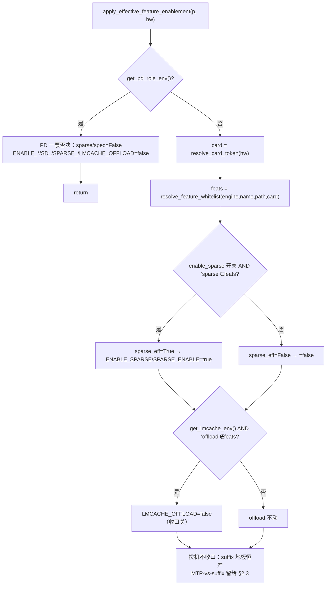
> 决策要点：**无 forced 分支**（§0 裁定1），sparse 纯 `开关 AND 命中`；PD 是唯一反向（force-OFF）。

### A.2 白名单解析 `resolve_feature_whitelist`

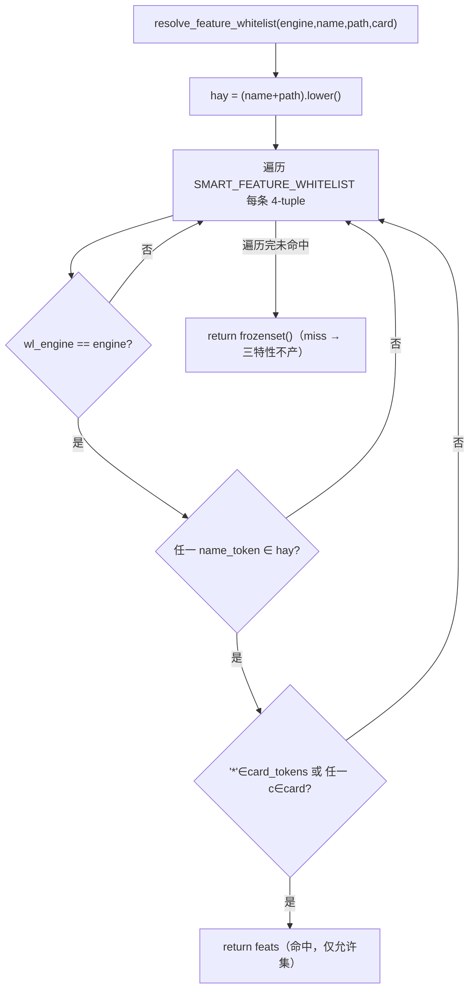
> 决策要点：三维子串匹配（engine→名→卡）；**miss 即空集**，下游一律不产（§0 裁定2 不管老模型）。

### A.3 投机 `resolve_speculative_strategy`（变体 + 白名单 gate + 卸载降级）

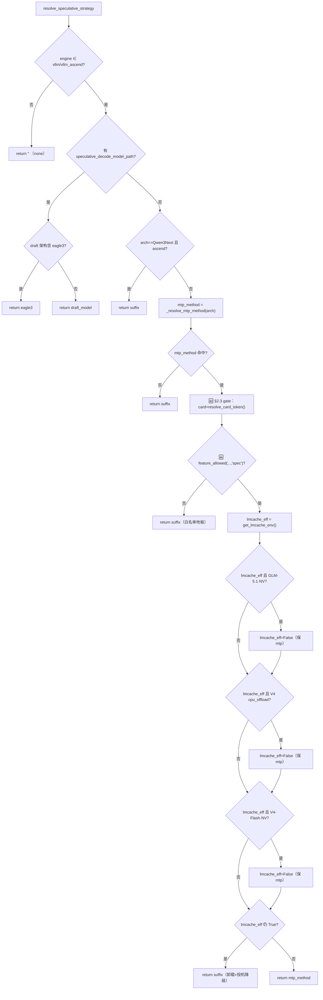
> 决策要点：5 个出口（eagle3/draft_model/mtp/suffix/none）；**三个 V4/GLM 例外把"卸载在场→降 suffix"反向豁免回 mtp**。

### A.4 稀疏 `_build_kv_sparse_cmd`（变体分支）

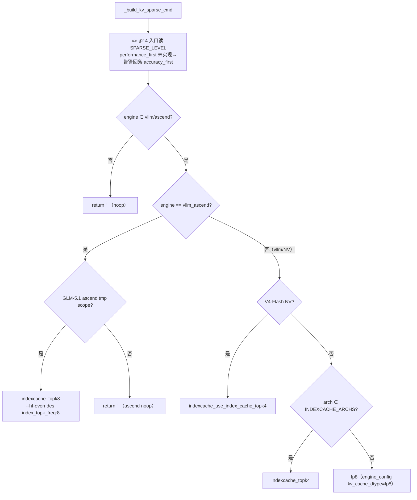
> 决策要点：5 变体；Ascend 仅 GLM-5.1 走 IndexCache，其余 ascend 是 noop；NV 非 IndexCache 架构落 FP8。

### A.5 卸载后端选择 `_build_cache_env_commands`

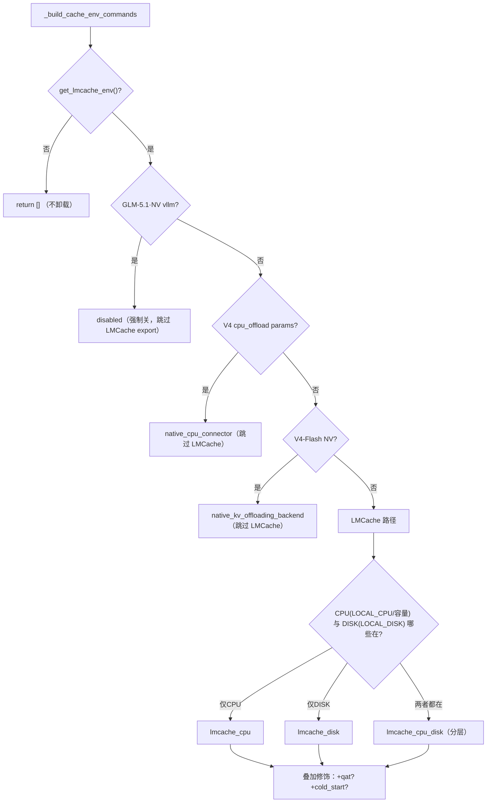
> 决策要点：三个 native/disabled 守卫**先于** LMCache；LMCache 内再分 CPU/Disk/分层，QAT 与 cold_start 正交叠加。

### A.6 卸载 CPU 容量 auto/custom（C4）`🆕`

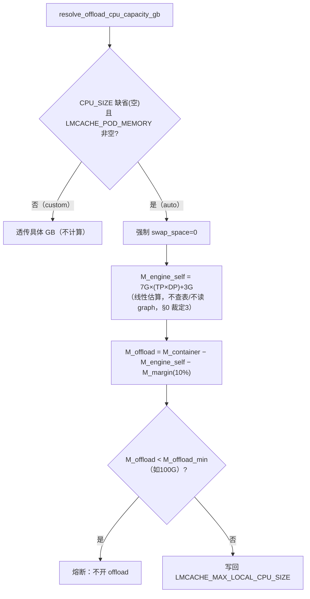
> 决策要点：auto 才算；引擎自耗按 `7G×(TP×DP)+3G` 线性估（不查表/不读 graph）；低于下限熔断。

### A.7 variants 记录写入（§4 监控）`🆕`

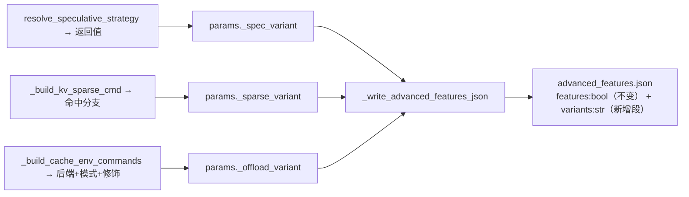
> 决策要点：变体名都是产出口现成 return，只 stash 后汇总；`features` bool 与一刀切回退不动。

### A.8 崩溃一刀切回退（runtime，保持现状）

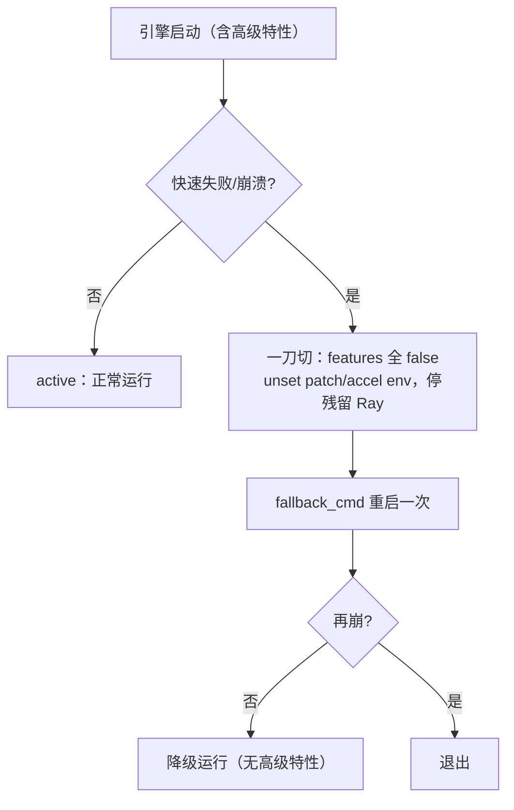
> 决策要点：**不区分肇事特性**，崩即全关重试一次（§0 不动此机制）。

---

## 附录B · 组合场景（入参 → 执行 → 出参 + 全枚举矩阵）

> 附录A 是「单决策点分支视图」；本附录补「**多特性叠加的端到端视图**」，按 `入参 → 执行 → 出参` 三段拆，并把白名单 9 行的组合结果全枚举。
> 共同假设：页面三开关**默认全开**、非 PD、未给 draft model path、offload 容量模式=auto。

### B.0 入参 → 执行 → 出参 · 通用管线骨架

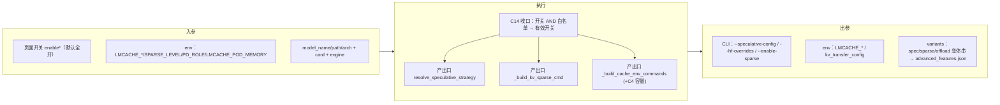

### B.1 全场景枚举矩阵（白名单 9 行 × 三特性出参）

| # | engine | 模型 | 卡 | 白名单 | spec 出参 | sparse 出参 | offload 出参 | 关键交互 |
| --- | --- | --- | --- | --- | --- | --- | --- | --- |
| 1 | vllm | qwen3.5-397b | * | spec,sparse | `qwen3_5_mtp` | `fp8` | off（不在白名单） | 无 offload→mtp 保留 |
| 2 | vllm | glm-4.7 | * | spec,sparse,offload | **`suffix`❗降级** | `fp8` | `lmcache_cpu+auto` | **offload 抢占 spec** |
| 3 | vllm | glm-5.1 | * | spec,sparse | `deepseek_mtp` | `indexcache_topk4` | off（白名单无+GLM51·NV 强制关） | sparse=IndexCache |
| 4 | vllm | minimax-m2.7 | * | spec,sparse,offload | `suffix`（无 mtp） | `fp8` | `lmcache_cpu+auto` | arch 无 mtp_method |
| 5 | vllm_ascend | glm-4.7 | 910b/c | spec,offload | **`suffix`❗降级** | off（白名单无） | `lmcache_cpu+auto` | **offload 抢占 spec** |
| 6 | vllm_ascend | minimax-m2.5 | 910b/c | spec,offload | `suffix`（无 mtp） | off | `lmcache_cpu+auto` | arch 无 mtp_method |
| 7 | vllm_ascend | deepseek-v3.2 | 910c | spec,offload | **`suffix`❗降级** | off | `lmcache_cpu+auto` | **offload 抢占 spec** |
| 8 | vllm_ascend | deepseek-v4-flash | 910b/c | spec,offload | `deepseek_mtp`✅共存 | off | `native_cpu_connector` | **V4 豁免→mtp 共存** |
| 9 | vllm_ascend | glm-5.1 | 910b/c | sparse | `suffix`（白名单地板） | `indexcache_topk8` | off（白名单无） | **spec gate 失败=bug 修复** |

> 三类标志性交互：**❗offload 抢占 spec**（2/5/7：mtp 被卸载降级为 suffix）；**✅V4 豁免共存**（8：native 连接器使 mtp 保留）；**白名单地板**（9：spec 不在白名单→suffix，修原误产 deepseek_mtp 的 bug）。

### B.2 场景A · offload 抢占 spec（glm-4.7·NV，行2；v3.2·Ascend 同型）

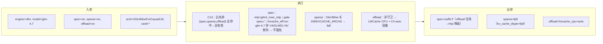

### B.3 场景B · V4 豁免共存（deepseek-v4-flash·Ascend，行8）

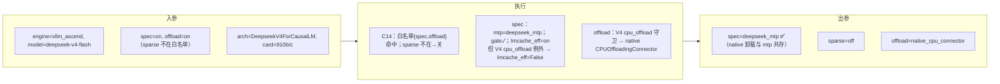

### B.4 场景C · sparse-only 地板（glm-5.1·Ascend，行9，修 bug）

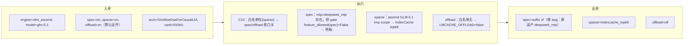

### B.5 场景D · 无 offload → mtp 保留（qwen3.5-397b·NV，行1；glm-5.1·NV 行3 同型）

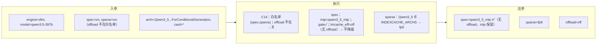

> 行3（glm-5.1·NV）同属本型但 sparse 走 IndexCache：spec=`deepseek_mtp`、sparse=`indexcache_topk4`、offload=off。
> 行4/6（minimax）同属「无 offload 降级」无关，但 **arch 不在 mtp 表 → spec 恒 suffix**，与 offload 是否在场无关。

---

## 附录C · 边界 / 非白名单场景（入参 → 处理流程 → 出参，详版）

> 附录B 枚举的是「命中白名单」9 行；但**绝大多数真实模型不在白名单**——这是默认路径，必须单列。
> 核心规则回顾：`miss → resolve_feature_whitelist 返回空集 → C14 把 sparse/offload 收口关；spec 不收口但产出口走 suffix 地板`。

### C.1 ★最常见★ 普通模型不在白名单（vllm/ascend，三开关默认全开）

例：`qwen2.5-72b` / `llama-3-70b` 等任意未适配模型，`arch=Qwen2ForCausalLM` 之类。

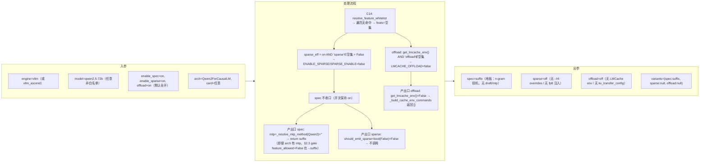
> 决策要点：非白名单模型**三特性净产出 = 仅 suffix 地板**，sparse/offload 全部静默关（§0 裁定2「miss→不产」即此）。模型正常起服务，不带任何加速补丁。

### C.2 边界场景枚举矩阵

| # | 场景 | spec 出参 | sparse 出参 | offload 出参 | 触发点 |
| --- | --- | --- | --- | --- | --- |
| C-a | 非白名单 + vllm/ascend + 默认全开 | `suffix`（地板） | off | off | C.1 |
| C-b | 非白名单 + **spec 开关也关** | `none`（无投机） | off | off | 开关 off → 不合成 speculative-config |
| C-c | 非白名单 + **非 vllm 引擎**（mindie/sglang） | `none`（engine 否决） | `none`（engine 否决） | off | resolve_*：engine∉{vllm,vllm_ascend} 直接 return '' |
| C-d | **白名单内但用户关某开关**（如 glm-4.7 关 offload） | 见 C.3 | 按开关 | off（用户关） | C14：开关 off → 该特性 eff=False |
| C-e | **PD 角色**（PD_ROLE=P/D） | `none` | off | off（仅 PD connector） | C14 get_pd_role_env() 一票否决 |

> 对照：C-a vs C-c 的区别在 spec——vllm 走 `suffix` 地板，非 vllm 引擎连 suffix 都不产（engine 守卫先于一切）。

### C.3 白名单内但用户关 offload（glm-4.7·NV，对照 B.2）

```mermaid
flowchart LR
  subgraph IN["入参"]
    direction TB
    A1["engine=vllm, model=glm-4.7（命中白名单）"]
    A2["spec=on, sparse=on, **offload=off（用户手动关）**"]
    A3["arch=Glm4MoeForCausalLM, card=*"]
  end
  subgraph EXEC["处理流程"]
    direction TB
    B1["C14: feats={spec,sparse,offload}（命中）"]
    B2["sparse_eff = on AND 命中 = True → ENABLE_SPARSE=true"]
    B3["offload: get_lmcache_env()=False（用户关）→ 本就不产，无需收口"]
    B4["产出口 spec: mtp=glm4_moe_mtp; gate✓; lmcache_eff=get_lmcache_env()=False<br/>→ **不触发卸载降级**"]
    B5["产出口 sparse: Glm4Moe∉INDEXCACHE_ARCHS → fp8"]
  end
  subgraph OUT["出参"]
    direction TB
    C1["spec=glm4_moe_mtp ✅（关掉 offload 反而救回 mtp，对照 B.2 的 suffix）"]
    C2["sparse=fp8"]
    C3["offload=off（用户关）"]
  end
  IN --> EXEC --> OUT
```
> 决策要点：**同一模型 glm-4.7，offload 开→spec 降 suffix（B.2）；offload 关→spec 保 glm4_moe_mtp（本图）**。这条 spec×offload 反向耦合是用户调参时最反直觉的点。

### C.4 PD 角色一票否决（任意模型）

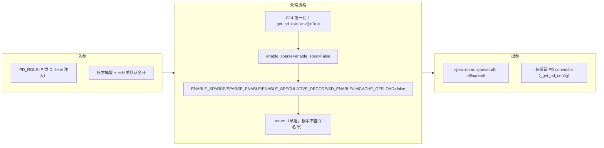
> 决策要点：PD 是**最高优先级 force-OFF**，早于白名单解析；US646 暂不支持 PD×高级特性共存。

### C.5 ★真实命令实例★ Qwen3.6-27B · vllm_ascend · 2 卡（入参 → 处理流程 → 出参，逐级溯源）

**入参（三段硬边界，verbatim）：**

```bash
# ① hardware_info.json（编排层注入 → /shared-volume）
{"count":2,"details":[],"units":"GB","device":"ascend"}

# ② user_cli（wings_start.sh，key 全 ⊆ 支持集）
bash /opt/wings-control/wings_start.sh \
  --engine vllm_ascend --model-name Qwen3.6-27B --model-path /usr/local/serving/models/ \
  --port 18000 --seed 42 --trust-remote-code --dtype auto --output-length 1024 \
  --enable-prefix-caching --max-num-batched-tokens 4096 --max-num-seqs 64 \
  --kv-cache-dtype auto --block-size 16 --gpu-memory-utilization 0.9 \
  --input-length 1024 --enable-chunked-prefill --gpu-usage-mode full --device-count 2

# ③ 注意：命令未带 ENABLE_SPECULATIVE_DECODE / ENABLE_SPARSE / LMCACHE_OFFLOAD
#    → 三特性开关「未置真」（MaaS 页面若开启会注入这三个 env，本命令没有）
```

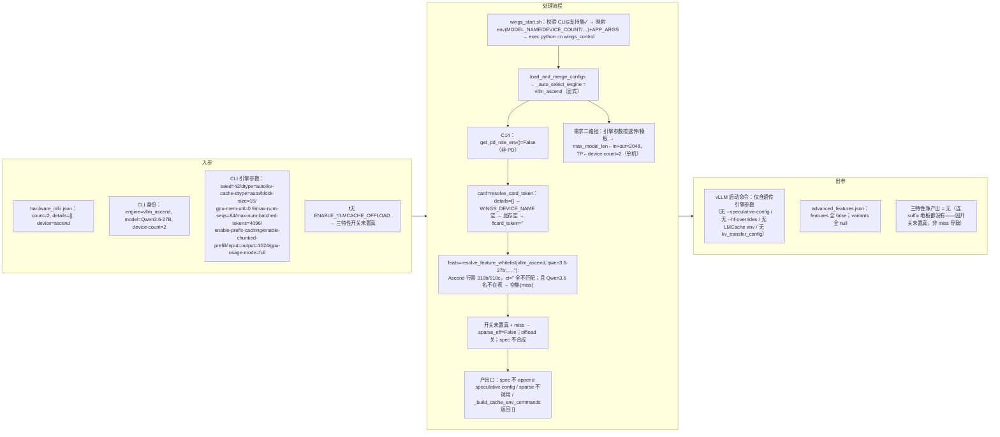

**逐级溯源表（处理流程关键判定）：**

| 阶段 | 判定 | 结果 | 依据 |
| --- | --- | --- | --- |
| wings_start.sh | CLI key ⊆ 支持集？ | ✓ 全部合法 | `WINGS_START_CLI_FLAGS` |
| C14 第一判 | `get_pd_role_env()`？ | 否（无 PD_ROLE） | §2.0 |
| C14 卡型 | `resolve_card_token` | **`card=''`**（details=[] 兜底全空） | §1.2 |
| C14 白名单 | `resolve_feature_whitelist` | **空集（miss）**：名不在表 + card 空致 Ascend 行必失配 | §1.3 |
| C14 收口 | 三开关未置真 + miss | sparse/offload 关，spec 不合成 | §2.0 |
| 产出口 | spec/sparse/offload | 全不产 | §2.1–2.3 |

> **结论**：这条真实命令**三特性全无产出**（advanced_features 四 false / variants 全 null），模型按需求二口径裸跑。
> **两个层次的"关"**：① 直接原因＝**三开关未置真**（命令没带那三个 env）；② 即便置真，**`details:[]` 致 `card_token=''` → Ascend 白名单全 miss**，仍然不产。
> ⚠ **暴露的真问题**：Ascend 白名单的卡维度依赖 `hardware_info.json` 填 `details[0].name`（或 `WINGS_DEVICE_NAME`）。本命令 `details:[]` 下**任何 Ascend 模型都拿不到 `910b/910c` → 整条 Ascend 白名单失效**。这比 §6-① 的「NV 卡码细分」更硬，需 MaaS 保证 Ascend 部署的 `hardware_info.json` 带 `details[0].name`，否则三特性在 Ascend 上永远开不起来。

---

## 附录D · 开发触发参考（模拟入参 → 流程 → 出参，按功能枚举）`🆕`

> 用途：**反向**——以「触发某变体」为目标，给出该填哪些入参字段，供开发直接造测试用例。
> 入参三件套：① `hardware_info.json`（`details[0].name` 必填，否则卡型空、Ascend 必 miss，见 C.5）；② `wings_start.sh` CLI；③ env（三开关 `ENABLE_SPECULATIVE_DECODE/ENABLE_SPARSE/LMCACHE_OFFLOAD` + LMCache 细分）。
> **基础模板**（各场景在此之上改字段）：
> ```bash
> # NV：{"count":8,"details":[{"name":"H20"}],"units":"GB","device":"nvidia"}
> # Ascend：{"count":8,"details":[{"name":"ascend910b3"}],"units":"GB","device":"ascend"}
> bash wings_start.sh --engine <E> --model-name <M> --model-path /models/ --port 18000 --device-count <N>
> ```

### D.1 投机 → 触发各 variant

| 目标 variant | 模拟入参（在模板上加） | 出参 | 白名单依赖 |
| --- | --- | --- | --- |
| `eagle3` | `SPECULATIVE_DECODE_MODEL_PATH=/models/eagle-draft`（draft arch 含 eagle3）+ `ENABLE_SPECULATIVE_DECODE=true` | `--speculative-config{method:eagle3}` | **无需**（path 分支在白名单 gate 之前） |
| `draft_model` | `SPECULATIVE_DECODE_MODEL_PATH=/models/some-draft`（非 eagle3）+ `ENABLE_SPECULATIVE_DECODE=true` | draft_model | 无需 |
| `deepseek_mtp` | `engine=vllm, model=glm-5.1`，`ENABLE_SPECULATIVE_DECODE=true`，**不设** LMCACHE_OFFLOAD | deepseek_mtp | 需 spec∈白名单（glm-5.1·NV ✓） |
| `suffix`（降级） | `engine=vllm, model=glm-4.7`，`ENABLE_SPECULATIVE_DECODE=true` **且** `LMCACHE_OFFLOAD=true` | suffix | spec+offload∈白名单（glm-4.7 ✓），非 V4 例外 |
| `suffix`（地板） | `model=<任意非白名单>`，`ENABLE_SPECULATIVE_DECODE=true` | suffix | miss 即地板 |
| `none` | **不设** `ENABLE_SPECULATIVE_DECODE` | 无 speculative-config | — |

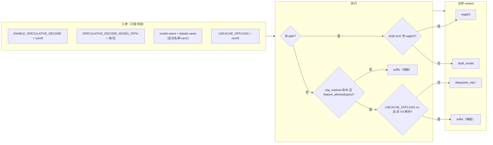

### D.2 稀疏 → 触发各 variant

| 目标 variant | 模拟入参 | 出参 | 可触发性 |
| --- | --- | --- | --- |
| `indexcache_topk8` | `engine=vllm_ascend, model=glm-5.1`, details.name=`ascend910b3`, `ENABLE_SPARSE=true` | `--hf-overrides {index_topk_freq:8}` | ✓（ascend glm-5.1 ∈白名单 sparse） |
| `indexcache_topk4` | `engine=vllm, model=glm-5.1`, `ENABLE_SPARSE=true` | `--hf-overrides {index_topk_freq:4}` | ✓（NV glm-5.1 ∈白名单 sparse；GlmMoeDsa∈INDEXCACHE_ARCHS） |
| `fp8` | `engine=vllm, model=glm-4.7`, `ENABLE_SPARSE=true` | `kv_cache_dtype=fp8` | ✓（Glm4Moe∉INDEXCACHE_ARCHS） |
| `indexcache_use_index_cache_topk4` | `engine=vllm, model=deepseek-v4-flash`, `ENABLE_SPARSE=true` | `--hf-overrides {use_index_cache:true, index_topk_freq:4}` | ⚠ **需 §6-④**：NV V4-Flash 不在白名单，C14 会先关 sparse → 当前**不可触发** |
| `noop` | `engine=vllm_ascend, model=<非 glm-5.1>`, `ENABLE_SPARSE=true` | `""` | ⚠ 非 glm-5.1 的 ascend 模型白名单均无 sparse → C14 先关 → **不可达** |

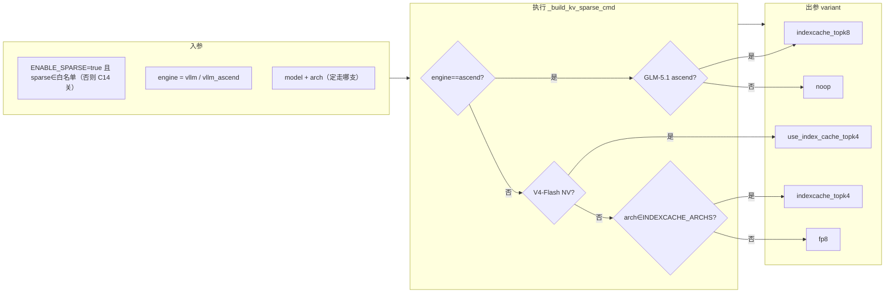

### D.3 卸载 → 触发各 variant（后端 × 模式 × 修饰）

| 目标 variant | 模拟入参（offload∈白名单 + `LMCACHE_OFFLOAD=true` 为前提） | 出参 |
| --- | --- | --- |
| `lmcache_cpu+auto` | `model=glm-4.7` + **不设** `LMCACHE_MAX_LOCAL_CPU_SIZE` + `LMCACHE_POD_MEMORY=<本节点GiB>` | LMCache CPU，C4 自算容量 |
| `lmcache_cpu+custom` | `model=glm-4.7` + `LMCACHE_LOCAL_CPU=true` + `LMCACHE_MAX_LOCAL_CPU_SIZE=200` | LMCache CPU，透传 200G |
| `lmcache_disk` | + `LMCACHE_LOCAL_DISK=/mnt/kv` + `LMCACHE_MAX_LOCAL_DISK_SIZE=500` | LMCache Disk |
| `lmcache_cpu_disk`（分层） | CPU 与 Disk env **同时**给 | CPU→Disk 分层 |
| `+qat` | 上述任一 + `LMCACHE_QAT=true` | 叠加 QAT 压缩段 |
| `+cold_start` | 上述任一 + `LMCACHE_COLD_START`（冷启动）| 叠加 pre_caching 段 |
| `native_cpu_connector` | `engine=vllm_ascend, model=deepseek-v4-flash`, details.name=`ascend910b3`, `LMCACHE_OFFLOAD=true` | CPUOffloadingConnector（非 LMCache） |
| `native_kv_offloading_backend` | `engine=vllm, model=deepseek-v4-flash`, `LMCACHE_OFFLOAD=true` | ⚠ **需 §6-④**：NV V4-Flash 不在白名单 → C14 关 offload → **当前不可触发** |
| `disabled` | `engine=vllm, model=glm-5.1`, `LMCACHE_OFFLOAD=true` | ⚠ C14 已先关（glm-5.1·NV 白名单无 offload）→ adapter 守卫变二级冗余 |

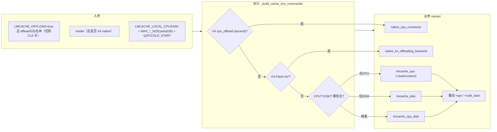

### D.4 组合 / PD → 触发

| 目标 | 模拟入参 | 出参 |
| --- | --- | --- |
| **offload 抢占 spec** | `model=glm-4.7`，`ENABLE_SPECULATIVE_DECODE=true` + `ENABLE_SPARSE=true` + `LMCACHE_OFFLOAD=true` | spec=`suffix`、sparse=`fp8`、offload=`lmcache_cpu` |
| **V4 豁免共存** | `engine=vllm_ascend, model=deepseek-v4-flash`, details=`ascend910b3`, `ENABLE_SPECULATIVE_DECODE=true`+`LMCACHE_OFFLOAD=true` | spec=`deepseek_mtp`、offload=`native_cpu_connector` |
| **sparse 地板 bug 修复** | `engine=vllm_ascend, model=glm-5.1`, 三开关全开 | spec=`suffix`、sparse=`indexcache_topk8`、offload=off |
| **PD 一票否决** | 任意模型 + `PD_ROLE=P`（或 D） | 三特性全 off，仅 PD connector |
| **全不产（裸跑）** | `model=<非白名单>`，三开关全开 | spec=`suffix` 地板、sparse/offload off |

> **开发提示**：① 触发任何 sparse/offload variant，**先确认该 (engine,model,卡) 的白名单含该特性**，否则 C14 先关，产出口根本进不去；② Ascend 场景 `details[0].name` 必填 `ascend910b3/910c`；③ `⚠ 需 §6-④` 的两条（V4-Flash·NV 的 sparse/offload）在白名单补行前不可触发，是已知缺口非 bug。
