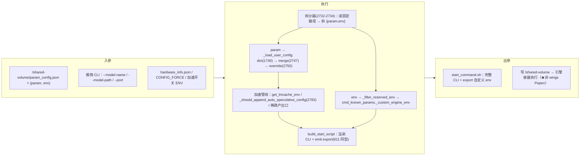
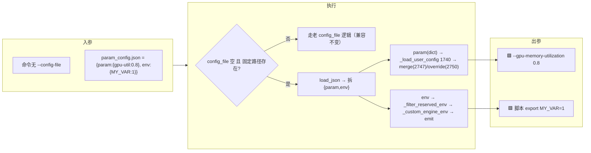
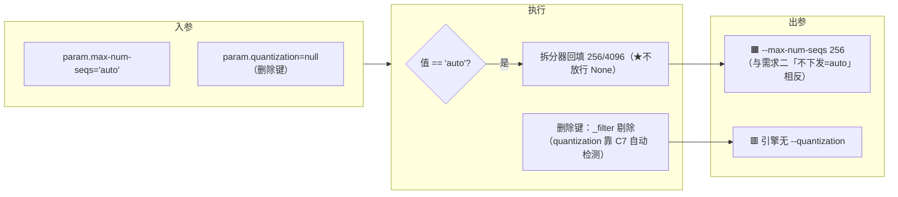
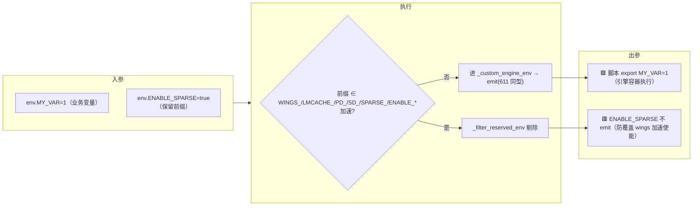
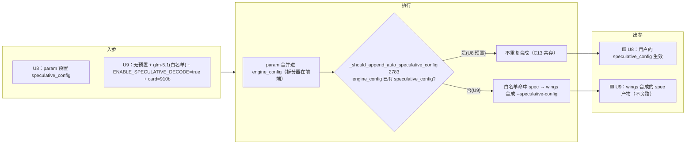

# 需求三 · JSON自定义透传 — wings-control 实施文档

> 母文档/索引见 [smart.md](smart.md)。本文件承载原 **§0.5-C / §4.4**。
> 触发极性：**字段「存在」触发**（param/env 非空 → 透传）。与需求一（开关置真）、需求二（字段缺省）三向互补。
> 跨需求的「§6 未决事实」「§7 影响范围/排期」仍在索引 [smart.md](smart.md)。

> **本文档 scope = JSON 参数配置页面**。删减集与 [需求二（普通参数配置页面）](需求二-参数删减.md)**不同**：JSON 页面向高级用户，暴露完整调优集，**只删 3**。

---

## C0) 页面约束（MaaS 下发，本版口径）

1. **JSON 字段中新增「环境变量字段」**（`env` 块）；**启动字段复用原有的默认参数**。
2. **整个 wings 拉服务逻辑保持不变**；**新增 json 路径**（内容与页面 JSON 配置一致），用于 **wings 额外解析**。
3. **非启动字段都转换为环境变量**（与需求二 §B.2 同一机制，复用 [start_args_compat.py](../../wings_control/core/start_args_compat.py) 的 `_env` 回退名）。

**页面 JSON 结构（`{ param, env }` 双块）**

```jsonc
{
  "param": {
    "input-length": 2048,            // 配置数值覆盖
    "output-length": 2048,           // 配置数值覆盖
    "trust-remote-code": true,       // 配置数值覆盖
    "dtype": "auto",
    "kv-cache-dtype": "auto",
    "quantization": null,            // 删除（靠 C7 自动检测）
    "quantization-param-path": null, // 删除
    "gpu-memory-utilization": 0.8,
    "enable-chunked-prefill": true,
    "block-size": 16,
    "max-num-seqs": 256,             // 配置数值覆盖；如为 auto，回填默认数值
    "max-num-batched-tokens": 4096,  // 配置数值覆盖；如为 auto，回填默认数值
    "seed": 42,
    "enable-expert-parallel": false,
    "enable-prefix-caching": true,
    "enable-auto-tool-choice": false,
    "enable-auto-think-choice": false,
    "engine": "vllm",                // 真实引擎类型
    "config-file": null              // 删除
    // 【允许用户根据引擎，新增参数】
  },
  "env": {
    "XXXX": true                     // 自定义环境变量（引擎侧，统一放置，勿入全局）
  }
}
```

**参考启动命令（极简，调优全由 JSON 承载）**

```bash
bash /opt/wings-control/wings_start.sh --model-name Qwen3.6-27B \
  --model-path /usr/local/serving/models/ --port 18000
```

**wings 额外解析的两个路径（均为固定约定路径，启动命令不传路径参数）**

| 路径 | 内容 | 用途 |
| --- | --- | --- |
| `/shared-volume/param_config.json` | 与页面 JSON 一致的 `{param, env}` | param→拆启动/非启动、env→引擎侧环境变量（拆分器见 §C.4） |
| `/shared-volume/hardware_info.json` | `{"hardware_family":"rtx_pro_5000_72G","device":"ascend"}` | `hardware_family`→卡型识别（白名单/卡型解析），见 [hardware_family_chip_identification.md](../smartxxxx/hardware_family_chip_identification.md) |

> ⚠ **固定路径而非命令行传入**：极简启动命令只带 `--model-name/--model-path/--port`，**不带 `--config-file`** → 该 json 只能靠固定约定路径读取，wings 启动早期无条件探测，存在即额外解析。
> ⚠ `hardware_family`→卡型 的消费在需求一（白名单/`resolve_card_token`）；本文档仅登记该路径属 wings 额外解析的输入，**不展开三特性**（超出参数配置页面 scope）。

---

## C) 需求三 · JSON自定义透传（字段「存在」触发）

### C.1 链路总表

| 页面来源 | wings 入参 | 判定点 | 执行 |
| --- | --- | --- | --- |
| `param` 块（自定义启动字段 JSON） | `/shared-volume/param_config.json` 的 `param`（**非** JSON 内的 `config-file` 键，该键已删） | wings 额外解析（§C.4 / §4.4 C11） | 归一 kebab→snake → **启动字段复用默认 / 非启动字段转 env** → 合并 `engine_config` → 渲染 CLI |
| `param` + 强制覆盖 | `CONFIG_FORCE=true` | `get_config_force_env()` 2733 | 用户配置**独占**，跳过模板 |
| `param` 内用户按引擎追加键 | 同 `param` 合并范式 | `_load_user_config` 1718 | 透传（优先级见 §4.4 C13 / §6-③） |
| `env` 块（自定义环境变量 JSON） | **emit 进 `build_start_script` 的 export 区**（过黑名单，引擎容器脚本，非 wings 全局、非 Pod spec） | wings 额外解析（§C.4 / §4.4 C12） | 引擎容器执行脚本时生效，wings 自身不受污染 |

> ⚠ **机制变更（相对旧版）**：旧版「复用现有 `--config-file`/`CONFIG_FILE`，wings 无改」**作废**。
> 约束明确「JSON 内 `config-file` 字段删除」+「新增 json 路径供 wings 额外解析」→ **承载方式从 `--config-file` 文本改为约定路径，wings 需新增解析**。
> 注意：删的是 **JSON 内的 `config-file` 键**，**不是** `wings_start.sh` 的 `--config-file` 注入机制（[wings_start.sh:340](../../wings_control/wings_start.sh#L340)）。

### C.2 param 字段三类取值语义

| 语义 | 字段 | 行为 |
| --- | --- | --- |
| **配置数值覆盖** | `input-length` / `output-length` / `trust-remote-code` / 及其余有值字段 | 用 JSON 值覆盖默认 |
| **auto → 回填默认数值** | `max-num-seqs`(256) / `max-num-batched-tokens`(4096) | 如配为 auto，**回填默认数值再下发** |
| **删除** | `quantization` / `quantization-param-path` / `config-file` | 不下发（`quantization` 改靠 C7 自动检测） |

> ⚠ **与需求二 auto 语义相反**：本页 `max-num-*` auto = **回填默认数值(256/4096)下发**；需求二普通页 auto = **不下发 → vLLM auto**（C9）。见 [需求二 §B.1 注](需求二-参数删减.md)。
> ⚠ **engine = 真实引擎类型**，且「允许用户根据引擎新增参数」→ 并入 `param` 合并范式（§4.4 C11/C13）。

### C.3 删减集对比（本页 only 删 3）

| | 需求二（普通页） | 需求三（JSON 页） |
| --- | --- | --- |
| 删除 | 10（dtype/kv-cache-dtype/gpu-util/block-size/quantization/seed/quantization-param-path/三布尔） | **3**（quantization / quantization-param-path / config-file） |
| 保留调优集 | 仅 5 | **完整调优集**（dtype/gpu-util/block-size/seed/enable-* 等均保留） |

> 差异**有意为之**：JSON 页面向高级用户。

### C.4 wings 额外解析 = 一层薄拆分器（定稿）

> **执行模型（两面，先读这段再看下面的链路）**：JSON **全程由 wings-control 处理**，引擎拿不到「裸 JSON」，只拿到 wings 生成的脚本。
>
> | 面 | 谁 | 干什么 |
> | --- | --- | --- |
> | **控制面** | wings-control 容器（当前进程） | 解析 JSON → 拆 `{param,env}` → 合并 config → **跑加速特性使能** → 生成 `start_command.sh` 写共享卷 |
> | **数据面** | 引擎容器（独立） | 执行 `start_command.sh`，把引擎（vLLM/…）拉起 |
>
> - 「**引擎不由 wings `Popen`**」**只**指引擎**进程**在引擎容器里被脚本拉起，**不等于** wings 不处理 JSON；交接物是脚本，**不是** `Popen(env=...)`。
> - 拆分器挂在 `load_and_merge_configs` **最前端**（[2732-2734](../../wings_control/core/config_loader.py#L2732)）→ `param` 拆出后**继续走完整条管线**（`get_lmcache_env` 卸载 / `_should_append_auto_speculative_config`(2783) 投机 / 稀疏产出口）→ **JSON 路径复用整条加速特性管线、不旁路、不开并行链路**（对齐 smart.md「wings 依旧需要使能加速特性」）。
> - `env` 块对加速开关前缀（`ENABLE_SPARSE/LMCACHE_*/SD_*/SPARSE_*`）做黑名单，**正是为不让用户 env 覆盖 wings 的加速使能**——加速由 wings 权威决定，`env` 只承载自定义业务变量；`param` 预置 `speculative_config/kv_transfer_config` 则走 C13「已预置不合成」共存。

> 页面 JSON 是**嵌套** `{param, env}`，而下游 `_load_user_config`([config_loader.py:1744-1759](../../wings_control/core/config_loader.py#L1744)) 期望**扁平**引擎参数 dict。故「额外解析」不是新写 parser，而是固定路径读取 + 一层拆分，**复用既有合并/注入，不开并行链路**：

```
读 /shared-volume/param_config.json   （固定路径，启动早期无条件探测）
 ├─ obj["param"] → 现有 _load_user_config 合并范式（kebab→snake、合 engine_config）       ← C11
 │                  其中：启动字段复用原有默认；非启动字段转 env（§B.2 映射）
 └─ obj["env"]   → 过保留字黑名单 → 随 params 透传 adapter → build_start_script 内
                    emit `export K=V`（引擎容器执行的脚本，非 wings 全局/非 Pod spec）      ← C12
```

- **C12 落点（定稿，已纠正架构口径）**：⚠ 本项目是 **launcher 模式**——引擎**不由 wings `Popen`**，而是 `build_start_script()` 把 bash 脚本写共享卷、**由独立引擎容器执行**（[mindie_adapter.py:1917](../../wings_control/engines/mindie_adapter.py#L1917)「生成的脚本将写入共享卷，由 engine 容器执行」）。故**不存在 Python `env=` 注入点**，`env` 块只能 **emit 成 `export` 行进生成脚本的 env 区**。
- 复用既有同型函数 `_append_lmcache_env_export`（[vllm_adapter.py:611-616](../../wings_control/engines/vllm_adapter.py#L611)：`env_commands.append(f"export {name}={shlex.quote(value)}")`），挂进 `_build_env_commands`/`_build_cache_env_commands`（656/690）产出的 env 命令块即可。脚本只跑引擎 → 天然引擎侧、不污染 wings 进程、不入 Pod spec，满足母注「统一放一起、勿入全局」。

> Maas：找傲宇确认 json 内部参数设计的逻辑（vllm，sglang，mindie），json 页面开启后，需要环境变量承载；引擎侧环境变量，需要统一放置在一起，不要放在全局中。
>
> wings：依旧需要使能加速特性。（0708 先不做）

---

## 4. 自定义透传（精确 diff）

### 4.4 C11/C12/C13 透传

- **C11 param 块（定稿）**：wings 从固定路径 `/shared-volume/param_config.json` 读 `param` → 归一 kebab→snake → **启动字段复用原有默认参数、非启动字段转 env（§B.2 映射，见 [需求二 §B.2](需求二-参数删减.md)）** → 合并 `engine_config`。新增的只是「固定路径读取 + `{param,env}` 拆分器」（§C.4），合并/渲染**复用** `_load_user_config`(1718)，旧「无改」作废、但不开并行链路。
- **C12 env 块（定稿 = emit 进引擎启动脚本 export 区）**：wings 读 `env` 块 → 过保留字黑名单（禁覆盖 `WINGS_*/LMCACHE_*/PD_*/SD_*/SPARSE_*`）→ 在 `build_start_script` 内 emit `export {name}={shlex.quote(value)}`（复用 `_append_lmcache_env_export` 同型，[vllm_adapter.py:611](../../wings_control/engines/vllm_adapter.py#L611)），见 §C.4。launcher 模式下引擎由独立容器执行该脚本 → 引擎侧生效、不污染 wings、不入 Pod spec；**不走 K8s Pod env**（Pod env 对整容器全局可见、且破坏单一 json 来源，已否决）。
- **C13 自定义 vs 白名单优先级**（需求一×三耦合点）：用户在 `param` 显式写 `kv_transfer_config/kv_cache_dtype/speculative_config` 时是否覆盖白名单——**待定见 §6-③**；实现挂靠现有「已预置不合成」范式（`_should_append_auto_speculative_config` 2722）。

> ⚠ **C13 优先级未决**：`param` 手写 `kv_transfer_config` 等，用户显式 > 白名单 还是反之？暂按「用户显式优先」。给值后 §4.4 即最终态——详见索引 [smart.md](smart.md) §6-③。

### 4.5 实施细节（代码级 diff）

> 新增面收敛到「一个固定路径读取 + 一层 `{param,env}` 拆分」，下游全部复用既有函数。

**① 拆分器 — `config_loader.load_and_merge_configs()`（[config_loader.py:2732-2734](../../wings_control/core/config_loader.py#L2732) 处）**

```python
# 现状：config = known_args.config_file; user_config = _load_user_config(config)
# 改后：config_file 为空时回落固定路径，并拆出 env 块
PARAM_CONFIG_PATH = "/shared-volume/param_config.json"   # 常量，改名只动此处（遗留-④）
config = known_args.config_file
custom_env: dict = {}
if not config and os.path.isfile(PARAM_CONFIG_PATH):
    obj = load_json_config(PARAM_CONFIG_PATH) or {}
    config = obj.get("param") or {}            # dict → _load_user_config(1740) 直接吃
    custom_env = obj.get("env") or {}          # 留给 adapter emit
user_config = _load_user_config(config)
# custom_env 过黑名单后塞进 cmd_known_params，随 params 透传到 adapter
cmd_known_params["_custom_engine_env"] = _filter_reserved_env(custom_env)
```

- `param` 是 dict → `_load_user_config` 在 [1740](../../wings_control/core/config_loader.py#L1740) 走 `isinstance(config, dict)` 分支，归一后并入既有合并链（2742-2750），**零新增合并逻辑**。
- 新增小函数 `_filter_reserved_env(d)`：剔除前缀命中 `WINGS_/LMCACHE_/PD_/SD_/SPARSE_` 的键（C12 黑名单）。

**② env emit — `vllm_adapter._build_env_commands()`（env 命令块尾部，~[690](../../wings_control/engines/vllm_adapter.py#L690)）**

```python
# 复用既有同型 export 写法（_append_lmcache_env_export, 611-616）
for k, v in (params.get("_custom_engine_env") or {}).items():
    env_commands.append(f"export {k}={shlex.quote(str(v))}")
```

- 引擎容器执行 `build_start_script` 产出脚本时生效；wings 进程与 Pod spec 均不写入。
- sglang/mindie 各自的 `build_start_script` 同理在其 env 块追加（mindie 走 `_build_start_script_env_block` [1889](../../wings_control/engines/mindie_adapter.py#L1889)）。

**③ param 内三类语义落点**

- **auto→回填默认**（`max-num-seqs`/`max-num-batched-tokens`）：拆分器读出后若值为 `"auto"`，回填 256/4096 再入 `param`（**与需求二 C9 相反**：此处不放行 None）。
- **删除键**（`quantization`/`quantization-param-path`/`config-file`）：MaaS 不应写入 `param`；若误写，`_filter` 阶段一并剔除（保险）。
- **按引擎追加键**：原样进 `_load_user_config`→`engine_config`，优先级见 C13。

### 4.6 JSON 逻辑下发 · 处理流程模拟

> **本节模拟「JSON 逻辑」如何下发**：页面下发 JSON 文件 → wings 每一步对数据做了什么（带 file:line）→ 引擎最终拿到什么脚本。
> **核心认知（JSON 逻辑的真相）**：页面下发的是 `/shared-volume/param_config.json`（**不是 CLI**），**wings 全程处理**——读固定路径 → 拆 `{param,env}` → param 走合并管线渲染成 CLI、env emit 成 `export` → 拼成 `start_command.sh` 写共享卷 → **引擎容器执行**（★非 wings `Popen`）。引擎拿不到「裸 JSON」。
> 结构：总览管线（§4.6.0）→ 端到端数据流模拟（§4.6.1，逐阶段追踪数据变化）→ 关键分支细化（§4.6.2–4.6.5，IN/EXEC/OUT 三泳道）。

#### 4.6.0 通用管线骨架



#### 4.6.1 端到端数据流模拟（逐阶段追踪数据变化）

**阶段0 · 页面下发**（一个 JSON 文件 + 极简命令）

```bash
# /shared-volume/param_config.json
{ "param": { "gpu-memory-utilization": 0.8, "max-num-seqs": "auto", "quantization": null },
  "env":   { "MY_VAR": "1", "ENABLE_SPARSE": "true" } }
# 极简命令（无 --config-file，调优全在 JSON）
bash /opt/wings-control/wings_start.sh --model-name Qwen3.6-27B --model-path /usr/local/serving/models/ --port 18000
```

**阶段1→8 · 逐阶段数据流**（JSON 如何变成最终脚本）

| 阶段 | 处理（file:line） | 数据变化 |
| --- | --- | --- |
| ① 拆分器 | 读固定路径，拆双块(2732-2734) | `param={gpu-util:0.8, max-num-seqs:"auto", quantization:null}` / `env={MY_VAR, ENABLE_SPARSE}` |
| ② param·auto 回填 | 值为 `"auto"`→默认 | `max-num-seqs: "auto" → 256` 🟧（**与需求二相反**，不放行 None） |
| ③ param·删除键 | `null`/保留前缀剔除 | `quantization` 丢弃（靠 C7 自动检测） |
| ④ param·合并 | `_load_user_config` dict(1740)→merge(2747)→override(2750) | `engine_config.gpu_memory_utilization=0.8` |
| ⑤ env·过滤 | `_filter_reserved_env` | `MY_VAR` 保留 / `ENABLE_SPARSE` **剔除**（防覆盖加速） |
| ⑥ 加速管线 | `get_lmcache_env` / `_should_append_auto_speculative_config`(2783) / 稀疏产出口 | 按白名单合成（**不旁路**；Qwen3.6-27B 非白名单→无） |
| ⑦ build_start_script | 渲染 CLI + emit export(611 同型) | `--gpu-memory-utilization 0.8 --max-num-seqs 256 …` + `export MY_VAR=1` |
| ⑧ 下发 | 写 `/shared-volume/start_command.sh` | 引擎容器执行脚本拉起 vLLM（★非 wings Popen） |

**阶段8 · 最终 start_command.sh（出参）**

```bash
export MY_VAR=1                                  # env 块（ENABLE_SPARSE 已被拦）
... vllm serve ... --gpu-memory-utilization 0.8 --max-num-seqs 256 \
    --max-model-len 2048 ...                     # param 块（quantization 丢弃，auto 已回填）
    # 加速字段：按 glm 等白名单模型合成；Qwen3.6-27B 非白名单则无
```

> **JSON 逻辑真相（结论）**：
> 1. **wings 全程处理**：JSON 不被引擎直接吃；新增**只有「固定路径读取 + `{param,env}` 拆分器」一层**，下游合并/加速/emit 全复用既有代码、不开并行链路。
> 2. **三处与需求二/直觉不同**：`max-num-*` auto = **回填默认**（非不下发）；`env` 落点是**脚本 export 区**（launcher 模式无 Popen 注入点）；加速开关前缀**黑名单拦截**（不让用户 env 覆盖 wings 使能）。
> 3. **加速不旁路**：拆分器在管线最前端，`param` 拆出后续走整条加速管线，预置走 C13 共存、未预置由 wings 按白名单合成。

**关键分支细化**（IN/EXEC/OUT 三泳道，§4.6.2–4.6.5）：U0/U1 param 覆盖+env emit → U2/U3 auto 回填/删除键 → U5/U6 env emit/黑名单 → U8/U9 加速预置共存/自动合成。下接各图。

#### 4.6.2 U0/U1 · 触发 param 覆盖（+ env emit 基线）

**入参**
```bash
cat > /shared-volume/param_config.json <<'EOF'
{ "param": { "gpu-memory-utilization": 0.8 }, "env": { "MY_VAR": "1" } }
EOF
bash /opt/wings-control/wings_start.sh \
  --model-name Qwen3.6-27B --model-path /usr/local/serving/models/ --port 18000
```

> 决策要点：拆分器是**唯一新增**，挂 `load_and_merge_configs` 最前端；`param` 是 dict 直走 1740 分支，零新增合并逻辑。

#### 4.6.3 U2/U3 · 触发 param auto 回填 / 删除键

**入参**
```bash
cat > /shared-volume/param_config.json <<'EOF'
{ "param": { "max-num-seqs": "auto", "max-num-batched-tokens": "auto", "quantization": null }, "env": {} }
EOF
bash /opt/wings-control/wings_start.sh \
  --model-name Qwen3.6-27B --model-path /usr/local/serving/models/ --port 18000
```

> 决策要点：JSON 页 `max-num-*` auto = **回填默认再下发**，与需求二普通页（不下发=vLLM auto，C9）刻意相反；删除键即便误写也在 `_filter` 阶段剔除。

#### 4.6.4 U5/U6 · 触发 env emit vs 黑名单拦截

**入参**
```bash
cat > /shared-volume/param_config.json <<'EOF'
{ "param": {}, "env": { "MY_VAR": "1", "ENABLE_SPARSE": "true" } }
EOF
bash /opt/wings-control/wings_start.sh \
  --model-name Qwen3.6-27B --model-path /usr/local/serving/models/ --port 18000
```

> 决策要点：env 落点是**生成脚本的 export 区**（launcher 模式无 Popen 注入点）；黑名单刻意拦加速开关，使加速由 wings 权威决定。

#### 4.6.5 U8/U9 · 触发加速复用：预置共存 vs 自动合成

**入参 · U8（param 预置）**
```bash
cat > /shared-volume/param_config.json <<'EOF'
{ "param": { "speculative_config": { "method": "eagle3", "num_speculative_tokens": 3 } }, "env": {} }
EOF
bash /opt/wings-control/wings_start.sh \
  --model-name Qwen3.6-27B --model-path /usr/local/serving/models/ --port 18000
```
**入参 · U9（未预置 + 白名单模型 + 开关 on）**
```bash
echo '{"count":2,"details":[{"name":"ascend910b3"}],"device":"ascend"}' > /shared-volume/hardware_info.json
echo '{"param":{},"env":{}}' > /shared-volume/param_config.json
ENABLE_SPECULATIVE_DECODE=true bash /opt/wings-control/wings_start.sh \
  --engine vllm_ascend --model-name glm-5.1 --model-path /usr/local/serving/models/ --port 18000
```

> 决策要点：JSON 路径**复用整条加速管线**——`param` 拆出后续走 2783/卸载/稀疏产出口；预置走「已预置不合成」，未预置由 wings 按白名单合成。U9 的 `hardware_info.json` 给了 `details[0].name=ascend910b3` → `card_token` 含 `910b` → glm-5.1 命中白名单（对照 [需求二 §4.5.2 B0](需求二-参数删减.md) 的 `details:[]` → `card_token=''` → miss）。对齐 smart.md「wings 依旧使能加速特性」。

---

## 遗留（MaaS / 设计待给值）

| # | 事实 | 卡住 | 现占位 |
| --- | --- | --- | --- |
| ① | **非启动字段清单 + env 映射**：与需求二 §遗留-① 同源，§B.2 已给现成映射，待 MaaS 确认。 | C11 转 env | 代码内 `_env` 回退名 |
| ② | **C13 优先级**：`param` 手写 `kv_transfer_config` 等，用户显式 > 白名单 还是反之？ | C13 实现 | 暂按「用户显式优先」 |

> ✅ **已收口（原 ③/④）**：③ `env` 块承载 = **emit 进 `build_start_script` 的 export 区**（launcher 模式无 Popen 注入点，§C.4/§4.5；否决 Pod env）；④ 新增 json 路径 = 固定 **`/shared-volume/param_config.json`**。
> 仅 ④ 的**最终路径名**待 MaaS 复核（不影响机制，改名只动 §4.5 的 `PARAM_CONFIG_PATH` 常量）。
