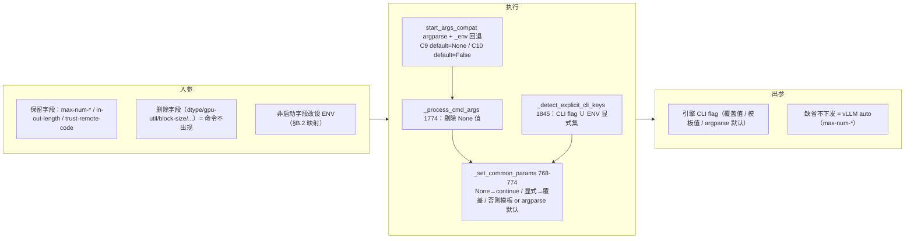
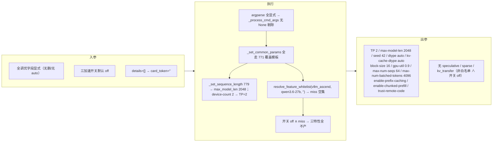
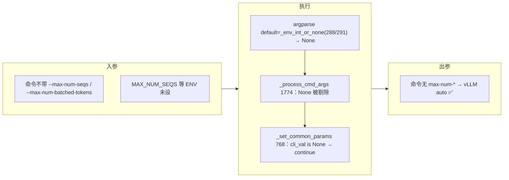
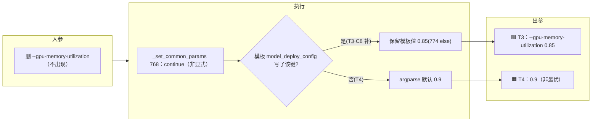
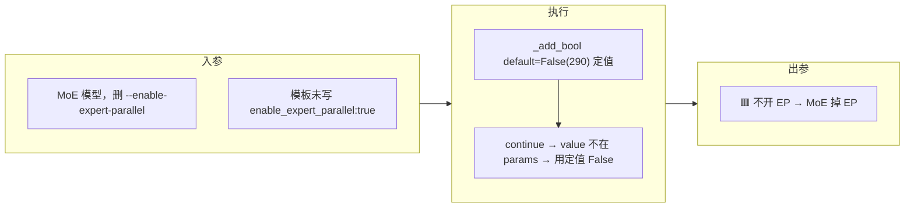
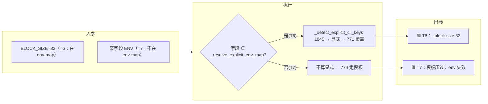

# 需求二 · 参数删减 — wings-control 实施文档

> 母文档/索引见 [smart.md](smart.md)。本文件承载原 **§0.5-B / §4.1–4.3**。
> 触发极性与需求一/三相反：**字段「缺省」触发**（页面不传 → 落模板/auto/argparse 默认）。
> 跨需求的「§6 未决事实」「§7 影响范围/排期」仍在索引 [smart.md](smart.md)。

> **本文档 scope = 普通「参数配置页面」**（CLI 直拉，`wings_start.sh … -- <调优字段>`）。
> JSON 参数配置页面的删减集**不同**（只删 3，保留完整调优集），见 [需求三-JSON自定义透传.md](需求三-JSON自定义透传.md)。

---

## B0) 页面约束（MaaS 下发，本版口径）

> 三条硬约束，下文所有改动都不得越界：

1. **删除参数 = 前端展示删除 ∧ 后端下发删除**；其余参数保持不变。
2. **整个 wings 拉服务逻辑保持不变** —— 删参只动「前端是否展示 / 后端是否下发」两点；`_set_common_params` 合并链路、`wings_start.sh` 编排链路均不动。C8 模板补值 / C10 布尔兜底属**模板侧兜底**，非链路改动。
3. **非启动字段都转换为环境变量**（见 §B.2）。

**参考启动命令（两档）**

```bash
# ① max-num-batched-tokens / max-num-seqs = auto（页面不传 → 命令里不出现 → vLLM auto，经 C9）
bash /opt/wings-control/wings_start.sh --engine vllm_acend --model-name Qwen3.6-27B \
  --model-path /usr/local/serving/models/ --port 18000 --trust-remote-code \
  -- --output-length 1024 --input-length 1024

# ② max-num-batched-tokens / max-num-seqs = 具体数值（页面显式传 → 覆盖）
bash /opt/wings-control/wings_start.sh --engine vllm_acend --model-name Qwen3.6-27B \
  --model-path /usr/local/serving/models/ --port 18000 --trust-remote-code \
  -- --output-length 1024 --input-length 1024 --max-num-batched-tokens 4096 --max-num-seqs 64
```

> ⚠ **极性纠正（相对旧版）**：旧版断言这两字段「保留→恒传→C9 不触发，仅未来预留」。**作废**。
> 上面 ① 档命令**根本不带**这两字段 → 要落 vLLM auto，argparse 默认必须是 `None`（即 C9）；当前默认 32/4096（[start_args_compat.py:288/291](../../wings_control/core/start_args_compat.py#L288)）不改的话 ① 档会错下发 32/4096。
> 结论：**C9 本版本随 ① 档即生效，是必须落地的活逻辑，非预留**。

---

## B.1 删减清单（MaaS 已定稿）

> 范围 = 删除表 12 字段 ∪「不在表内但页面恒传」3 字段。切分依据：MaaS 给定保留集
> `max-num-seqs / max-num-batched-tokens / input-length / output-length / trust-remote-code`，其余调优字段一律不透传。

**🟢 保留（5，页面继续透传）**

| 字段                     | 是否在删除表 | 说明                                     |
| ------------------------ | ------------ | ---------------------------------------- |
| `max-num-seqs`           | 在表（C9）   | **可缺省(=auto，经 C9 不下发) / 可显式(覆盖)**；C9 本版本生效 |
| `max-num-batched-tokens` | 在表（C9）   | 同上                                     |
| `input-length`           | 不在表       | 驱动 `max_model_len`                     |
| `output-length`          | 不在表       | 驱动 `max_model_len`                     |
| `trust-remote-code`      | 不在表       | 模型加载/安全开关                        |

**🔴 删除（10，页面不再透传）**

| 字段                                                         | 命中删除表行                             |
| ------------------------------------------------------------ | ---------------------------------------- |
| `dtype` / `kv-cache-dtype`                                   | dtype / kv-cache-dtype                    |
| `gpu-memory-utilization`                                     | gpu-memory-utilization                   |
| `block-size` / `quantization` / `seed` / `quantization-param-path` | block-size/quantization/seed/quantization-param-path |
| `enable-chunked-prefill` / `enable-prefix-caching` / `enable-expert-parallel` | 三布尔（C10）                  |

> 结构/身份字段（`engine`/`model-name`/`model-path`/`port`/`device-count`/`gpu-usage-mode` 等）始终透传，不属删减范围。
> ⚠ **保留集 → C9 生效**：`max-num-seqs`/`max-num-batched-tokens` 现支持「页面不传 = auto」。不传 → 非显式 → `_set_common_params` 走「`cli_val is None: continue` 跳过下发」→ vLLM auto（**前提：C9 把默认改 None，且模板不写死这两键**）。传具体值 → 显式覆盖。
> ⚠ **删除集 → 仍需 C8/C10 兜底**：删除的 10 个落「模板有则用，否则 argparse 定值」；`gpu-memory-utilization`/`block-size`/`quantization`/`enable-*` 须按 §4.1 C8 给目标模型模板补值，`enable-expert-parallel` 删后 MoE 静默掉 EP（§4.3 C10）。
> ⚠ **与需求三 auto 语义相反**：本页 auto = **不下发 → vLLM auto**；JSON 页 auto = **回填默认数值再下发**（256/4096）。见 [需求三 §C.2](需求三-JSON自定义透传.md)。

---

## B.2 启动字段 / 非启动字段划分（非启动 → 环境变量）

> 约束「非启动字段都转换为环境变量」的落地依据：[start_args_compat.py:267-315](../../wings_control/core/start_args_compat.py#L267-L315) 里**每个 CLI 参数都已带 `_env(...)` 回退名**。所以「转环境变量」**无需新造名字**，set 对应 env 即可（argparse 自动回退读取）。

**启动字段（构编排用，留 CLI / `--` 之前）**

`engine / model-name / model-path / port / host / device-count / gpu-usage-mode / model-type / save-path / distributed·nnodes·node-* / master-ip / config-file`

**非启动字段（调优，→ 环境变量）及其 env 回退名**

| 非启动字段 | env 回退名 | 行 |
| --- | --- | --- |
| `--input-length` / `--output-length` | `INPUT_LENGTH` / `OUTPUT_LENGTH` | 272/273 |
| `--dtype` / `--kv-cache-dtype` | `DTYPE` / `KV_CACHE_DTYPE` | 281/282 |
| `--quantization` / `--quantization-param-path` | `QUANTIZATION` / `QUANTIZATION_PARAM_PATH` | 283/284 |
| `--gpu-memory-utilization` | `GPU_MEMORY_UTILIZATION` | 285 |
| `--block-size` / `--seed` | `BLOCK_SIZE` / `SEED` | 287/289 |
| `--max-num-seqs` / `--max-num-batched-tokens` | `MAX_NUM_SEQS` / `MAX_NUM_BATCHED_TOKENS` | 288/291 |
| `--enable-chunked-prefill` / `--enable-prefix-caching` / `--enable-expert-parallel` | `ENABLE_CHUNKED_PREFILL` / `ENABLE_PREFIX_CACHING` / `ENABLE_EXPERT_PARALLEL` | 286/292/290 |
| `--enable-auto-tool-choice` / `--enable-auto-think-choice` | `ENABLE_AUTO_TOOL_CHOICE` / `ENABLE_AUTO_THINK_CHOICE` | 297/301 |
| `--trust-remote-code` | `TRUST_REMOTE_CODE` | 280 |

> ⚠ **灰区（归属待定，列入遗留）**：约束示例里 `--trust-remote-code` 在 `--` **之前**（像启动字段），而 `--input-length/--output-length` 在 `--` **之后**（像非启动）。这三个字段「算启动还是非启动」**未拍板**，见 §遗留。

---

## 4. 参数删减（精确 diff）

### 4.1 C8 模板补值

- 在 `config/defaults/{ascend,nvidia,vllm}_default.json` 的 `model_deploy_config/<arch>/<模型名>/<engine>` 补：`gpu_memory_utilization / block_size / quantization / enable_expert_parallel`。
- 合并规则（`_set_common_params` 762-774）：删参后字段非显式 → 模板有则用模板，无则落 argparse 定值。
- **必须跑挂兜底**：`quantization` 删后靠 C7 保留的自动检测；MoE 必须补 `enable_expert_parallel`（见 C10）。

### 4.2 C9 seqs/tokens 真 auto — `start_args_compat.py:288/291`

```python
# 改前 default=_env_int("MAX_NUM_SEQS",32) / default=_env_int("MAX_NUM_BATCHED_TOKENS",4096)
# 改后 default=_env_int_or_none("MAX_NUM_SEQS") / default=_env_int_or_none("MAX_NUM_BATCHED_TOKENS")
# None → _set_common_params(766) `cli_val is None: continue` 跳过下发 → vLLM auto
# ⚠ 模板里也别写死这两个键，否则用模板值
```

> ✅ **本版本生效**：保留集现支持「页面不传 = auto」（见 §B0 ① 档命令），不传 → 默认 None → 不下发 → vLLM auto。C9 是该档能落 auto 的前提，**不再是未来预留**。

### 4.3 C10 布尔删参陷阱 — `start_args_compat.py:286/290/292`

- `_add_bool` 默认=定值 **False**（81 行），`enable-expert-parallel` 删后静默 False → **MoE 掉 EP**。
- 处理：①MoE 模型模板显式写 `enable_expert_parallel:true`（并入 C8 盘点）；②或这三个布尔默认改 None 走「未传不下发」。

### 4.4 实施细节（代码级 diff）

**① C9 `_env_int_or_none` 新增 — `start_args_compat.py`（[`_env_int` 后, 39 行](../../wings_control/core/start_args_compat.py#L39)）**

```python
def _env_int_or_none(name: str):
    """页面未设该 env → None（argparse default=None → 不下发 → vLLM auto）。"""
    raw = _env(name, "")
    if not raw:
        return None
    try:
        return int(raw)
    except ValueError:
        return None
```

```python
# 288/291 改：去掉 32/4096 定值默认
p.add_argument("--max-num-seqs",           type=int, default=_env_int_or_none("MAX_NUM_SEQS"))
p.add_argument("--max-num-batched-tokens", type=int, default=_env_int_or_none("MAX_NUM_BATCHED_TOKENS"))
```

- **auto 档执行链路**：页面不传 → `MAX_NUM_SEQS` 未设 → default `None` → `_process_cmd_args`([1774-1777](../../wings_control/core/config_loader.py#L1774)) 过滤掉 None → `cmd_known_params` 无此键 → `_set_common_params`([768](../../wings_control/core/config_loader.py#L768)) `cli_val is None: continue` → 不下发 → **vLLM auto**。✅
- **具体值档**：页面传 `--max-num-seqs 64`（或设 env）→ `_detect_explicit_cli_keys`([1840/1845](../../wings_control/core/config_loader.py#L1840)) 命中 → `_set_common_params`([771](../../wings_control/core/config_loader.py#L771)) 覆盖模板。✅
- ⚠ 模板（`*_default.json`）**不得写死**这两键，否则走 [774](../../wings_control/core/config_loader.py#L774) `value not in params` 失效、回退模板值。

**② 非启动字段→env 的承接（wings 侧基本免改，关键在优先级）**

- 每个非启动字段（§B.2）**已有 argparse env 回退**（[267-315](../../wings_control/core/start_args_compat.py#L267)）+ `wings_start.sh` 已 re-export（[276-303](../../wings_control/wings_start.sh#L276)）→ 页面把 `--flag value` 改为「设对应 env」后，**wings 无需改即可承接**。
- **优先级保持**：env 被 set 即被 `_detect_explicit_cli_keys`([1845-1847](../../wings_control/core/config_loader.py#L1845)) 视作**显式**（前提：该字段在 `_resolve_explicit_env_map` 引擎映射内）→ 与 CLI 一致地**覆盖模板**。
- ⚠ **唯一风险点**：若某非启动字段的 env 名**不在** `_resolve_explicit_env_map`，则 env 值不算显式 → 走补值分支、被模板压过。落地前需核对 §B.2 全表 env 名是否都进了该映射（→ 遗留①）。

**③ C8 模板补值（示例位置）**

```jsonc
// config/defaults/vllm_default.json  →  model_deploy_config/<arch>/<模型名>/<engine>
{ "gpu_memory_utilization": 0.9, "block_size": 16,
  "quantization": null, "enable_expert_parallel": true /* MoE 必补，否则 C10 掉 EP */ }
```

### 4.5 删除逻辑下发 · 处理流程模拟

> **本节模拟「删除逻辑」如何下发**：页面删字段 → wings 每一步对数据做了什么（带 file:line）→ 引擎最终下发什么。
> **核心认知（删除逻辑的真相）**：页面「删除」= 该 `--flag` 不出现在命令里，但 **argparse 用 default 把它填回来**（非 None 就不会被丢）。所以**删除 ≠ 引擎缺省**，而是「落 argparse 默认 / 或被模板覆盖」——这正是 C8/C9/C10 存在的原因。
> 结构：总览管线（§4.5.0）→ 端到端数据流模拟（§4.5.1，逐字段追踪值变化）→ 关键分支细化（§4.5.2–4.5.6，IN/EXEC/OUT 三泳道）。

#### 4.5.0 通用管线骨架



#### 4.5.1 端到端数据流模拟（逐字段追踪值变化）

**阶段0 · 页面下发**（用户删了 10 个调优字段 → 命令里完全不出现；保留 5 个）

```bash
bash /opt/wings-control/wings_start.sh --engine vllm_ascend --model-name Qwen3.6-27B \
  --model-path /usr/local/serving/models/ --port 18000 \
  --trust-remote-code --input-length 1024 --output-length 1024 --max-num-seqs 64 --max-num-batched-tokens 4096
# 删除字段（dtype/kv-cache-dtype/gpu-util/block-size/quantization/seed/
#   quantization-param-path/enable-chunked-prefill/enable-prefix-caching/enable-expert-parallel）均不出现
```

**阶段1→5 · 逐字段数据流**（每个字段在管线里的值如何流转）

| 字段（删/留） | 页面 | ①argparse 默认 | ②`_process_cmd_args` 丢 None(1774) | ③`_set_common_params`(768-774) | **引擎下发** |
| --- | --- | --- | --- | --- | --- |
| `dtype`(删) | — | `"auto"`(281) | 保留(非 None) | 非显式→模板有用模板 / 无用 auto | `dtype=auto` 🟩无害 |
| `kv-cache-dtype`(删) | — | `"auto"`(282) | 保留 | 同上 | `auto` 🟩无害 |
| `gpu-util`(删) | — | `0.9`(285) | 保留 | 同上 | `0.9` 🟧或模板 |
| `block-size`(删) | — | `16`(287) | 保留 | 同上 | `16` 🟧或模板 |
| `seed`(删) | — | `0`(289) | 保留 | 同上 | `0` 🟧或模板 |
| `enable-chunked-prefill`(删) | — | `False`(286) | 保留 | 同上 | 静默 False 🟧 |
| `enable-prefix-caching`(删) | — | `False`(292) | 保留 | 同上 | 静默 False 🟧 |
| `enable-expert-parallel`(删) | — | `False`(290) | 保留 | 同上 | **不开 EP** 🟥(MoE) |
| `quantization`(删) | — | `""`(283) | 空串→下游跳过 | — | 不下发→C7 自动检测 🟩 |
| `max-num-seqs`(留) | 64 | 64 | 保留 | **显式→覆盖**(771) | `64` 🟩 |
| `max-num-batched-tokens`(留) | 4096 | 4096 | 保留 | 显式→覆盖(771) | `4096` 🟩 |
| `input/output-length`(留) | 1024/1024 | — | 保留 | `_set_sequence_length`(779) | `max-model-len 2048` 🟩 |
| `trust-remote-code`(留) | (flag) | — | 保留 | `_add_bool`→True(280) | `--trust-remote-code` 🟩 |

> **删除逻辑真相（结论）**：
> 1. **删除 ≠ 引擎缺省**：10 个删除字段里，**8 个被 argparse 默认回填**（`auto` 类无害，但 `gpu-util=0.9 / block-size=16 / enable-*=False` 是定值，可能错）；只有空串字段（`quantization`）下游跳过。
> 2. **要真正「后端下发删除」**（让引擎用自己的默认）只有两条路：**① C8 模板补对值**覆盖 argparse 定值；**② 把默认改 None 走丢弃**（目前仅 C9 对 `max-num-*` 这么做，但那俩是保留字段）。
> 3. **删除逻辑的核心交付 = C8**：给目标模型模板补 `gpu_memory_utilization/block_size/enable_expert_parallel` 等，否则删字段静默落非最优定值（MoE 尤其会掉 EP）。

**关键分支细化**（IN/EXEC/OUT 三泳道，§4.5.2–4.5.6）：B0 全显式基线 → T1 删 max-num-*(C9 auto) → T3/T4 删字段×模板(C8) → T5 MoE 掉 EP(C10) → T6/T7 非启动→env 优先级。下接各图。

#### 4.5.2 B0 · 基线触发（全显式 / 非白名单 / 无加速）

**入参**
```bash
echo '{"count":2,"details":[],"units":"GB","device":"ascend"}' > /shared-volume/hardware_info.json
bash /opt/wings-control/wings_start.sh \
  --engine vllm_ascend --model-name Qwen3.6-27B --model-path /usr/local/serving/models/ --port 18000 \
  --seed 42 --trust-remote-code --dtype auto --output-length 1024 --enable-prefix-caching \
  --max-num-batched-tokens 4096 --max-num-seqs 64 --kv-cache-dtype auto --block-size 16 \
  --gpu-memory-utilization 0.9 --input-length 1024 --enable-chunked-prefill \
  --gpu-usage-mode full --device-count 2
```


> 决策要点：全显式 → 模板被全覆盖，C8/C9/C10 均**不触发**；非白名单普通模型 = 加速静默关（需求一 §0 裁定2「miss→不产」），零特殊处理直拉。**这是其余用例的 delta 原点。**

#### 4.5.3 T1 · 触发 C9 seqs/tokens auto

**入参**（B0 删掉两个 max-num-* flag）
```bash
bash /opt/wings-control/wings_start.sh \
  --engine vllm_ascend --model-name Qwen3.6-27B --model-path /usr/local/serving/models/ --port 18000 \
  --trust-remote-code --output-length 1024 --input-length 1024
```

> 决策要点：auto 命门 = **None 贯穿 argparse→剔除→continue** 三环；与需求三 JSON 页「auto→回填默认」相反。

#### 4.5.4 T3/T4 · 触发 C8 删参兜底（模板有/无）

**入参**（B0 删掉 `--gpu-memory-utilization`）
```bash
bash /opt/wings-control/wings_start.sh \
  --engine vllm_ascend --model-name Qwen3.6-27B --model-path /usr/local/serving/models/ --port 18000 \
  --trust-remote-code --output-length 1024 --input-length 1024 --max-num-seqs 64 --max-num-batched-tokens 4096
  # 注意：无 --gpu-memory-utilization
```

> 决策要点：删参字段一律 `continue`，落点取决于模板是否补值 → C8 必须给目标模型补 `gpu_memory_utilization/block_size/quantization/enable_expert_parallel`。

#### 4.5.5 T5 · 触发 C10 MoE 掉 EP

**入参**（换 MoE 模型 + 删 `--enable-expert-parallel`，模板未补）
```bash
bash /opt/wings-control/wings_start.sh \
  --engine vllm_ascend --model-name Qwen3-235B-MoE --model-path /usr/local/serving/models/ --port 18000 \
  --trust-remote-code --output-length 1024 --input-length 1024 --device-count 8
  # 注意：无 --enable-expert-parallel，且模板未写 enable_expert_parallel:true
```

> 决策要点：布尔删参默认是**定值 False（非 None）**，所以删了不是「不下发」而是「静默关」；MoE 必须由 C8 模板补 `enable_expert_parallel:true` 兜底。

#### 4.5.6 T6/T7 · 触发 非启动字段→env（覆盖 vs 失效）

**入参**（B0 删 `--block-size 16`，改用 ENV）
```bash
BLOCK_SIZE=32 bash /opt/wings-control/wings_start.sh \
  --engine vllm_ascend --model-name Qwen3.6-27B --model-path /usr/local/serving/models/ --port 18000 \
  --trust-remote-code --output-length 1024 --input-length 1024 --max-num-seqs 64 --max-num-batched-tokens 4096
  # 注意：无 --block-size，改 BLOCK_SIZE=32 环境变量
```

> 决策要点：env 能否覆盖**取决于字段是否在 `_resolve_explicit_env_map`**；落地前须核对 §B.2 全表 env 名都在映射内（遗留①）。

---

## 遗留（MaaS 待给值）

| # | 事实 | 卡住 | 现占位 |
| --- | --- | --- | --- |
| ① | **非启动字段清单 + env 映射确认**：约束要求「提供非启动字段有哪些、具体转换为何环境变量」。§B.2 已按 [start_args_compat.py](../../wings_control/core/start_args_compat.py) 给出现成映射，待 MaaS 确认是否全集采用。 | §B.2 落地 | 现用代码内 `_env` 回退名 |
| ② | **灰区字段归属**：`trust-remote-code` / `input-length` / `output-length` 算启动字段（留 CLI）还是非启动字段（转 env）？约束示例两边都有。 | §B.2 划分 | 暂按示例位置（前 CLI / 后非启动） |
